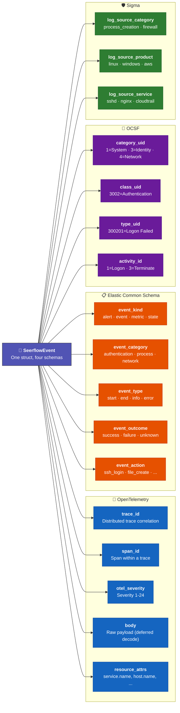

# SeerflowEvent Model

## Concept

Every log event in the pipeline is represented as a `SeerflowEvent` — a single struct that carries fields from **four log schema standards** simultaneously:

- **OpenTelemetry** LogRecord — trace context, nanosecond timestamps, severity 1-24
- **Elastic Common Schema (ECS)** — event.kind/category/type/outcome hierarchy
- **OCSF** — numeric taxonomy with category_uid/class_uid/type_uid
- **Sigma** — logsource.category/product/service for detection rule matching

Why unify four schemas? Because downstream consumers speak different languages. The detection ensemble reads anomaly scores. Sigma rules query logsource fields. The correlation engine resolves entity references. The alerting layer formats ECS event types for human-readable notifications. One struct serves them all — no translation layer, no schema mapping at query time.

### Design Choices

| Choice | Why |
|--------|-----|
| `msgspec.Struct` | 4x faster serialization than dataclasses, 17x faster than Pydantic v2 |
| `frozen=True` | Immutability prevents hidden side effects — safe to pass between pipeline stages |
| `gc=False` | Disables cyclic garbage collection — SeerflowEvent has no reference cycles, saving GC overhead at 10K+ events/sec |
| `tag=True` | Adds a `type` discriminator to serialized output — enables tagged-union decoding when multiple struct types share a wire channel |

## How It Works

### Field Reference

#### Identity

| Field | Type | Description | Example |
|-------|------|-------------|---------|
| `event_id` | `UUID` | Unique event identifier | `550e8400-e29b-41d4-a716-446655440000` |
| `timestamp_ns` | `int` | Event time (nanoseconds since epoch) | `1742007247000000000` |
| `observed_ns` | `int` | Pipeline receive time (nanoseconds) | `1742007247001000000` |

#### Trace Context (OpenTelemetry)

| Field | Type | Description | Example |
|-------|------|-------------|---------|
| `trace_id` | `str | None` | OTel trace ID for correlated spans | `"4bf92f3577b34da6a3ce929d0e0e4736"` |
| `span_id` | `str | None` | OTel span ID | `"00f067aa0ba902b7"` |

#### Severity

| Field | Type | Description | Example |
|-------|------|-------------|---------|
| `severity_id` | `SeverityLevel` | Unified severity (0=TRACE to 6=FATAL) | `SeverityLevel.WARNING` (3) |
| `otel_severity` | `int` | OTel SeverityNumber (1-24) | `13` (WARN) |

The `SeverityLevel` enum maps to a 7-level scale: TRACE (0), INFORMATIONAL (1), NOTICE (2), WARNING (3), ERROR (4), CRITICAL (5), FATAL (6).

#### Classification (ECS)

| Field | Type | Description | Example |
|-------|------|-------------|---------|
| `event_kind` | `str` | ECS event kind | `"alert"` |
| `event_category` | `str` | ECS category | `"authentication"` |
| `event_type` | `str` | ECS type | `"start"` |
| `event_outcome` | `str` | ECS outcome | `"failure"` |
| `event_action` | `str` | ECS action | `"ssh_login"` |

#### OCSF Taxonomy

| Field | Type | Description | Example |
|-------|------|-------------|---------|
| `category_uid` | `int` | OCSF category | `3` (Identity & Access) |
| `class_uid` | `int` | OCSF class | `3002` (Authentication) |
| `type_uid` | `int` | OCSF type | `300201` (Logon: Failed) |
| `activity_id` | `int` | OCSF activity | `1` (Logon) |

**Invariant:** `type_uid = class_uid * 100 + activity_id`. Callers setting any of these three must set all three consistently.

#### Content

| Field | Type | Description | Example |
|-------|------|-------------|---------|
| `message` | `str` | Human-readable log message | `"Failed password for root from 198.51.100.23"` |
| `body` | `msgspec.Raw | None` | Deferred-decoding payload for arbitrary log bodies | Raw JSON bytes |

#### Source Tracking

| Field | Type | Description | Example |
|-------|------|-------------|---------|
| `source_type` | `str` | Receiver type that ingested this event | `"syslog"` |
| `source_id` | `str` | Unique source identifier | `"syslog-udp"` |
| `log_source_category` | `str` | Sigma logsource category | `"process_creation"` |
| `log_source_product` | `str` | Sigma logsource product | `"linux"` |
| `log_source_service` | `str` | Sigma logsource service | `"sshd"` |

#### Drain3 Metadata

| Field | Type | Description | Example |
|-------|------|-------------|---------|
| `template_id` | `int` | Drain3 cluster ID (-1 = no match) | `42` |
| `template_str` | `str` | Extracted template | `"Failed password for <*> from <*>"` |
| `template_params` | `tuple[str, ...]` | Wildcard values | `("root", "<IP>")` |

#### Entity References

| Field | Type | Description | Example |
|-------|------|-------------|---------|
| `entity_refs` | `tuple[str, ...]` | UUID5 entity IDs (resolved) | `("a1b2c3...",)` |
| `related_ips` | `tuple[str, ...]` | Extracted IP addresses | `("198.51.100.23",)` |
| `related_users` | `tuple[str, ...]` | Extracted usernames | `("root",)` |
| `related_hosts` | `tuple[str, ...]` | Extracted hostnames | `("web-prod-01",)` |
| `related_files` | `tuple[str, ...]` | Extracted file paths | `("/var/log/auth.log",)` |
| `related_domains` | `tuple[str, ...]` | Extracted domains | `("api.example.com",)` |
| `related_processes` | `tuple[str, ...]` | Extracted process names | `("sshd",)` |
| `related_hashes` | `tuple[str, ...]` | File/process hashes | `("sha256:e3b0c4...",)` |

#### MITRE ATT&CK

| Field | Type | Description | Example |
|-------|------|-------------|---------|
| `mitre_tactics` | `tuple[str, ...]` | ATT&CK tactic IDs | `("TA0006",)` (Credential Access) |
| `mitre_techniques` | `tuple[str, ...]` | ATT&CK technique IDs | `("T1110",)` (Brute Force) |

#### Scores

| Field | Type | Description | Example |
|-------|------|-------------|---------|
| `risk_score` | `float` | Accumulated entity risk (0-100) | `72.0` |
| `confidence` | `float` | Detection confidence (0-1) | `0.95` |
| `anomaly_score` | `float` | Blended ML anomaly score (0-1) | `0.65` |

#### Metadata

| Field | Type | Description | Example |
|-------|------|-------------|---------|
| `attributes` | `dict[str, AttrValue]` | Arbitrary key-value pairs | `{"facility": "auth"}` |
| `tags` | `tuple[str, ...]` | Free-form tags | `("brute-force", "external")` |
| `raw_event` | `str` | Original unmodified log line | Full raw text |
| `resource_attrs` | `dict[str, str]` | OTel resource attributes | `{"service.name": "sshd"}` |

### Schema Unification

The security and observability industry has no single standard for log events. Four competing schemas dominate, each designed for a different purpose:

| Schema | Origin | Strength | Used by |
|--------|--------|----------|---------|
| **OpenTelemetry** | CNCF (2019) | Distributed tracing, nanosecond timestamps, resource attributes | Cloud-native apps, Kubernetes, OTel Collector |
| **Elastic Common Schema** | Elastic (2019) | Human-readable event classification (`event.kind/category/type/outcome`) | Elasticsearch, Kibana, Elastic SIEM |
| **OCSF** | AWS + Splunk (2022) | Numeric taxonomy for machine processing (`category_uid/class_uid/type_uid`) | AWS Security Lake, Splunk, CrowdStrike |
| **Sigma** | Open-source (2017) | Portable detection rules via `logsource.category/product/service` matching | 3,000+ SigmaHQ rules, every major SIEM |

Traditional tools pick one schema and translate everything into it — losing information in the process. Seerflow takes a different approach: **carry all four schemas simultaneously** in a single struct. No translation, no lossy mapping, no schema conversion at query time.



### Who Reads What

Each pipeline component queries only the fields it understands — no component needs to know about the other schemas:

| Component | Schema it reads | Fields it uses | Why |
|-----------|----------------|----------------|-----|
| **OTLP receivers** | OpenTelemetry | `trace_id`, `span_id`, `otel_severity`, `body`, `resource_attrs` | Native format — zero conversion on ingest |
| **Sigma engine** | Sigma | `log_source_category`, `log_source_product`, `log_source_service` | Rule matching requires logsource fields to route rules to the right events |
| **Detection ensemble** | Seerflow-native | `anomaly_score`, `risk_score`, `template_id`, `related_*` | ML models and scoring don't care about classification schemas |
| **Correlation engine** | ECS + Seerflow | `event_category`, `event_outcome`, `entity_refs`, `related_*` | Entity graph needs both classification context and entity references |
| **Dashboard / alerting** | ECS + OCSF | `event_kind`, `event_category`, `category_uid`, `class_uid` | Human-readable labels (ECS) + machine-readable taxonomy (OCSF) for filtering |
| **Export / SIEM forwarding** | All four | Everything | Forward events to downstream systems in their native schema without translation |

### Concrete Example: One Event, Four Lenses

A single SSH brute-force event carries all four schemas at once:

```
OpenTelemetry lens:
  trace_id: "4bf92f3577b34da6a3ce929d0e0e4736"
  otel_severity: 13 (WARN)
  resource_attrs: {"service.name": "sshd", "host.name": "web-prod-01"}

ECS lens:
  event_kind: "alert"
  event_category: "authentication"
  event_type: "start"
  event_outcome: "failure"
  event_action: "ssh_login"

OCSF lens:
  category_uid: 3        → Identity & Access Management
  class_uid: 3002        → Authentication
  type_uid: 300201       → Authentication: Logon — Failed
  activity_id: 1         → Logon

Sigma lens:
  log_source_product: "linux"
  log_source_service: "sshd"
  → matches rule: "Sigma SSH Brute Force Detection"
```

No translation happened. The OTLP receiver populated the OTel fields at ingest. The normalizer set the ECS and OCSF fields based on message classification. The Sigma engine matched rules using the logsource fields. Every downstream consumer got exactly the fields it needed, in its native format.

## Configuration

The `SeerflowEvent` itself has no runtime configuration — its structure is fixed. To update an event immutably (e.g., adding ATT&CK tactics after detection), use `msgspec.structs.replace()`:

```python
import msgspec.structs

enriched = msgspec.structs.replace(
    event,
    mitre_tactics=("TA0006",),
    mitre_techniques=("T1110",),
    risk_score=72.0,
)
# `event` is unchanged; `enriched` is a new instance
```

This functional update pattern ensures immutability throughout the pipeline. No stage mutates events from a previous stage.

## Dual-Lens Example

=== "🔒 Security"

    **SSH brute-force event (fully populated):**

    ```python
    SeerflowEvent(
        event_id=UUID("550e8400-e29b-41d4-a716-446655440000"),
        timestamp_ns=1742007247000000000,
        observed_ns=1742007247001000000,
        severity_id=SeverityLevel.WARNING,         # Unified
        otel_severity=13,                          # OTel WARN
        event_kind="alert",                        # ECS
        event_category="authentication",           # ECS
        event_outcome="failure",                   # ECS
        category_uid=3,                            # OCSF: Identity & Access
        class_uid=3002,                            # OCSF: Authentication
        type_uid=300201,                           # OCSF: Logon Failed
        activity_id=1,                             # OCSF: Logon
        message="Failed password for root from 198.51.100.23 port 44123",
        source_type="syslog",
        log_source_category="",                    # Sigma
        log_source_product="linux",                # Sigma
        log_source_service="sshd",                 # Sigma
        template_id=42,
        template_str="Failed password for <*> from <*> port <*>",
        related_ips=("198.51.100.23",),
        related_users=("root",),
        mitre_tactics=("TA0006",),                 # Credential Access
        mitre_techniques=("T1110",),               # Brute Force
        risk_score=72.0,
        anomaly_score=0.65,
    )
    ```

=== "⚙️ Operations"

    **OOMKill event (fully populated):**

    ```python
    SeerflowEvent(
        event_id=UUID("661f9511-f3ac-52e5-b827-557766551111"),
        timestamp_ns=1742007334000000000,
        observed_ns=1742007334002000000,
        severity_id=SeverityLevel.ERROR,           # Unified
        otel_severity=17,                          # OTel ERROR
        event_kind="event",                        # ECS
        event_category="process",                  # ECS
        event_outcome="failure",                   # ECS
        category_uid=1,                            # OCSF: System Activity
        class_uid=1001,                            # OCSF: Process Activity
        type_uid=100103,                           # OCSF: Terminate
        activity_id=3,                             # OCSF: Terminate
        message="Container nginx-canary-7f8b9 exceeded memory limit 512Mi, OOMKilled",
        source_type="webhook",
        source_id="k8s-events",
        template_id=87,
        template_str="Container <*> exceeded memory limit <*>, OOMKilled",
        related_processes=("nginx-canary-7f8b9",),
        mitre_tactics=(),                          # No ATT&CK mapping for ops events
        mitre_techniques=(),
        risk_score=0.0,                            # No security risk
        anomaly_score=0.85,                        # High ops anomaly
    )
    ```

!!! abstract "How Seerflow Implements This"
    - **Event struct:** [`models/event.py`](https://github.com/seerflow/seerflow/blob/main/src/seerflow/models/event.py) — `SeerflowEvent` (frozen msgspec.Struct with 30+ fields)
    - **Severity enum:** [`models/event.py`](https://github.com/seerflow/seerflow/blob/main/src/seerflow/models/event.py) — `SeverityLevel` (unified 0-6 scale)
    - **Immutable updates:** `msgspec.structs.replace()` for functional event enrichment

    **Next:** [Entity Graph →](../entity-graph/index.md) — How entities extracted from events form a connected graph for correlation.
