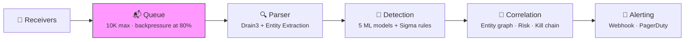

# Architecture & Pipeline

## The Problem: Too Many Logs, Not Enough Signal

Modern infrastructure generates millions of log events per day. Security teams drown in alerts they can't triage. SRE, DevOps, and infrastructure teams miss failures buried in noise. Traditional tools force a choice: rule-based SIEMs that catch known threats but miss novel ones, or ML-only platforms that flag anomalies but can't explain them.

Seerflow takes a different approach: **one streaming pipeline that serves both security and operations**, combining rules (fast, explainable) with machine learning (adaptive, catches unknowns).

## The Dual-Lens Approach

Every log event passes through the same pipeline, but two lenses interpret it:

- **Security lens:** Is this a brute-force attack? A lateral movement attempt? Does it match a Sigma detection rule?
- **Operations lens:** Is this a deployment failure? A memory leak? An anomalous error rate spike?

The architecture doesn't care which lens matters — it processes every event through parsing, detection, correlation, and alerting. The detectors and rules decide what's interesting.

## How Seerflow Compares

| Dimension | Traditional SIEM | Pure-ML Tool | Seerflow |
|-----------|-----------------|-------------|----------|
| Detection approach | Rules only | ML only | ML + rules hybrid |
| Latency | Batch (minutes) | Batch (minutes) | Streaming (seconds) |
| New log formats | Manual parsers | Retraining required | Drain3 auto-templates |
| Explainability | High (rules are readable) | Low (black box) | High (rules + LLM edge cases) |
| Coverage | Known threats only | Anomalies only | Known + unknown |
| Cost model | Per-GB ingest pricing | GPU compute | CPU-only streaming |

## Pipeline Overview

Every log event flows through five stages:



- **Receivers** ingest logs from syslog servers (`auth.log`, `kern.log`), application log files (`/var/log/*.log`), OpenTelemetry Collectors (forwarding CloudWatch, GCP Logging, Azure Monitor), and webhook endpoints (GitHub, Kubernetes, custom apps). A bounded asyncio queue (10,000 events max) absorbs bursts and applies backpressure at 80% utilization.
- **Parser** uses Drain3 for streaming template extraction — no grok patterns or manual parsers needed. New log formats are learned automatically. Regex-based entity extraction pulls IPs, usernames, hostnames, domains, processes, and file paths from every message.
- **Detection** runs five online ML models in parallel: Half-Space Trees (content anomalies), Holt-Winters (volume spikes), CUSUM (change points), Markov chains (sequence anomalies), and DSPOT (auto-thresholds). Plus 3,000+ Sigma rules for known threat signatures.
- **Correlation** connects related events through an igraph-based entity graph (40-250x faster than NetworkX), per-entity risk accumulation with configurable half-life decay, and MITRE ATT&CK kill-chain tracking that fires when an entity crosses 3+ tactics.
- **Alerting** dispatches to webhook endpoints (Slack, Teams, custom) and PagerDuty with dedup windows (default 15 min, per-rule overrides) to prevent alert storms.

The entire pipeline runs in a single Python asyncio event loop — no threads, no multiprocessing, no GIL contention. Predictable memory, simple debugging, 10K+ events/sec on a single core.

## A Preview: Two Events, One Pipeline

=== "🔒 Security"

    **Scenario:** An attacker brute-forces SSH credentials on `web-prod-01`.

    ```text
    Mar 15 03:14:07 web-prod-01 sshd[12345]: Failed password for root from 198.51.100.23 port 44123
    ```

    This log enters via the **syslog receiver**, gets parsed by Drain3 into template `Failed password for <*> from <*> port <*>`, entities `{user: root, ip: 198.51.100.23}` are extracted, the **detection ensemble** scores it as anomalous, and the **correlation engine** links it to prior failed attempts from the same IP — escalating the risk score.

    Follow this event through each pipeline stage in the pages below.

=== "⚙️ Operations"

    **Scenario:** A canary deploy triggers OOMKill events in Kubernetes.

    ```text
    2026-03-15T10:22:14Z nginx-canary-7f8b9 exceeded memory limit 512Mi, OOMKilled
    ```

    This event arrives via the **webhook receiver** (Kubernetes event hook), Drain3 extracts template `<*> exceeded memory limit <*>, OOMKilled`, the entity `{process: nginx-canary-7f8b9}` is extracted, the **detection ensemble** flags the volume spike, and **correlation** links it to the deploy event — identifying the canary as the root cause.

    Follow this event through each pipeline stage in the pages below.

## Who Is This Guide For?

| You are a... | Start here | Then read |
|--------------|-----------|-----------|
| **Operator** setting up Seerflow | This page → [Receivers](receivers.md) | [Operations](../operations/index.md) for alerting and tuning |
| **Contributor** working on the codebase | [Pipeline](pipeline.md) → [Parsing](parsing.md) | [Event Model](event-model.md) for the core data structure |
| **Security analyst** evaluating Seerflow | Skim this page → [Security Primer](../security-primer/index.md) | [Detection](../detection/index.md) → [Correlation](../correlation/index.md) |
