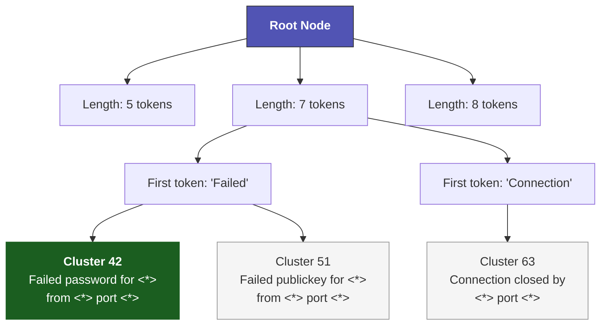

# Log Parsing & Normalization

## Concept

Every log message passes through a two-stage parse before entering the detection pipeline:

1. **Structural parsing (Drain3):** Extract a reusable template from the message, separating fixed text from variable parameters
2. **Semantic parsing (Entity Extraction):** Identify meaningful entities — IP addresses, usernames, hostnames — from the message content

These two stages work together. Drain3 identifies *what kind* of log message this is. Entity extraction identifies *who and what* is involved. Together, they transform raw bytes into a richly annotated `SeerflowEvent`.

### Why Streaming Template Extraction?

Traditional log parsers require pre-written patterns (grok, regex). When a new application starts logging a format the parser doesn't recognize, events are silently dropped or misclassified.

Drain3 uses a **fixed-depth parse tree** that learns templates on the fly. The first time it sees `Failed password for root from 10.0.0.1`, it creates a new template. The second time it sees `Failed password for admin from 10.0.0.2`, it recognizes the pattern and extracts `root`/`admin` and `10.0.0.1`/`10.0.0.2` as parameters. No manual parser configuration needed.

## How It Works

### Drain3 Template Extraction

The `DrainParser` wraps the drain3 library with Seerflow-specific preprocessing:

**Step 1 — Masking:** Before parsing, IPs and UUIDs are replaced with fixed tokens for template stability:

```
Input:  "Failed password for root from 192.168.1.100 port 44123"
Masked: "Failed password for root from <IP> port 44123"
```

Without masking, every unique IP would create a separate template. With masking, all `Failed password` events share one template regardless of source IP.

**Step 2 — Tree traversal:** The masked message traverses a fixed-depth parse tree (default depth=4). At each level, the tree matches tokens against existing cluster nodes. If a cluster matches with similarity ≥ `sim_th` (default 0.4), the message joins that cluster. Otherwise, a new cluster is created.



Messages enter at the root, route by token count, then by first token at each depth level. Leaf nodes are template clusters. New messages either join an existing cluster (similarity ≥ `sim_th`) or create a new one.

**Step 3 — Template + parameters:** The result is a template ID, template string, and extracted parameters:

```
Template: "Failed password for <*> from <*> port <*>"
Params:   ("root", "<IP>", "44123")
```

The `<*>` wildcards mark positions where messages in this cluster differ. Parameters contain the actual values from each message.

??? info "Tuning the similarity threshold"

    The `sim_th` parameter (0.0 to 1.0) controls how aggressively Drain3 merges messages:

    - **Lower values (0.3):** More templates, higher precision — messages with small differences get separate templates
    - **Higher values (0.6):** Fewer templates, higher recall — more variation tolerated within a template
    - **Default (0.4):** Good balance for mixed security/ops log sources

    If you see too many templates for similar messages, raise `sim_th`. If different message types are merged into one template, lower it.

### Entity Extraction

The `EntityExtractor` scans each message for six entity types:

| Entity Type | Pattern | Example Match |
|-------------|---------|--------------|
| **IP** (v4 + v6) | Octet-validated IPv4, common IPv6 forms | `192.168.1.100`, `::1` |
| **User** | `user=` or `for user` prefix | `root`, `deploy@company.com` |
| **Host** | `host=` or `hostname=` prefix | `web-prod-01.example.com` |
| **File** | Common file path patterns | `/var/log/auth.log` |
| **Domain** | FQDN patterns | `api.example.com` |
| **Process** | Process name/ID patterns | `sshd[12345]` |

Each extracted entity is **tagged** with its source:

- `param` — found in a Drain3 wildcard position (high confidence: this is a variable)
- `template` — found in the fixed portion of the template (lower confidence: could be a constant)
- `unknown` — found in a message that didn't match any template

Why tagging matters: the correlation layer uses these tags for entity graph edge weighting. An IP in a `param` position (like the attacker IP in `Failed password for <*> from <*>`) is more likely to be meaningful than an IP in a hardcoded log prefix.

Entities are deduplicated per type (preserving first-seen order) and capped at `MAX_ENTITIES_PER_TYPE` to prevent pathological messages from consuming unbounded memory.

### EventNormalizer

The `EventNormalizer` composes `DrainParser` and `EntityExtractor` into a single `normalize()` method:

```
RawEvent(data=bytes, source_type, source_id, received_ns, metadata)
    ↓ decode bytes → UTF-8 string (truncate to MAX_MESSAGE_LEN)
    ↓ extract severity from metadata (syslog sets it; others default to INFORMATIONAL)
    ↓ Drain3 parse → template_id, template_str, template_params
    ↓ entity extract (with params-aware tagging)
    ↓
SeerflowEvent(event_id=UUID, timestamp_ns, severity_id, message, template_*, related_*, ...)
```

The normalizer is **NOT thread-safe** — it wraps Drain3 which mutates internal state. Create one instance per asyncio task (which is fine since the pipeline is single-threaded).

## Configuration

```yaml
# Drain3 tuning is not exposed in seerflow.yaml — defaults work well.
# Advanced users can modify DrainParser constructor args in code:
#   sim_th: 0.4        # similarity threshold
#   depth: 4           # parse tree depth
#   max_clusters: 1000 # maximum distinct templates
```

??? example "Internal constants (parsing/_constants.py)"

    ```python
    MAX_MESSAGE_LEN = 8192      # Truncate messages longer than 8KB
    MAX_RAW_BYTES = 65536       # Truncate raw event bytes at 64KB
    MAX_ENTITIES_PER_TYPE = 32  # Cap per-type entity extraction
    ```

    These limits prevent pathological log messages (e.g., a 10MB stack trace) from consuming excessive CPU or memory during parsing.

## Dual-Lens Example

=== "🔒 Security"

    **SSH brute-force through the parser:**

    ```
    Raw:       "Failed password for root from 192.168.1.100 port 44123 ssh2"
    Masked:    "Failed password for root from <IP> port 44123 ssh2"
    Template:  "Failed password for <*> from <*> port <*> <*>"
    Params:    ("root", "<IP>", "44123", "ssh2")
    Entities:  {ip: [TaggedEntity("192.168.1.100", "param")],
                user: [TaggedEntity("root", "param")]}
    ```

    The IP and user are both in `param` positions — they're the variables that change between brute-force attempts. The correlation layer will weight these highly.

=== "⚙️ Operations"

    **OOMKill through the parser:**

    ```
    Raw:       "Container nginx-canary-7f8b9 exceeded memory limit 512Mi, OOMKilled"
    Masked:    "Container nginx-canary-7f8b9 exceeded memory limit 512Mi, OOMKilled"
    Template:  "Container <*> exceeded memory limit <*>, OOMKilled"
    Params:    ("nginx-canary-7f8b9", "512Mi")
    Entities:  {process: [TaggedEntity("nginx-canary-7f8b9", "param")]}
    ```

    No IPs or users here — the key entity is the process name, extracted from a `param` position. The correlation layer will link this to deploy events involving the same container.

!!! abstract "How Seerflow Implements This"
    - **Drain3 wrapper:** [`parsing/drain.py`](https://github.com/seerflow/seerflow/blob/main/src/seerflow/parsing/drain.py) — `DrainParser` with IP/UUID masking and configurable similarity threshold
    - **Entity extraction:** [`parsing/entities.py`](https://github.com/seerflow/seerflow/blob/main/src/seerflow/parsing/entities.py) — `EntityExtractor` with 6 entity types and param-aware tagging
    - **Normalizer:** [`parsing/normalizer.py`](https://github.com/seerflow/seerflow/blob/main/src/seerflow/parsing/normalizer.py) — `EventNormalizer` composing parser + extractor into `normalize(RawEvent) → SeerflowEvent`

    **Next:** [Event Model →](event-model.md) — The unified struct that carries all this data through the pipeline.
