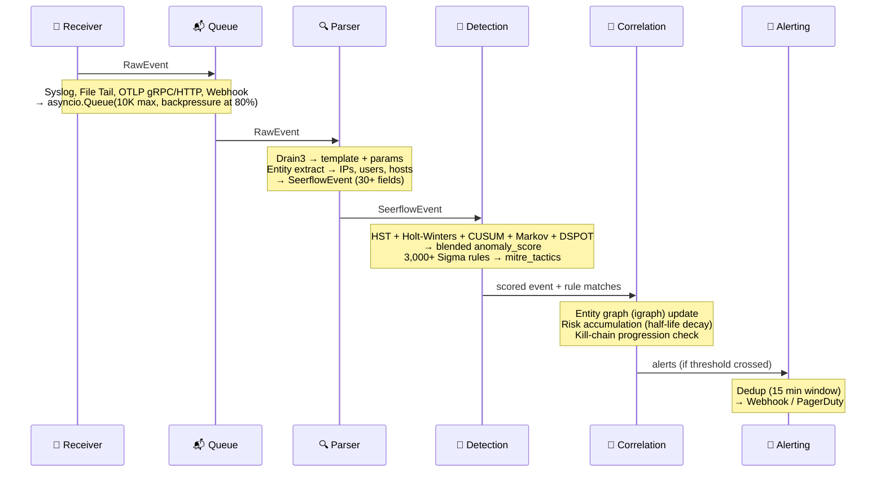

# Pipeline Architecture

## Concept

Seerflow processes every log event through a five-stage streaming pipeline:

1. **Ingest** — Receivers accept logs from external sources and produce `RawEvent` objects
2. **Parse** — Drain3 extracts templates; entity extractor identifies IPs, users, hosts
3. **Detect** — Five online ML models score the event; Sigma rules check for known patterns
4. **Correlate** — Entity graph, risk accumulation, kill-chain tracking connect related events
5. **Alert** — Dispatchers send notifications via webhooks and PagerDuty with deduplication

The entire pipeline runs in a **single asyncio event loop**. There are no threads, no multiprocessing, no GIL contention. This design gives predictable memory usage, simpler debugging, and throughput of 10,000+ events per second on a single core.

### Why Single-Threaded Async?

Traditional SIEMs use thread pools or distributed workers. Seerflow uses cooperative async for three reasons:

- **No GIL contention:** Python's GIL makes threads useless for CPU-bound work. Async avoids the overhead entirely.
- **Predictable memory:** One event loop, one set of data structures, no cross-thread synchronization.
- **Simpler debugging:** Stack traces show the full call chain. No race conditions, no deadlocks.

Backpressure is handled by a bounded `asyncio.Queue` (default 10,000 events). When the queue reaches 80% capacity, receivers log a warning. When full, `put_event` returns `False` and the receiver handles the overflow (typically by dropping the event and incrementing a counter).

## How It Works

### Event Lifecycle

!!! tip "Click any diagram to zoom in. Click again to zoom out."



**Step by step:**

1. **Log Source → Receiver:** Raw bytes arrive over the wire — a syslog UDP packet, an HTTP POST, a gRPC protobuf, or a new line in a tailed file. The receiver decodes the protocol framing and extracts metadata (e.g., syslog severity).

2. **Receiver → ReceiverManager:** The receiver wraps the bytes into a `RawEvent` and calls `put_event()`. If the queue is full (10K events), the call returns `False` and the receiver drops the event (backpressure).

3. **ReceiverManager → EventNormalizer:** The main event loop pulls the next `RawEvent` from the queue. The normalizer decodes bytes to UTF-8, runs Drain3 to extract a template and parameters, then runs entity extraction to identify IPs, users, hosts, files, domains, and processes. The result is a fully populated `SeerflowEvent`.

4. **EventNormalizer → DetectionEnsemble:** Five online ML models score the event in sequence: Half-Space Trees for content anomalies, Holt-Winters for volume spikes, CUSUM for change points, Markov chains for sequence anomalies, and DSPOT for auto-thresholds. Scores are blended into a single `anomaly_score`.

5. **DetectionEnsemble → SigmaEngine:** The enriched event is matched against 3,000+ Sigma rules (logsource-indexed for throughput). Matching rules populate `mitre_tactics` and `mitre_techniques` fields.

6. **SigmaEngine → CorrelationEngine:** The correlation engine updates the entity graph (linking IPs, users, and hosts seen in this event), accumulates risk per entity (with configurable half-life decay), and checks kill-chain progression. If an entity crosses the risk threshold or reaches 3+ ATT&CK tactics, an alert is generated.

7. **CorrelationEngine → AlertDispatcher → Sinks:** The dispatcher checks the dedup window (default 15 minutes, per-rule overrides). If this alert hasn't been sent recently, it fires to configured sinks — webhook endpoints (Slack, Teams) and/or PagerDuty.

### The Handler Factory

At startup, `make_handler()` wires all components together and returns a single async function:

```python
handler = make_handler(
    ensemble=detection_ensemble,
    storage=sqlite_backend,
    sigma_holder=sigma_holder,  # EngineHolder[SigmaEngine | None]
    entity_graph=entity_graph,
    window_buffer=window_buffer,
    risk_register=risk_register,
    alert_dispatcher=alert_dispatcher,
    # ... other components
)

# Every event runs through this one function:
await handler(raw_event)
```

This closure-based composition means the pipeline has no global state. Every component is injected at construction time, making the pipeline testable and reconfigurable.

### Pipeline Startup Sequence

`_run_with_config()` in `pipeline/run.py` orchestrates startup:

1. **Storage:** Connect SQLite backend, create data directory
2. **Detection:** Build `DetectionEnsemble`, restore saved model states
3. **Attack mapping:** Load MITRE ATT&CK regex patterns (if configured)
4. **Sigma:** Load Sigma rules from configured directories
5. **Entity graph:** Initialize igraph-based entity graph
6. **Correlation:** Build correlation engine with window buffer, risk register, kill-chain tracker
7. **Alerting:** Configure webhook targets and PagerDuty sink
8. **Handler:** Wire everything into `make_handler()` closure
9. **Receivers:** Start all configured receivers (syslog, file, OTLP, webhook)
10. **Event loop:** Pull events from queue, run handler, repeat

## Configuration

Quick-start — a minimal `seerflow.yaml` that gets the pipeline running:

```yaml
storage:
  backend: sqlite

receivers:
  syslog_enabled: true
  syslog_udp_port: 514

log_level: INFO
```

??? example "Full pipeline configuration"

    ```yaml
    storage:
      backend: sqlite           # or "postgresql"
      data_dir: ""              # default: ~/.local/share/seerflow/
      sqlite_path: ""           # default: {data_dir}/seerflow.db
      postgresql_url: ""        # required if backend is postgresql

    receivers:
      syslog_enabled: true
      syslog_udp_port: 514
      syslog_tcp_port: 601
      syslog_tcp_enabled: true
      otlp_grpc_enabled: true
      otlp_grpc_port: 4317
      otlp_http_enabled: true
      otlp_http_port: 4318
      file_paths: []
      webhook_enabled: false
      webhook_port: 8081
      bind_addr: "0.0.0.0"
      queue_maxsize: 10000

    log_level: INFO              # DEBUG, INFO, WARNING, ERROR, CRITICAL
    dashboard_port: 8080
    health_bind_address: "127.0.0.1"
    ```

## Dual-Lens Example

=== "🔒 Security"

    **SSH brute-force through the pipeline:**

    | Stage | What happens | Key fields |
    |-------|-------------|------------|
    | **Ingest** | Syslog receiver reads `Failed password for root from 198.51.100.23` | `RawEvent(source_type="syslog", received_ns=...)` |
    | **Parse** | Drain3 → template `Failed password for <*> from <*> port <*>`, entities extracted | `template_id=42, related_ips=("198.51.100.23",), related_users=("root",)` |
    | **Detect** | HST content score 0.3, Holt-Winters volume spike 0.8 (burst of failures) | `anomaly_score=0.65 (blended)` |
    | **Correlate** | Entity graph links IP to prior failures; risk register crosses threshold | `risk_score=72.0, mitre_tactics=("TA0006",)` |
    | **Alert** | AlertDispatcher fires webhook with dedup key `sigma:ssh_brute_force:198.51.100.23` | Webhook POST to Slack |

=== "⚙️ Operations"

    **OOMKill through the pipeline:**

    | Stage | What happens | Key fields |
    |-------|-------------|------------|
    | **Ingest** | Webhook receiver accepts Kubernetes event JSON | `RawEvent(source_type="webhook", source_id="k8s-events")` |
    | **Parse** | Drain3 → template `<*> exceeded memory limit <*>, OOMKilled`, process entity extracted | `template_id=87, related_processes=("nginx-canary-7f8b9",)` |
    | **Detect** | Holt-Winters flags volume anomaly (3 OOMKills in 2 minutes vs baseline of 0) | `anomaly_score=0.85` |
    | **Correlate** | Entity graph links process to deploy event from 2 minutes prior | `event_category="process", event_outcome="failure"` |
    | **Alert** | AlertDispatcher fires PagerDuty with dedup key `anomaly:oomkill_spike:nginx-canary` | PagerDuty incident |

!!! abstract "How Seerflow Implements This"
    - **Pipeline startup:** [`pipeline/run.py`](https://github.com/seerflow/seerflow/blob/main/src/seerflow/pipeline/run.py) — `_run_with_config()` orchestrates the 10-step startup sequence
    - **Handler factory:** [`pipeline/handler.py`](https://github.com/seerflow/seerflow/blob/main/src/seerflow/pipeline/handler.py) — `make_handler()` wires all components into a single async closure
    - **Pipeline builder:** [`pipeline/__init__.py`](https://github.com/seerflow/seerflow/blob/main/src/seerflow/pipeline/__init__.py) — `build_pipeline()` constructs the handler from config

    **Next:** [Receivers →](receivers.md) — How logs get into the pipeline.
