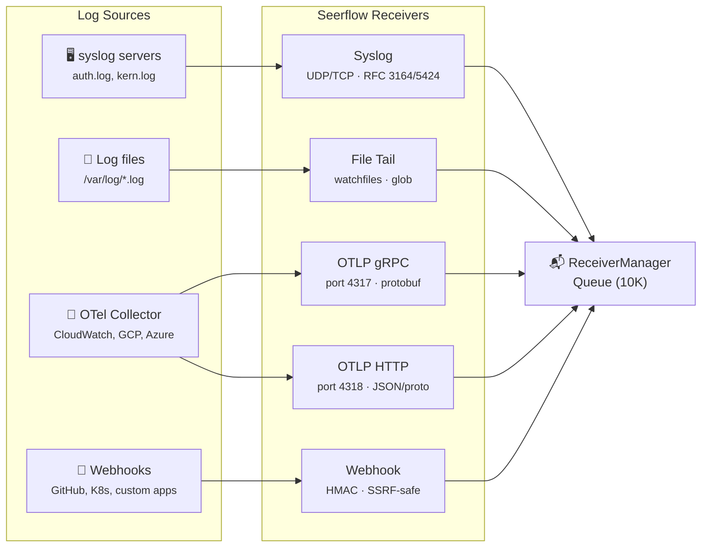

# Log Receivers

## Concept

Receivers are the boundary between external log sources and the Seerflow pipeline. Every receiver implements a simple Protocol:

```python
class Receiver(Protocol):
    async def start(self) -> None: ...
    async def stop(self) -> None: ...
    def is_healthy(self) -> bool: ...
```

All receivers produce the same output — a `RawEvent`:

```python
@dataclass(frozen=True, slots=True)
class RawEvent:
    data: bytes              # Raw log payload
    source_type: str         # "syslog", "file", "otlp_grpc", "otlp_http", "webhook"
    source_id: str           # Unique identifier for this source
    received_ns: int         # Nanosecond timestamp when received
    metadata: dict[str, Any] # Source-specific metadata (e.g., syslog severity)
```

This boundary is important: everything before `RawEvent` is protocol-specific (syslog framing, gRPC protobuf, HTTP JSON). Everything after is unified.

## Receiver Ecosystem



## How It Works

### Syslog (UDP/TCP)

Accepts standard syslog messages on configurable ports. UDP (port 514) handles high-throughput fire-and-forget sources. TCP (port 601) provides reliable delivery for critical logs.

- **Protocols:** RFC 3164 (BSD syslog) and RFC 5424 (structured syslog)
- **Implementation:** asyncio datagram protocol (UDP) and stream protocol (TCP)
- **Severity mapping:** Syslog severity (0-7) is mapped to Seerflow's unified `SeverityLevel` and stored in `metadata["seerflow_severity"]`
- **Common sources:** Linux `auth.log`, `syslog`, firewall logs, network devices

### File Tail

Monitors log files using `watchfiles` (a Rust-backed file watcher). Supports glob patterns for watching multiple files and handles log rotation automatically.

- **Implementation:** watchfiles event loop triggers reads on file changes
- **Checkpoint resume:** Tracks file position and inode; resumes from last position after restart
- **Rotation handling:** Detects file truncation/rename and reopens
- **Common sources:** Application logs, nginx access logs, Docker container logs

### OTLP gRPC

Implements the OpenTelemetry `LogsService` gRPC endpoint. This is the standard way to receive logs from an OpenTelemetry Collector, which can aggregate logs from CloudWatch, GCP Logging, Azure Monitor, and other cloud sources.

- **Implementation:** gRPC service on port 4317, protobuf → RawEvent conversion
- **TLS:** Supports TLS termination for encrypted transport
- **Common sources:** OTel Collector forwarding cloud provider logs

### OTLP HTTP

Same as OTLP gRPC but over HTTP. Some environments prefer HTTP transport (simpler firewalling, load balancer compatibility).

- **Implementation:** aiohttp route on port 4318
- **Content negotiation:** Accepts both `application/x-protobuf` and `application/json`
- **Common sources:** Same as gRPC — OTel Collector with HTTP exporter

### Webhook

A generic HTTP endpoint for receiving structured log events from any source that can send HTTP POST requests.

- **HMAC validation:** Verifies request signatures using a shared secret (configurable per endpoint)
- **SSRF protection:** Blocks requests to private IP ranges (10.x, 172.16.x, 192.168.x, 100.64.x CGNAT, loopback, link-local)
- **Field mapping:** Configurable JSON field mapping to extract message, timestamp, and metadata
- **Common sources:** GitHub webhooks, Kubernetes event hooks, custom application hooks

### ReceiverManager

The `ReceiverManager` orchestrates the lifecycle of all receivers and provides a unified event queue:

1. **Register:** `mgr.register("syslog-main", syslog_receiver)` — register receivers by source ID
2. **Start:** `await mgr.start()` — starts all receivers, returns list of any that failed
3. **Queue:** `asyncio.Queue(maxsize=10_000)` — bounded queue with backpressure
4. **Backpressure:** At 80% utilization, logs a warning. When full, `put_event()` returns `False`
5. **Consume:** `await mgr.get_event()` — blocks until an event is available or shutdown
6. **Stop:** `await mgr.stop()` — graceful shutdown of all receivers

## Configuration

### Syslog

```yaml
receivers:
  syslog_enabled: true
  syslog_udp_port: 514
  bind_addr: "0.0.0.0"
```

??? example "Full syslog configuration"

    ```yaml
    receivers:
      syslog_enabled: true
      syslog_udp_port: 514       # UDP port (0 to disable)
      syslog_tcp_port: 601       # TCP port
      syslog_tcp_enabled: true   # Enable TCP alongside UDP
      bind_addr: "0.0.0.0"       # Bind address for all receivers
    ```

### File Tail

```yaml
receivers:
  file_paths:
    - "/var/log/nginx/*.log"
    - "/var/log/auth.log"
```

??? example "Full file tail configuration"

    ```yaml
    receivers:
      file_paths:
        - "/var/log/nginx/*.log"
        - "/var/log/auth.log"
      file_checkpoint_dir: ""        # default: {data_dir}/checkpoints/
      file_debounce_ms: 1600         # debounce interval for file changes
      allowed_log_roots:             # restrict which directories can be tailed
        - "/var/log"
    ```

### OTLP (gRPC + HTTP)

```yaml
receivers:
  otlp_grpc_enabled: true
  otlp_grpc_port: 4317
  otlp_http_enabled: true
  otlp_http_port: 4318
```

??? example "Full OTLP configuration"

    ```yaml
    receivers:
      otlp_grpc_enabled: true
      otlp_grpc_port: 4317
      otlp_grpc_max_workers: 4           # gRPC thread pool size
      otlp_http_enabled: true
      otlp_http_port: 4318
      otlp_http_max_request_bytes: 4194304  # 4MB max request body
    ```

### Webhook

```yaml
receivers:
  webhook_enabled: true
  webhook_port: 8081
  webhooks:
    - path: "/ingest/k8s"
      source_id: "k8s-events"
```

??? example "Full webhook configuration"

    ```yaml
    receivers:
      webhook_enabled: true
      webhook_port: 8081
      webhooks:
        - path: "/ingest/k8s"
          source_id: "k8s-events"
          auth_header: "X-Hub-Signature-256"   # HMAC header name
          auth_token: "${WEBHOOK_SECRET}"       # HMAC secret (env var)
          field_mapping:                        # JSON field → log message mapping
            message: "object.message"
            timestamp: "object.lastTimestamp"
    ```

## Dual-Lens Example

=== "🔒 Security"

    **Syslog receiver ingesting SSH auth failures:**

    The syslog receiver on port 514 accepts UDP packets from `web-prod-01`. Each `Failed password` line becomes a `RawEvent` with `source_type="syslog"` and `metadata={"seerflow_severity": 3}` (WARNING). The ReceiverManager queues it for the parser.

    ```text
    RawEvent(
        data=b"Failed password for root from 198.51.100.23 port 44123",
        source_type="syslog",
        source_id="syslog-udp",
        received_ns=1742007247000000000,
        metadata={"seerflow_severity": 3}
    )
    ```

=== "⚙️ Operations"

    **Webhook receiver ingesting Kubernetes events:**

    The webhook receiver on port 8081 accepts a POST from the Kubernetes event forwarder. The JSON body is extracted using the configured `field_mapping`, HMAC signature is validated, and the event becomes a `RawEvent` with `source_type="webhook"`.

    ```text
    RawEvent(
        data=b"nginx-canary-7f8b9 exceeded memory limit 512Mi, OOMKilled",
        source_type="webhook",
        source_id="k8s-events",
        received_ns=1742007334000000000,
        metadata={}
    )
    ```

!!! abstract "How Seerflow Implements This"
    - **Receiver Protocol:** [`receivers/base.py`](https://github.com/seerflow/seerflow/blob/main/src/seerflow/receivers/base.py) — `Receiver` Protocol and `RawEvent` dataclass
    - **Lifecycle manager:** [`receivers/manager.py`](https://github.com/seerflow/seerflow/blob/main/src/seerflow/receivers/manager.py) — `ReceiverManager` with backpressure queue
    - **Syslog:** [`receivers/syslog.py`](https://github.com/seerflow/seerflow/blob/main/src/seerflow/receivers/syslog.py) — UDP/TCP asyncio protocols
    - **File Tail:** [`receivers/file_tail.py`](https://github.com/seerflow/seerflow/blob/main/src/seerflow/receivers/file_tail.py) — watchfiles-based file monitoring
    - **OTLP gRPC:** [`receivers/otlp_grpc.py`](https://github.com/seerflow/seerflow/blob/main/src/seerflow/receivers/otlp_grpc.py) — gRPC LogsService
    - **OTLP HTTP:** [`receivers/otlp_http.py`](https://github.com/seerflow/seerflow/blob/main/src/seerflow/receivers/otlp_http.py) — aiohttp route
    - **Webhook:** [`receivers/webhook.py`](https://github.com/seerflow/seerflow/blob/main/src/seerflow/receivers/webhook.py) — HMAC + SSRF protection

    **Next:** [Parsing →](parsing.md) — How raw logs become structured events.
