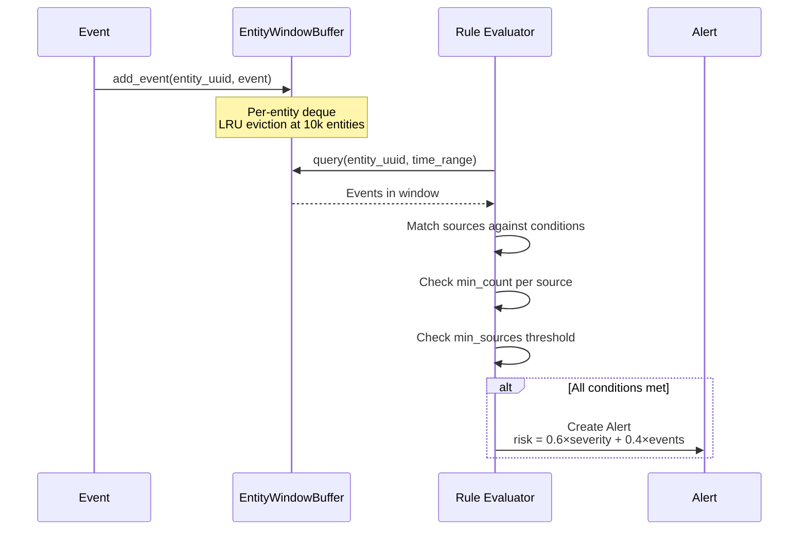

# Correlation Engine

The correlation engine joins events from multiple log sources within time windows to detect patterns that no single event reveals. Where [Sigma rules](sigma.md) match known signatures, the correlation engine finds *combinations* — an SSH brute-force from one source followed by a successful login from another, or database errors across two services converging on the same entity.

---

## Real-World Examples

!!! example "Security: Cross-Source Brute-Force with Lateral Movement"
    An attacker runs SSH brute-force against `admin` from IP `10.0.5.88`. The authentication
    log shows 50 failed attempts in 3 minutes. Then a successful login appears — but from a
    different source (`sshd` audit log, not `auth.log`). The correlation engine joins both
    sources within a 600-second window and fires: "5+ auth failures AND 1+ successful login
    for entity `admin` within 10 minutes."

    Without cross-source correlation, each log source looks unremarkable on its own — failed
    logins are common, and a single successful login is normal.

!!! example "Operations: Deployment Failure Cascade"
    After the v2.3.1 deployment, `api-gateway` starts throwing 500 errors (application logs)
    while `postgres-primary` reports connection pool saturation (database logs). The correlation
    engine detects both conditions hitting the same entity within a 5-minute window — a pattern
    that precedes OOM crashes. The combined signal fires 12 minutes before the crash.

    See the [Ops Primer](../ops-primer/ops-correlation.md) for the full deployment scenario.

---

## How It Works



Events arrive and are buffered in per-entity temporal windows. When the engine evaluates a rule, it queries the window for events within the rule's time range, filters by source type, applies regex conditions to each event, and checks whether enough sources contributed enough matching events.

**Risk score blending:** Each correlation alert gets a risk score combining rule severity (60% weight, normalized to 0-1) and event count (40% weight, capped at 10 events). This means a high-severity rule with few events still scores well, while a low-severity rule with many events also gets attention.

---

## YAML Rule Format

Correlation rules are YAML files that define what event patterns to look for and how many sources must participate.

```yaml
name: brute-force-lateral-movement        # 2-64 chars, lowercase alphanumeric + hyphens
entity_type: user                          # user | ip | host | process | file | domain
window_seconds: 600                        # Max: 604,800 (7 days)
min_sources: 2                             # At least 2 different source conditions must match
alert_severity: 5                          # 0-6 (maps to SeverityLevel enum)
description: "Brute-force followed by successful lateral movement"
mitre_tactics:                             # Optional ATT&CK context
  - credential-access
  - lateral-movement
mitre_techniques:
  - T1110
  - T1021
sources:
  - source_type: syslog                    # Log source to match
    conditions:                            # Field → regex pattern (all must match)
      message: "(?i)failed password|authentication failure"
    min_count: 5                           # At least 5 matching events
  - source_type: syslog
    conditions:
      message: "(?i)accepted\\s+(password|publickey)"
    min_count: 1                           # At least 1 successful login
```

### Field Reference

| Field | Type | Required | Validation |
|-------|------|----------|------------|
| `name` | string | Yes | 2-64 chars, `^[a-z0-9][a-z0-9-]*[a-z0-9]$` |
| `entity_type` | string | Yes | One of: `user`, `ip`, `host`, `process`, `file`, `domain` |
| `window_seconds` | int | Yes | 1 to 604,800 (7 days) |
| `min_sources` | int | No | Default: 1. Must be ≤ number of sources |
| `alert_severity` | int | Yes | 0 to 6 |
| `description` | string | No | Free text |
| `mitre_tactics` | list[string] | No | ATT&CK tactic names |
| `mitre_techniques` | list[string] | No | ATT&CK technique IDs (e.g., T1110) |
| `sources` | list | Yes | At least 1 source required |

### Source Conditions

| Field | Type | Required | Validation |
|-------|------|----------|------------|
| `source_type` | string | Yes | Non-empty |
| `conditions` | dict | No | Field name → regex pattern. Max 512 chars per pattern |
| `min_count` | int | No | Default: 1. Minimum matching events from this source |

**Valid condition fields:** `message`, `source_type`, `source_id`, `template_str`, `severity_id`, `entity_refs`, `related_ips`, `related_users`, `related_hosts`

All regex patterns are compiled and validated at load time. Invalid patterns cause the rule to be rejected with a `RuleValidationError`.

---

## Cross-Source Rules

Here's how a cross-source rule detects lateral movement by combining authentication logs with network logs:

```yaml
name: ssh-pivot-detection
entity_type: ip
window_seconds: 300
min_sources: 2
alert_severity: 5
mitre_tactics:
  - lateral-movement
sources:
  - source_type: syslog
    conditions:
      message: "(?i)accepted\\s+publickey"
    min_count: 1
  - source_type: netflow
    conditions:
      message: "(?i)dst_port=(22|2222)"
      related_ips: "10\\.0\\."
    min_count: 3
```

**How it evaluates:**

1. An event arrives for entity IP `10.0.5.88`
2. The engine queries the window for all events with that entity in the last 300 seconds
3. **Source 1 check:** Filter events where `source_type == "syslog"`, then check if `message` matches `(?i)accepted\s+publickey`. Need ≥ 1 match.
4. **Source 2 check:** Filter events where `source_type == "netflow"`, then check both conditions (`message` and `related_ips`). Need ≥ 3 matches.
5. **min_sources check:** Both sources must have enough matches. Since `min_sources: 2`, both source 1 AND source 2 must pass.
6. If all checks pass → create alert with risk score.

---

## Temporal Windows

The `EntityWindowBuffer` stores recent events per entity in bounded deques.

| Parameter | Type | Default | Description |
|-----------|------|---------|-------------|
| `window_ns` | int | — | Temporal window in nanoseconds |
| `max_events` | int | 1,000 | Per-entity event buffer size (deque maxlen) |
| `max_entities` | int | 10,000 | Maximum tracked entities |

### Memory Management

- **Per-entity deques:** Each entity gets a `deque(maxlen=max_events)`. When full, the oldest event is automatically dropped.
- **LRU entity eviction:** Entities are tracked in dict insertion order (Python 3.7+). When `max_entities` is reached, the least recently used entity is evicted. Accessing or adding events moves the entity to the end.
- **Lazy pruning:** Events older than `window_ns` are removed when queried, not on insertion. This avoids per-insert overhead.

### Memory Bounds

With defaults (10k entities, 1k events each), worst-case memory is bounded at ~10M event references. In practice, lazy pruning keeps active memory much lower since most entities have far fewer than 1,000 events in any given window.

---

## Watermarking

The `Watermark` tracks the latest event timestamp to detect late-arriving events.

| Parameter | Type | Default | Description |
|-----------|------|---------|-------------|
| `tolerance_ns` | int | — | How late an event can arrive before being flagged |

- `advance(event_time_ns)` — monotonically updates the watermark position (only moves forward)
- `is_late(event_time_ns)` — returns `True` if the event is older than `current - tolerance`
- Before the first `advance()` call, all events are considered on-time (avoids filtering during startup)

---

## Hot Reloading

The `RuleReloader` watches rule directories for changes and atomically swaps the engine without restarting the pipeline.

1. **Watch:** `watchfiles.awatch()` monitors configured directories with a Rust-based inotify backend
2. **Filter:** Only `.yml` and `.yaml` file changes trigger a reload
3. **Debounce:** 1,600ms — batches rapid saves from editors
4. **Reload:** Re-parse all YAML rules, rebuild the `CorrelationEngine`, and assign to `EngineHolder.engine`
5. **Atomic swap:** `EngineHolder` is a generic dataclass with a single `engine` field. Assignment is GIL-safe within the asyncio event loop.
6. **Fallback:** If reload fails (invalid YAML, broken regex), the old engine stays active and a warning is logged.

---

## Bundled Rules

Seerflow ships 5 built-in correlation rules:

| Rule | Entity | Window | Min Sources | Tactics |
|------|--------|--------|-------------|---------|
| `brute-force-lateral-movement` | user | 600s | 2 | credential-access, lateral-movement |
| `c2-beaconing` | ip | 1,800s | 1 | command-and-control |
| `credential-stuffing` | ip | 300s | 1 | credential-access |
| `data-exfiltration` | ip | 900s | 2 | exfiltration |
| `privilege-escalation-chain` | user | 600s | 2 | privilege-escalation |

Load them with `get_bundled_rule_dir()` — returns the path to the bundled rules directory.

---

## See Also

- [Sigma Rules](sigma.md) — pattern matching that feeds events into correlation
- [Kill Chain Tracking](kill-chain.md) — how correlation alerts accumulate tactics per entity
- [Risk Accumulation](risk-accumulation.md) — how correlation alert severity contributes to entity risk

**Next:** [Kill Chain Tracking](kill-chain.md)
