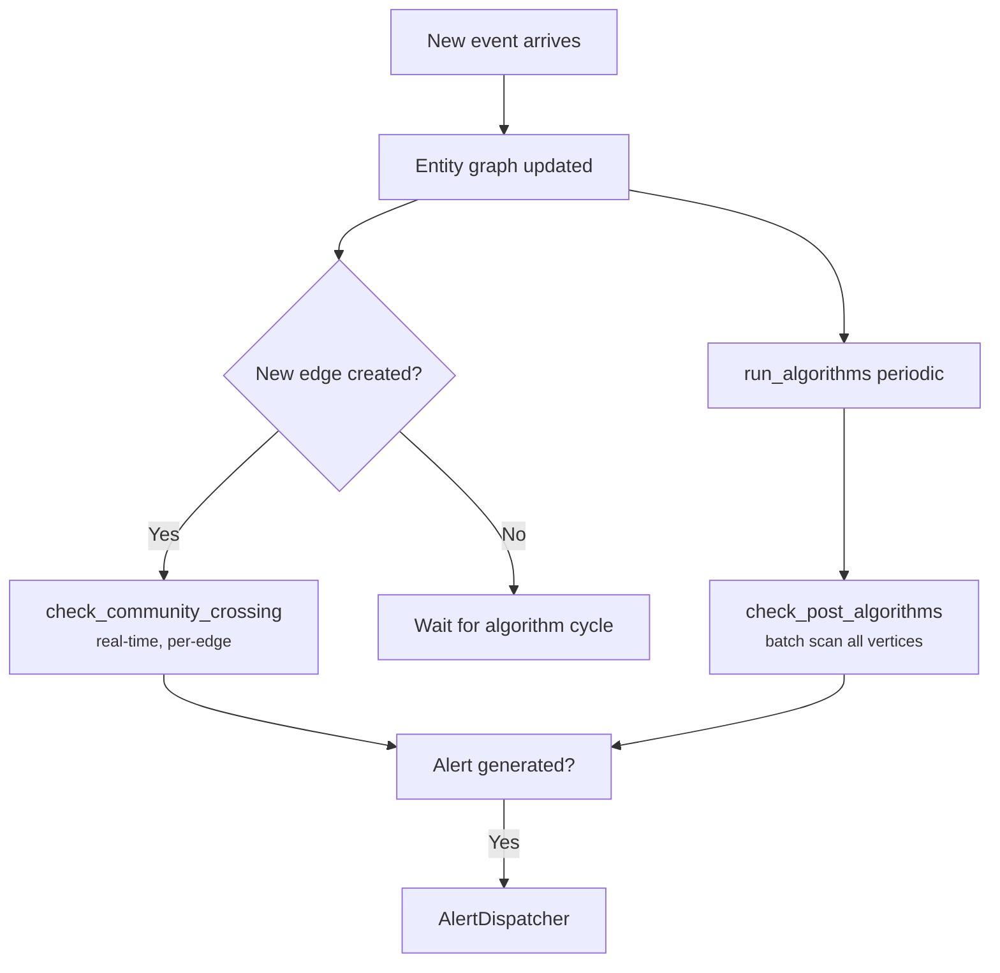

# Graph-Structural Correlation

The [entity graph](../entity-graph/index.md) captures relationships between users, IPs, hosts, and other entities. Graph-structural correlation analyzes the **shape** of that graph — community boundaries, centrality scores, connection patterns — to detect threats that individual log events can't reveal.

This page covers how graph-structural alerts flow through the correlation pipeline. For the underlying algorithms, see [Algorithms & Detection](../entity-graph/algorithms.md).

---

## How It Works

The `GraphStructuralEvaluator` runs at the correlation stage of the pipeline, after events have been parsed, entities extracted, and the entity graph updated.

### Two Evaluation Modes

**1. Per-edge (real-time):** Every time a new edge is added to the entity graph, `check_community_crossing()` fires immediately. This catches lateral movement the instant it happens — no waiting for a batch cycle.

**2. Post-algorithm (batch):** After `EntityGraph.run_algorithms()` recomputes centrality and fan-out scores, `check_post_algorithms()` scans all vertices for betweenness spikes and fan-out bursts. This runs periodically (on each algorithm refresh cycle).



---

## Detection Modes

### Community Crossing

**When:** A new edge connects entities in **different Louvain communities**.

| Field | Value |
|-------|-------|
| Alert type | `graph-community-crossing` |
| Risk score | `0.6` (fixed) |
| MITRE tactic | Lateral Movement |
| MITRE technique | [T1021 — Remote Services](https://attack.mitre.org/techniques/T1021/) |
| Dedup key | UUID5 of `community-crossing:{source_id}:{target_id}` |

**Why fixed at 0.6?** Community crossing is always moderately suspicious — it means an entity interacted with a group it hasn't been part of. But legitimate cross-team access happens (an SRE accessing a production database during an incident). The fixed score means community crossings contribute to risk accumulation without overwhelming the alert queue on their own.

### Betweenness Spike

**When:** A vertex's betweenness centrality exceeds `betweenness_threshold` after the algorithm refresh.

| Field | Value |
|-------|-------|
| Alert type | `graph-high-betweenness` |
| Risk score | `min(1.0, betweenness x betweenness_risk_multiplier)` |
| MITRE tactic | Lateral Movement |
| MITRE technique | [T1021 — Remote Services](https://attack.mitre.org/techniques/T1021/) |
| Dedup key | UUID5 of `high-betweenness:{entity_id}` |

### Fan-out Burst

**When:** A vertex's fan-out exceeds `mean + (fan_out_sigma x std_dev)` in its rolling history window, AND raw fan-out >= `fan_out_min_floor`.

| Field | Value |
|-------|-------|
| Alert type | `graph-fan-out-burst` |
| Risk score | `min(1.0, current_fan_out / max(threshold, 1.0))` |
| MITRE tactic | Lateral Movement |
| MITRE technique | [T1021 — Remote Services](https://attack.mitre.org/techniques/T1021/) |
| Dedup key | UUID5 of `fan-out-burst:{entity_id}` |

---

## Alert Deduplication

All graph-structural alerts use **UUID5 deterministic dedup keys**. The same anomaly produces the same dedup key every time, so the alert dispatcher suppresses duplicates automatically.

For example, if `alice` keeps crossing into the production community, only one `graph-community-crossing` alert is generated for the `alice → prod-db` pair until the dedup window expires.

---

## Example: Lateral Movement Detection

**Scenario:** An attacker compromises `alice`'s workstation and pivots to the production database.

**Step 1 — Normal state:**

```
Community 0 (Dev):     alice → dev-host-1, alice → dev-host-2
Community 1 (Prod):    svc-deploy → prod-db, svc-deploy → prod-app
```

Alice has never interacted with any production entity. Her community is 0.

**Step 2 — Attacker pivots:**

A new SSH session: `alice → prod-db` (10.0.0.5 → 10.1.0.50)

**Step 3 — Seerflow detects:**

1. **Community crossing:** `alice` (community 0) → `prod-db` (community 1). Alert: `graph-community-crossing`, risk = 0.6.
2. **Betweenness spike:** `alice`'s betweenness jumps from 0.02 to 0.45 (she's now a bridge between dev and prod). Alert: `graph-high-betweenness`, risk = min(1.0, 0.45 x 1.5) = 0.675.
3. **Risk accumulation:** Two graph-structural alerts on the same entity within the correlation window. Combined risk amplifies to 0.82.

**Step 4 — Alert dispatched:**

The AlertDispatcher fires a webhook with all three contributing signals, entity context, and MITRE mapping. The SOC analyst sees: *"alice crossed from dev to production community, becoming a bridge node — possible lateral movement via T1021."*

---

## Configuration Tuning

| Parameter | Default | When to raise | When to lower |
|-----------|---------|---------------|---------------|
| `graph.betweenness_threshold` | `0.3` | Too many alerts from legitimate bridge nodes (jump hosts, shared services) | Missing pivot detections |
| `graph.fan_out_sigma` | `3.0` | Noisy alerts from batch jobs or monitoring agents | Missing scanning activity |
| `graph.fan_out_history_size` | `20` | Baselines shift too slowly for your environment | Baselines are too noisy |
| `graph.fan_out_min_floor` | `5` | Small environments where 5 connections is normal | Larger networks where 5 is trivially low |
| `graph.community_crossing_risk` | `0.6` | Cross-team access is routine in your org | Security-sensitive environment with strict segmentation |

!!! tip "Tuning Strategy"
    Start with defaults. Run for a week and review the alert volume. Adjust one parameter at a time — changing multiple parameters simultaneously makes it impossible to attribute improvements or regressions.

---

## Real-World Examples

=== "Security"

    **Threat Actor Pivoting:** An attacker compromises `web-frontend`, then uses stored credentials to reach `postgres-primary`, and pivots to `redis-cache` to extract session tokens. Seerflow's entity graph detects the unusual community-crossing pattern — `web-frontend` and `redis-cache` are in different graph communities, and a single actor bridging them produces a betweenness spike.

=== "Operations"

    **Failure Propagation Through Service Dependencies:** The v2.3.1 deployment cascades through service dependencies visible in the entity graph:

    ```mermaid
    graph LR
        A[api-gateway] -->|DB queries| B[postgres-primary]
        A -->|cache reads| C[redis-cache]
        B -.->|pool exhaustion<br/>propagates back| A
        A -.->|timeout errors<br/>cascade to| C
    ```

    `api-gateway` errors cause connection pool pressure on `postgres-primary`, which in turn increases `api-gateway` latency, which cascades timeouts to `redis-cache`. Seerflow detects this through fan-out analysis — `api-gateway` suddenly has anomalous edge weights to both `postgres-primary` and `redis-cache`, a pattern that doesn't appear during normal operation. See the [Ops Primer](../ops-primer/ops-correlation.md) for the full cross-source correlation walkthrough.
