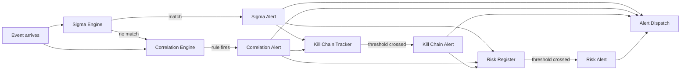

# Correlation & Threat Detection

Individual detectors (HST, Holt-Winters, CUSUM, Markov) score events one at a time. Correlation connects the dots — joining events across sources, matching known attack patterns, tracking multi-stage campaigns, and maintaining a decaying risk score per entity. This is where isolated anomalies become actionable intelligence.

---

## The Four Strategies

| Strategy | What It Does | When It Fires | Deep Dive |
|----------|-------------|---------------|-----------|
| **Sigma Rules** | Pattern-matches events against known threat signatures | An event matches a Sigma rule's logsource + detection logic | [Sigma Rules](sigma.md) |
| **Temporal Correlation** | Joins events from multiple sources within time windows | Multiple conditions across sources are met within a sliding window | [Correlation Engine](engine.md) |
| **Kill Chain Tracking** | Tracks per-entity MITRE ATT&CK tactic progression | An entity accumulates 3+ distinct tactics within 24 hours | [Kill Chain](kill-chain.md) |
| **Risk Accumulation** | Maintains a decaying risk score per entity | An entity's accumulated risk crosses the configured threshold | [Risk Accumulation](risk-accumulation.md) |

Graph-structural correlation (community crossing, betweenness spikes, fan-out bursts) operates at the entity graph layer. See [Graph-Structural Correlation](graph-structural.md).

---

## How They Work Together

Every event passes through the Sigma engine first (pattern matching is cheap). Events also enter the correlation engine's temporal windows regardless of Sigma results. Alerts from both Sigma and correlation feed into the kill chain tracker (tactic accumulation) and risk register (score decay). Each layer can independently produce alerts — they complement rather than gate each other.

---

## Reading Order

**Security focus:** Start with [Sigma Rules](sigma.md) to understand rule-based detection, then [Kill Chain](kill-chain.md) for multi-stage attack tracking, then [Risk Accumulation](risk-accumulation.md) for entity scoring.

**Operations focus:** Start with the [Correlation Engine](engine.md) to understand how cross-source events are joined, then [Risk Accumulation](risk-accumulation.md) for understanding why some entities trigger alerts over time.

**Building custom rules:** [Sigma Rules](sigma.md) → Writing Custom Rules section, then [Correlation Engine](engine.md) → YAML Rule Format section.
