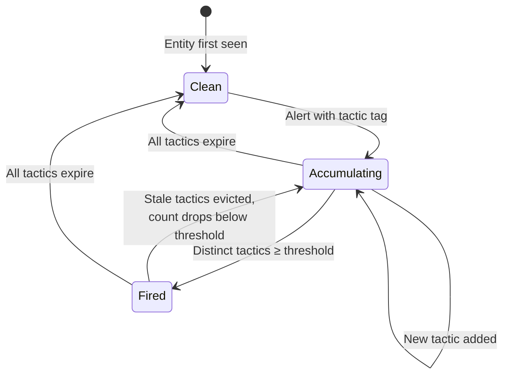

# Kill Chain Tracking

A single detection is noise. Three or more distinct ATT&CK tactics on the same entity within 24 hours is a campaign. Kill chain tracking watches for this progression: each alert's MITRE tactics are recorded per entity, and when the count crosses a threshold, a high-severity alert fires.

## Real-World Examples

=== "Security"

    **ATT&CK Tactic Progression:** An attacker moves through reconnaissance (port scanning) → initial access (SSH brute-force) → lateral movement (internal SSH pivots) → exfiltration (large outbound transfer). Seerflow tracks each tactic per-entity and fires a kill chain alert when three or more stages are observed for the same actor within the correlation window.

=== "Operations"

    **Failure Cascade Chain:** The v2.3.1 deployment triggers a failure chain that mirrors a kill chain progression — each stage escalates severity:

    | Time | Stage | Signal |
    |------|-------|--------|
    | T+0  | **Deploy** | New image `api-gateway:v2.3.1` rolled out |
    | T+12 | **Error spike** | 500 error rate jumps from 1% to 8% (CUSUM change point) |
    | T+18 | **Resource exhaustion** | `postgres-primary` connection pool saturated (Sigma rule) |
    | T+30 | **Crash** | `api-gateway` pod OOM killed (HST + system log anomaly) |

    Seerflow tracks this as an operational kill chain: each stage accumulates risk score on the `api-gateway` entity. By T+18, the combined score crosses the alert threshold — 12 minutes before the OOM crash. See the [Ops Primer](../ops-primer/ops-correlation.md) for the full entity graph view.

## Theory

### The Kill Chain Model

The Cyber Kill Chain describes stages from reconnaissance → initial access → execution → persistence → privilege escalation → defense evasion → credential access → discovery → lateral movement → collection → command and control → exfiltration → impact. Seerflow tracks 14 MITRE ATT&CK tactics, one for each stage an attacker (or failing system) might pass through. Each tactic is counted once per entity — deduplication means the threshold measures *breadth* of attack, not *volume*. An attacker who triggers 50 alerts in the `reconnaissance` category still counts as only 1 distinct tactic.

### Why a Threshold?

The threshold translates raw tactic counts into an actionable severity signal:

| Distinct Tactics | Interpretation |
|-----------------|----------------|
| 1 | Normal — single-category noise |
| 2 | Possible — worth watching but common in false positives |
| **3+** | **Likely campaign** — an entity showing reconnaissance AND credential access AND lateral movement is rarely coincidence |

The default threshold of 3 balances sensitivity with noise — low enough to catch early-stage campaigns, high enough to suppress isolated false positives.

## Seerflow Implementation

### KillChainTracker

The tracker maintains an `OrderedDict` of entities, each mapping to a set of `(tactic, timestamp)` pairs. When `record_alert()` is called, the tracker executes five steps in order: (1) evict any tactics whose timestamps fall outside the current window, (2) add the new tactic from the incoming alert, (3) move the entity to the end of the `OrderedDict` to mark it as recently used, (4) if capacity is exceeded, evict the least-recently-used entity from the front of the dict, (5) count distinct tactics and check against the threshold — if the count meets or exceeds the threshold and the entity has not already fired, emit a kill chain alert and mark the entity as fired.

### Dedup and Re-firing

Once an entity fires a kill chain alert, it is added to `_fired_entities` so that continued accumulation on the same campaign does not produce a flood of repeated alerts. An entity can fire again only after stale eviction removes enough tactics to drop the count below the threshold, which also resets the fired flag. For example: entity accumulates tactics A, B, C → fires at count 3 → 24 hours pass → tactic A expires → count drops to 2 → fired flag resets → entity receives a new tactic D → count is now 3 (B, C, D) → fires again, representing the detection of a resumed or ongoing campaign.

### Eviction

- **Tactic eviction:** Tactics older than `window_seconds` (default: 86,400 s / 24h) are removed from an entity's set the next time that entity is accessed.
- **Entity eviction:** When the tracker reaches `max_entities` capacity (default: 10,000), the least-recently-used entity is evicted via `OrderedDict.popitem(last=False)`, freeing memory without discarding active targets.
- **Tactic cap:** A maximum of 14 distinct tactics can be recorded per entity, matching the total number of ATT&CK tactics. Any tactic beyond that cap is silently dropped — the entity has already fired and this bound prevents unbounded set growth.

## Configuration

| Parameter | Type | Default | Description |
|-----------|------|---------|-------------|
| `enabled` | bool | `true` | Enable/disable kill chain tracking |
| `tactic_threshold` | int | `3` | Distinct tactics required to fire alert |
| `window_seconds` | int | `86,400` (24h) | How long tactics persist before expiring |
| `max_entities` | int | `10,000` | Maximum tracked entities (LRU eviction) |

## Practical Example

The following table simulates a multi-stage attack on entity `admin@web-server-01` as Seerflow observes it in real time:

| Time | Event | Tactic | Distinct Count |
|------|-------|--------|---------------|
| T+0 | Port scan detected (Sigma rule) | `reconnaissance` | 1 |
| T+5m | SSH brute-force (correlation rule) | `credential-access` | 2 |
| T+12m | Successful SSH from new IP (Sigma rule) | `initial-access` | **3 → ALERT** |
| T+20m | Internal SSH pivot to database server | `lateral-movement` | 4 (already fired) |

At T+12m, Seerflow emits an alert with `alert_type` set to `"correlation"`, `rule_name` set to `"kill-chain-progression"`, and `severity_id` at ERROR (4). The `risk_score` is 0.6, derived from the ratio of observed tactics to a representative campaign length (3 of 5 expected stages). The `dedup_key` is `"kill-chain:admin@web-server-01"`, ensuring that the T+20m lateral-movement event, which raises the distinct tactic count to 4, is recorded internally but does not emit a second alert — the entity has already fired for this campaign window.

## See Also

- [Security Primer: ATT&CK Framework](../security-primer/iocs-entities.md) — background on MITRE tactics and techniques
- [Sigma Rules](sigma.md) — how ATT&CK tags are extracted from Sigma rules
- [Risk Accumulation](risk-accumulation.md) — how kill chain alerts feed into entity risk scores

**Next:** [Risk Accumulation](risk-accumulation.md)
