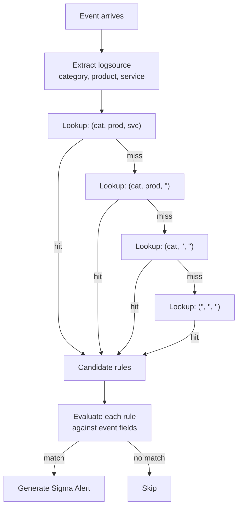

# Sigma Rules

Sigma is a vendor-neutral detection rule standard — like Snort/YARA but for logs. Seerflow compiles Sigma rules via pySigma and dispatches events through a logsource-indexed engine for O(1) rule selection.

## Real-World Examples

=== "Security"

    **SSH Brute-Force Detection:** A Sigma rule triggers when 50+ failed SSH authentication attempts originate from a single IP within 5 minutes. Seerflow's pySigma engine compiles the rule into a log filter and dispatches it via logsource-indexed routing — the rule only evaluates against `auth.log` sources, not all logs.

=== "Operations"

    **Connection Pool Exhaustion Pattern:** A custom Sigma rule detects when `postgres-primary` logs three or more `remaining connection slots are reserved` warnings within 2 minutes — a pattern that precedes full pool exhaustion and cascading request failures.

    ```
    2026-04-08 03:18:22 UTC WARNING:  remaining connection slots are reserved: active=50/50 waiting=28
    2026-04-08 03:19:22 UTC WARNING:  remaining connection slots are reserved: active=50/50 waiting=41
    2026-04-08 03:20:22 UTC WARNING:  remaining connection slots are reserved: active=50/50 waiting=55
    ```

    In the v2.3.1 deployment scenario, this Sigma rule fires at T+18 — before the OOM kill at T+30 — giving operators a window to roll back. See the [Ops Primer](../ops-primer/ops-correlation.md) for how rule-based detection combines with ML anomaly scores.

## Theory

### What Is Sigma?

Sigma is a detection rule standard for log events, designed to be portable across SIEMs and log platforms. Rules are YAML files with three sections: `logsource` (what logs to match), `detection` (field conditions), and metadata (severity, ATT&CK tags). Rules are vendor-neutral — the same rule can target Splunk, Elastic, or Seerflow by swapping the backend compiler. Seerflow uses pySigma to compile Sigma rules into its own field namespace, enabling the full SigmaHQ rule catalogue to work against `SeerflowEvent` fields without modification.

### Rule Anatomy

```yaml
title: SSH Brute Force Attempt
status: stable
level: high
logsource:
    category: authentication        # Which logs to evaluate
    product: linux
detection:
    selection:
        message|contains: "Failed password"    # Field condition
    condition: selection             # Boolean expression
tags:
    - attack.credential_access       # MITRE tactic
    - attack.t1110                   # MITRE technique
```

| Section | Field | Purpose |
|---------|-------|---------|
| `logsource` | `category`, `product`, `service` | Selects which log events this rule evaluates |
| `detection` | `selection`, `filter`, `condition` | Field conditions and boolean logic |
| `level` | `informational`, `low`, `medium`, `high`, `critical` | Severity mapping |
| `tags` | `attack.*` | MITRE ATT&CK tactic and technique IDs |

Sigma severity levels map to Seerflow's internal `SeverityLevel` enum:

| Sigma Level | Seerflow SeverityLevel | Numeric |
|-------------|----------------------|---------|
| `informational` | INFORMATIONAL | 1 |
| `low` | NOTICE | 2 |
| `medium` | WARNING | 3 |
| `high` | ERROR | 4 |
| `critical` | CRITICAL | 5 |

## Seerflow Implementation

### Logsource-Indexed Dispatch

Evaluating every Sigma rule against every event would be prohibitively expensive at scale. Seerflow pre-indexes rules by their `logsource` tuple `(category, product, service)` at load time, so dispatching an event to its candidate rules is an O(1) dict lookup rather than a linear scan. Only the rules that match the event's logsource are evaluated — a web request event never touches DNS or process rules.



The lookup cascade moves from most specific to least specific: a rule indexed at `(authentication, linux, sshd)` takes priority over one indexed at `(authentication, linux, '')`, which takes priority over `(authentication, '', '')`. This hierarchy means broad rules (e.g. "any authentication event") are still reachable, while narrow rules stay efficient.

### Field Mapping Pipeline

Sigma rules were originally designed around Windows event fields like `CommandLine`, `Image`, and `EventID`. pySigma handles the translation layer, remapping Windows-centric field names to `SeerflowEvent` fields so that existing SigmaHQ rules work without modification.

| Sigma Field | SeerflowEvent Field | Notes |
|-------------|-------------------|-------|
| `CommandLine`, `Image`, `ParentImage` | `message` | Command execution fields |
| `User`, `SourceUser`, `TargetUser` | `related_users` | Tuple field — any element matches |
| `SourceIp`, `DestinationIp`, `IpAddress` | `related_ips` | Tuple field — any element matches |
| `HostName`, `ComputerName`, `Workstation` | `related_hosts` | Tuple field — any element matches |
| `Hashes`, `FileHash`, `md5`, `sha256` | `related_hashes` | Tuple field — any element matches |
| `EventID`, `EventId` | `template_id` | Scalar field — exact match |

26 field mappings are defined in total. The `body` and `raw_event` fields are excluded from matching to avoid broad false-positive hits on unstructured text.

### Bundled Rules

Seerflow ships 63 curated SigmaHQ rules out of the box, loaded via `engine.load_bundled()` which uses `importlib.resources` to access the package-embedded rule files — no filesystem path required. Bundled loading can be disabled via `sigma.load_bundled: false` if you prefer a fully custom rule set.

| Category | Rules | Example Detections |
|----------|-------|--------------------|
| `web/` | SQL injection, XSS, SSTI, path traversal, web shells | HTTP request with `UNION SELECT` in query string |
| `dns/` | Malware domains, C2 callbacks, DNS data exfiltration | DNS query to known C2 domain |
| `process/` | Crypto mining, reverse shells, privilege escalation | `bash -i >& /dev/tcp/` pattern |
| `network/` | Suspicious network connections | Outbound to Tor exit nodes |
| `linux/` | Linux-specific detections | `chmod 4755` (SUID bit) |

### Writing Custom Rules

**1. Write the rule YAML:**

```yaml
title: Excessive Database Connection Failures
status: experimental
level: medium
description: Detects repeated database connection failures that may indicate pool exhaustion
logsource:
    category: application
    product: postgresql
detection:
    selection:
        message|contains: "connection refused"
    condition: selection
tags:
    - attack.impact
```

**2. Save to custom rules directory:** `rules/custom/db-connection-failures.yml`

**3. Configure Seerflow:**

```yaml
sigma:
  custom_rule_dirs:
    - rules/custom
```

When the engine starts, it validates each YAML file, compiles it via pySigma, and indexes the compiled rule by its logsource key. Rules that fail validation are skipped with a warning logged at startup — the rest of the rule set continues to operate normally. Only `.yml` files are discovered; other file extensions in the directory are ignored.

### Hot Reloading

Seerflow watches custom rule directories for changes using `watchfiles`. When a `.yml` file is created, modified, or deleted, `RuleReloader` triggers a full reload cycle: re-parse all rule files, re-compile via pySigma, re-index by logsource, then atomically swap the live engine via `EngineHolder`. A 1600 ms debounce prevents thrashing during bulk file operations (e.g. `git pull`). If the new engine fails to compile — due to a syntax error in a custom rule — the old engine remains active and an error is logged, ensuring continuous detection coverage.

## Configuration

| Parameter | Type | Default | Description |
|-----------|------|---------|-------------|
| `sigma.custom_rule_dirs` | `list[str]` | `[]` | Directories to scan for custom Sigma rules |
| `sigma.load_bundled` | `bool` | `true` | Whether to load the 63 bundled SigmaHQ rules |

## See Also

- [Correlation Engine](engine.md) — how Sigma alerts feed into temporal correlation
- [Kill Chain Tracking](kill-chain.md) — how Sigma ATT&CK tags drive tactic progression
- [Scoring & Attack Mapping](../detection/scoring.md) — how Sigma severity maps to risk scores

**Next:** [Correlation Engine](engine.md)
