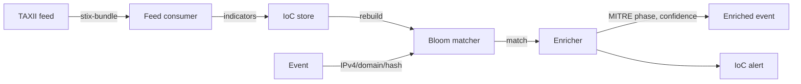

# Threat Intelligence

Seerflow consumes external threat-intelligence feeds (STIX 2.1 over
TAXII 2.1), holds the indicators in a memory-efficient Bloom filter,
and matches every ingested event against them. Matches enrich the
event with the indicator's MITRE phase and confidence, and feed the
correlation engine — so a single touch of a known-bad IP can light
up an entire entity timeline.

Threat intel is **disabled by default**. Set
[`threat_intel.enabled: true`](../reference/config.md#threat-intel) to
enable.

## Architecture



- **Consumer** — async poller, one task per feed.
- **STIX parser** — converts STIX 2.1 bundles to canonical indicators.
- **Matcher** — Bloom filter for O(1) negative lookups, with a hash
  set for positive confirmation.
- **Enricher** — annotates the event with the matched indicator's
  metadata; downgrades expired indicators.

## Supported indicator types

The Bloom matcher accepts these types by default
([`threat_intel.matcher.enabled_types`](../reference/config.md#ioc-matcher-threat_intelmatcher)):

`ipv4`, `ipv6`, `domain`, `url`, `md5`, `sha1`, `sha256`.

Restrict the set for performance or privacy by trimming the list.

## Configuring a feed

Every feed runs on its own poller. Secrets are referenced by **env-var
name only** — plaintext credentials are rejected at startup.

```yaml
threat_intel:
  enabled: true
  default_poll_interval_s: 3600       # 1 h
  request_timeout_s: 30.0
  max_indicators_per_feed: 1_000_000
  startup_jitter_s: 30                # stagger pollers on boot

  feeds:
    - id: misp-public
      url: https://misp.example.com/taxii2/
      collection_id: indicators
      poll_interval_s: 1800           # override default
      confidence_floor: 50
      auth:
        kind: api_key
        api_key_env: MISP_API_KEY
        api_key_header: Authorization

    - id: anomali-limo
      url: https://limo.anomali.com/taxii2/
      collection_id: 41
      auth:
        kind: basic
        username_env: ANOMALI_USER
        password_env: ANOMALI_PASS

  matcher:
    enabled: true
    fpr: 0.001
    min_capacity: 200_000
    capacity_growth_factor: 1.25
    enabled_types: [ipv4, domain, sha256]
```

### TLS handling

- **DNS rebinding defence:** feed URLs are resolved at request time;
  responses that resolve to private IP ranges are rejected unless
  `allow_private_addresses: true` is set on the feed entry.
- **Self-signed certificates:** rejected by default; opt in per-feed
  with `allow_insecure: true`. Avoid in production.

### Circuit breaker

Every feed wraps its HTTP client in a circuit breaker that opens after
repeated failures and falls back to the last successfully cached
indicator set. The breaker resets on the next successful poll.

## How matching works

For every ingested event:

1. The IP / domain / URL / hash fields are extracted.
2. Each candidate is hashed and probed against the Bloom filter.
3. On a positive Bloom hit, the matcher confirms via the indicator
   store (eliminates false positives from the Bloom layer).
4. On a confirmed match, the enricher attaches:
   - `ioc.indicator_id`
   - `ioc.feed_id`
   - `ioc.confidence`
   - `ioc.mitre_phase` and (when known) the mapped tactic
   - `ioc.severity` (derived from indicator severity + confidence)
5. The event flows on with these fields populated. A low-noise IoC
   alert (`alert_type = "ioc"`) is generated when the confidence
   crosses the per-feed `confidence_floor`.

The Bloom filter is rebuilt incrementally with a debounce of
`matcher.rebuild_debounce_ms` (default 200 ms) — rapid indicator
updates are coalesced rather than triggering a rebuild per event.

## Expiry

Indicators have STIX `valid_until` timestamps. Expired indicators are
kept for `threat_intel.expired_grace_days` (default 30 d) so a late
match still surfaces "expired — recent" context, then purged.

## Operations

`seerflow query alerts --type ioc` lists IoC-triggered alerts.

`GET /api/v1/stats` reports per-feed counters: `indicators_loaded`,
`last_poll_ts`, `last_error`, `bloom_capacity`, `bloom_fill`.

The dashboard surfaces feed health in the Sigma / IoC panel; failing
feeds are flagged red.

## Tuning

| Symptom | Adjustment |
|---------|-----------|
| Many false-positive Bloom hits (slow path) | Lower `matcher.fpr` (e.g. `0.0001`); accept the memory cost. |
| Out-of-memory on large feed sets | Trim `matcher.enabled_types`; raise `confidence_floor`; cap individual feeds with `max_indicators_per_feed`. |
| Slow feed startup spikes | Increase `startup_jitter_s` to stagger pollers. |
| Stale feed not refreshing | Check the circuit-breaker state in `/api/v1/stats`; inspect logs for the feed's last error. |

## Security

- All feed credentials are read from environment variables only —
  never from the config file directly.
- Indicator hashes are stored in-process; raw values stay on disk in
  the indicator store with redaction-on-export.
- The matcher refuses to accept indicators below
  `confidence_floor` on insert, limiting attack surface from
  low-quality feeds.

See [Config Reference → Threat
Intel](../reference/config.md#threat-intel) for the full configuration
table.
