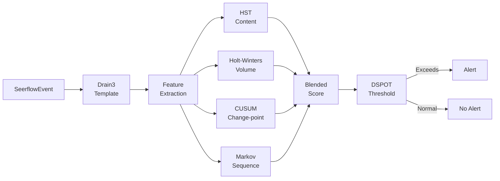

# Detection Ensemble

Seerflow runs multiple streaming ML detectors in parallel — each catching a different type of anomaly (content novelty, volume deviation, mean shifts, sequence anomalies). Their scores are blended via weighted average and tested against an adaptive EVT-based threshold.

!!! example "Security: Compromised Service Account"
    A stolen `svc-deploy` credential is used for lateral movement. Each detector catches a different aspect: HST flags novel SSH patterns, Holt-Winters catches the 3 AM volume spike, CUSUM detects the sustained auth failure shift, and Markov flags the impossible command sequence. Follow this scenario through each detector's deep-dive page to see how the ensemble provides defense in depth.

!!! example "Operations: Memory Leak Cascade"
    A v2.3.1 deploy introduces a memory leak → OOM kills → connection pool exhaustion → cascading timeouts. HST flags novel stack traces, Holt-Winters catches connection count divergence, CUSUM detects the error rate shift, and Markov flags abnormal restart sequences. Follow this scenario through each page to see how multiple signals converge.

## How It Works

Each `SeerflowEvent` is first parsed by Drain3 into a log template, then numeric features are extracted from that template and the surrounding context. Four detectors score the event **independently and in parallel** — each watching a different signal type. Their raw scores are z-score normalized using a per-detector Welford online accumulator, then combined into a single blended score via weighted average. When two or more detectors converge (all flagging elevated z-scores at the same time), the blended score is amplified — 1.5× when at least half converge, 2× when at least two-thirds converge. Finally, DSPOT applies an EVT-derived adaptive threshold to decide whether the blended score constitutes an anomaly.

## Detector Summary

| Detector | Signal Type | What It Catches | Memory | Warmup | Deep Dive |
|----------|-------------|-----------------|--------|--------|-----------|
| HST | Content | Novel patterns in feature space | ~50 KB | None (scores immediately) | [Half-Space Trees](hst.md) |
| Holt-Winters | Volume | Deviations from seasonal volume | ~12 KB | 1440 min (24 h) | [Holt-Winters](holt-winters.md) |
| CUSUM | Change-point | Sustained mean shifts | ~200 B | 30 min | [CUSUM](cusum.md) |
| Markov | Sequence | Low-probability event transitions | ~10 KB/entity | 100 events/entity | [Markov Chains](markov.md) |

DSPOT is the **threshold layer**, not a detector — it receives the blended score and applies an adaptive upper/lower threshold derived from Extreme Value Theory. See [DSPOT](dspot.md) for details.

## Model Persistence

Detector state is checkpointed periodically to `ModelStore` (every `model_save_interval_seconds`, default 300 s / 5 min). The serialization strategy differs by detector type:

- **HST** — uses a restricted pickle unpickler with an explicit allowlist. Only River's `HalfSpaceTrees` internals are allowed through; arbitrary code execution is blocked.
- **Holt-Winters, CUSUM, Markov, DSPOT** — serialized with `msgspec` to JSON. No pickle, no arbitrary code execution.

The ensemble writes a `ensemble:manifest` key last, after all individual model keys are written. On restart, the manifest is read first; if it is missing (e.g., a crash during a save), the partial data is ignored and detectors start fresh. When the manifest is present, the ensemble loads each detector's saved state and resumes online learning — no cold start, no lost history.

## Source Management

Each unique `source_type` value (e.g., `"nginx"`, `"auth"`, `"k8s-pod"`) gets its own isolated set of 4 detectors plus a DSPOT threshold. Sources are tracked in an `OrderedDict` that acts as an LRU cache:

- When `max_sources` (default **256**) is reached, the least-recently-scored source is evicted — its detectors, threshold, score windows, and associated template/entity Holt-Winters instances are all removed.
- Template-level and entity-level Holt-Winters pools have their own separate LRU limits (`max_template_hw`, `max_entity_hw`), so a single noisy source cannot crowd out all HW capacity.

**Memory budget per source (approximate):**

| Component | Per-source footprint |
|-----------|----------------------|
| HST | ~50 KB |
| Holt-Winters (source-level) | ~12 KB |
| CUSUM | ~200 B |
| DSPOT | ~8 KB |
| Markov | ~10 KB × tracked entities |

At defaults: 256 sources × ~70 KB base = **~18 MB**, plus Markov entity overhead (varies by workload).

## Scoring Pipeline

A brief overview — full detail including weights and amplification math is in [Scoring & Attack Mapping](scoring.md):

1. Each of the four detectors produces a raw score in [0, 1].
2. Raw scores are z-score normalized against their historical distribution using a per-detector Welford online accumulator. During warmup (fewer than 2 observations) the raw score is used directly.
3. Weighted average across all active (non-NaN) detectors using configurable weights (`weights_content`, `weights_volume`, `weights_pattern`, `weights_sequence`, plus `weights_template_volume` and `weights_entity_volume` for the granular HW channels).
4. **Signal amplification** when multiple detectors converge — 1.5× when ≥ half fire, 2× when ≥ two-thirds fire (minimum 2 detectors required for either multiplier).
5. DSPOT receives the amplified blended score and applies an adaptive upper/lower threshold to make the final anomaly decision.

---

**See also:**

- [Security Primer: Anomaly Detection](../security-primer/anomaly-detection.md) — background concepts behind streaming ML detection
- [Architecture: Pipeline](../architecture/pipeline.md) — where the detection ensemble fits in the broader processing pipeline
- [Configuration Reference](../reference/config.md) — all parameters controlling the ensemble
