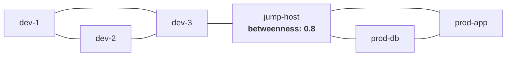
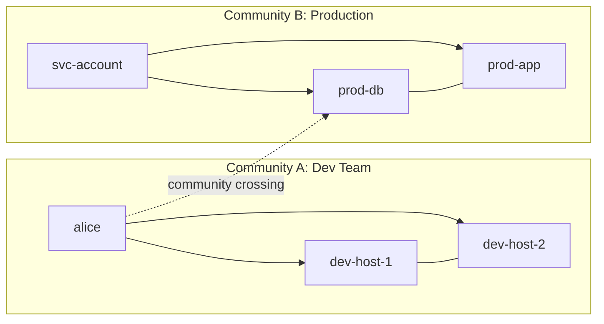

# Algorithms & Detection

Once Seerflow builds the entity graph, it runs **graph algorithms** to analyze its structure. These algorithms assign scores to each entity — centrality, community membership, connection counts — and detect anomalies when the structure deviates from established patterns.

---

## Betweenness Centrality

**What it measures:** How often a node lies on the shortest path between other nodes. High-betweenness nodes are **bridges** — removing them would disconnect parts of the graph.

**Range:** 0.0 (leaf node, not on any path) to 1.0 (sole bridge between all nodes).

In this example, `jump-host` has high betweenness because all traffic between the dev and prod communities flows through it.

### Security Meaning

A node with **suddenly high betweenness** that was previously a leaf is suspicious — it may have become a pivot point for lateral movement. An attacker who compromises a workstation and uses it to reach the production network turns that workstation into a high-betweenness bridge.

### Configuration

| Parameter | Default | Description |
|-----------|---------|-------------|
| `graph.betweenness_threshold` | `0.3` | Alert when betweenness exceeds this value |
| `graph.betweenness_risk_multiplier` | `1.5` | Risk score = `min(1.0, betweenness x 1.5)` |

---

## PageRank

**What it measures:** Node importance based on incoming connections. A node is "important" if important nodes point to it — the same algorithm Google originally used to rank web pages.

**Range:** Scores sum to approximately 1.0 across all nodes. Higher = more important.

### Security Meaning

High-PageRank entities are **high-value targets** — they're the nodes that many other entities depend on. A database server that every application connects to will have high PageRank. Anomalous activity on high-PageRank nodes deserves higher scrutiny.

---

## Community Detection (Louvain)

**What it measures:** Clusters of entities that interact more with each other than with the rest of the graph. Seerflow uses the **Louvain algorithm**, computed on an undirected, simplified view of the graph (multi-edges collapsed, self-loops removed).

### Security Meaning

Normal operations stay **within** communities — the dev team accesses dev hosts, production services talk to production databases. When an entity crosses a community boundary — a dev user suddenly accessing a production database — it signals potential **lateral movement**.

Community crossing is Seerflow's most intuitive graph-structural alert: *this entity has never interacted with that community before.*

---

## Fan-in and Fan-out

**Fan-out:** The number of unique entities a node connects **to** (outgoing edges). High fan-out means an entity is reaching many targets.

**Fan-in:** The number of unique entities connecting **to** a node (incoming edges). High fan-in means many entities are accessing the same target.

### Security Meaning

- **Fan-out burst:** A host suddenly connecting to 50 targets when its baseline is 3 → port scanning or credential spraying
- **Fan-in spike:** 20 different IPs connecting to a single host in 5 minutes → distributed brute force

### Configuration

| Parameter | Default | Description |
|-----------|---------|-------------|
| `graph.fan_out_sigma` | `3.0` | Alert when fan-out exceeds mean + (sigma x std_dev) |
| `graph.fan_out_history_size` | `20` | Rolling window size for baseline calculation |
| `graph.fan_out_min_floor` | `5` | Minimum outgoing connections before alerting |

Fan-out risk score: `min(1.0, current_fan_out / max(computed_threshold, 1.0))`

---

## Graph-Structural Anomaly Detection

Seerflow combines the algorithms above into three detection modes, all tagged with [MITRE ATT&CK T1021 (Remote Services)](https://attack.mitre.org/techniques/T1021/) under the Lateral Movement tactic:

### Community Crossing

**Trigger:** A new edge connects entities in **different Louvain communities**.

**Risk score:** Fixed at `0.6` (configurable via `graph.community_crossing_risk`) — community crossing is always moderately suspicious but not inherently critical (legitimate cross-team access does happen).

| Parameter | Default | Description |
|-----------|---------|-------------|
| `graph.community_crossing_enabled` | `true` | Enable or disable community crossing detection |
| `graph.community_crossing_risk` | `0.6` | Fixed risk score for community crossing alerts |

**Example:** User `alice` (community 0, dev team) creates an `authenticated_from` edge to `prod-db` (community 1, production). Seerflow generates a `graph-community-crossing` alert.

### Betweenness Spike

**Trigger:** A vertex's betweenness centrality exceeds `betweenness_threshold` (default 0.3) after the algorithm refresh.

**Risk score:** `min(1.0, betweenness x 1.5)` — scales with severity.

**Example:** A compromised workstation becomes a pivot point, raising its betweenness from 0.02 to 0.45. Risk score = `min(1.0, 0.45 x 1.5)` = 0.675.

### Fan-out Burst

**Trigger:** A vertex's fan-out exceeds `mean + (fan_out_sigma x std_dev)` in its rolling history window, AND the raw fan-out is at least `fan_out_min_floor` (default 5).

**Risk score:** `min(1.0, current / max(threshold, 1.0))` — scales with how far above threshold.

**Example:** `compromised-host` normally connects to 3 targets. In the last window, it connects to 18. Mean=3, std_dev=1.5, threshold = 3 + (3.0 x 1.5) = 7.5. Risk = min(1.0, 18/7.5) = 1.0.

### Alert Details

All graph-structural alerts include:

- **Deterministic dedup key:** UUID5-based, so duplicate alerts for the same anomaly are suppressed
- **MITRE mapping:** tactic = `lateral-movement`, technique = `T1021`
- **Entity context:** source and target entity IDs, relationship type
- **Timestamps:** when the anomaly was detected

For how these alerts flow through the correlation pipeline, see [Graph-Structural Correlation →](../correlation/graph-structural.md).

For the full configuration reference, see [Configuration Reference →](../reference/config.md).

---

## Interactive Entity Graph Explorer

Explore a simulated Seerflow entity graph. Click nodes to see entity details, use the dropdown to switch between scenarios, and toggle entity types with the checkboxes.

<iframe src="../assets/entity-graph-explorer.html" width="100%" height="700" style="border: 1px solid var(--md-default-fg-color--lightest); border-radius: 8px;" loading="lazy"></iframe>

**Scenarios:**

- **Normal Operations** — clean community structure, entities clustered by role
- **Lateral Movement** — attacker crosses community boundary (red highlighted edges)
- **Fan-out Burst** — compromised host scanning many targets (red highlighted node)

**Controls:** Zoom with scroll wheel, pan by dragging the background, click a node for details, use checkboxes to filter entity types.

**Next:** [Graph-Structural Correlation →](../correlation/graph-structural.md) — how graph anomalies become actionable alerts in the pipeline.
