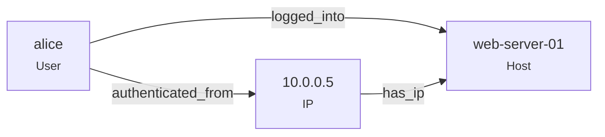

# Building the Graph

Seerflow builds its entity graph from log events in three steps: **extract** entities from each event, **resolve** them to deterministic IDs, and **infer** edges from co-occurring entities. This page covers each step.

---

## Entity Types

Seerflow recognizes six entity types. Each maps to a struct in the codebase and a UUID5 namespace for deterministic ID generation.

| Type | Example | Canonical Form | UUID5 Namespace |
|------|---------|----------------|-----------------|
| **User** | `alice`, `CORP\admin` | lowercase, domain-normalized | `a1b2c3d4-0001-...` |
| **IP** | `10.0.0.5`, `2001:db8::1` | normalized string | `a1b2c3d4-0002-...` |
| **Host** | `web-server-01` | lowercase FQDN | `a1b2c3d4-0003-...` |
| **Process** | `sshd (pid 1234)` | `name:pid:host` | `a1b2c3d4-0004-...` |
| **File** | `/etc/passwd` | absolute path | `a1b2c3d4-0005-...` |
| **Domain** | `evil-c2.example.com` | lowercase, no trailing dot | `a1b2c3d4-0006-...` |

### Deterministic IDs with UUID5

Every entity gets a **deterministic UUID** — the same entity always produces the same ID, regardless of which log source it appears in or when it's seen. This is how Seerflow correlates across sources.

The formula is simple:

```
entity_id = uuid5(namespace_for_type, canonical_form)
```

For example, user `alice` always produces:

```
uuid5(NS_USER, "alice") → always the same UUID
```

This means when `alice` appears in an SSH log, a sudo log, and a web access log, all three events link to the same graph node.

### Username Normalization

Windows-style (`CORP\admin`) and email-style (`admin@corp.local`) usernames resolve to the same identity. Seerflow strips the domain prefix/suffix and lowercases:

- `CORP\Admin` → `admin`
- `admin@corp.local` → `admin`
- `Admin` → `admin`

### Entity Attributes

Each entity type carries additional attributes beyond its ID:

- **User:** domain, email, SID, UID, groups, is_service_account
- **IP:** version (4/6), is_private, is_tor_exit, ASN, geo (country/city)
- **Host:** FQDN, OS family, IP addresses, MAC addresses
- **Process:** PID, command line, image path, hashes, parent PID
- **File:** path, name, hashes, size, owner
- **Domain:** registrar, creation date, is_dga (domain generation algorithm)

---

## Edge Inference

When an event mentions multiple entities, Seerflow **infers edges** between them. A single log line can create multiple edges.

### Example: SSH Login

The log line:

```
Failed password for alice from 10.0.0.5 port 22 on web-server-01
```

Contains three entities: user `alice`, IP `10.0.0.5`, host `web-server-01`. Seerflow creates three edges:



### Relationship Types

The full set of edge types, defined in the `EDGE_TYPE_MAP`:

| Source Type | Target Type | Relationship |
|-------------|-------------|-------------|
| User | IP | `authenticated_from` |
| User | Host | `logged_into` |
| IP | Host | `has_ip` |
| User | File | `accessed` |
| IP | Domain | `resolved_to` |
| Process | Process | `spawned_by` |

Edges are bidirectional in lookup — if an event has (IP, User), Seerflow checks both (ip, user) and (user, ip) in the map.

!!! note "Core Set"
    The `EDGE_TYPE_MAP` above shows the relationship types currently implemented in `edges.py`. Additional relationship types (e.g., host-to-process, process-to-file) may be inferred by custom rules or future extensions. The [interactive explorer](algorithms.md#interactive-entity-graph-explorer) includes illustrative relationship types beyond this core set.

### Edge Deduplication

The same edge can be inferred from many events. Rather than creating duplicate edges, Seerflow **merges** them:

- `first_seen` = earliest timestamp across all events
- `last_seen` = latest timestamp across all events
- `event_count` = total number of events that produced this edge

This means a single edge between `alice` and `web-server-01` might represent hundreds of SSH sessions, with metadata showing when the first and last sessions occurred.

---

## igraph Implementation

Seerflow uses [igraph](https://igraph.org/) as its graph engine rather than the more commonly known NetworkX.

### Why igraph?

| Metric | igraph | NetworkX |
|--------|--------|----------|
| Speed | **40-250x faster** | Baseline |
| Memory per edge | **32 bytes** | ~200+ bytes |
| Community detection (10K nodes) | ~50ms | ~5 seconds |
| PageRank (10K nodes) | ~20ms | ~2 seconds |

For a streaming SIEM processing thousands of events per second, this performance difference matters. igraph is written in C with a Python binding, giving near-native performance with a Python API.

### Graph Data Structure

```python
# Seerflow's EntityGraph wraps igraph.Graph
graph = igraph.Graph(directed=True)  # directed multigraph
```

Key implementation details:

- **O(1) vertex lookup:** An internal `_vertex_map` (dict of `str → int`) maps entity UUIDs to igraph vertex indices. Adding or finding a vertex is constant time.
- **Multigraph support:** Multiple edges between the same pair of nodes are allowed if they have different `rel_type` values. A user can both `logged_into` and `accessed` the same host.
- **Edge attributes:** Each edge stores `rel_type`, `first_seen`, `last_seen`, and `event_count`.
- **Vertex attributes:** Arbitrary key-value pairs (community ID, centrality scores, risk scores) can be stored on vertices via `set_vertex_attr()`.

### Persistence

The entity graph survives restarts through export/import:

- `export_edges()` returns a list of tuples: `(source_id, target_id, rel_type, first_seen, last_seen, event_count)`
- `load()` rebuilds the graph from these tuples

This format is stored in the configured storage backend (SQLite or PostgreSQL).

**Next:** [Algorithms & Detection →](algorithms.md) — how Seerflow analyzes the graph to detect threats.
