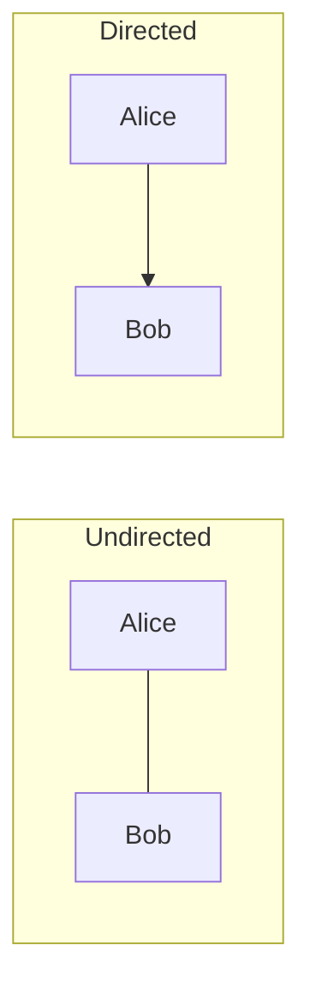

# Entity Graph

Every log line records one event: *user alice logged into web-server-01 from 10.0.0.5*. Useful, but isolated. An **entity graph** connects these events by their shared actors — users, IPs, hosts, processes, files, domains — revealing relationships that no single log line can show.

This section introduces graph theory from scratch, then shows how Seerflow builds and analyzes its entity graph to detect lateral movement, privilege escalation, and operational failure propagation.

---

## What Is a Graph?

A **graph** is a data structure made of two things:

- **Nodes** (also called vertices) — the things you care about
- **Edges** (also called links) — the relationships between them

That's it. If you can draw circles and lines between them, you have a graph.

### Real-World Analogies

| Analogy | Nodes | Edges |
|---------|-------|-------|
| Social network | People | "follows" or "friends with" |
| Road map | Cities | Roads connecting them |
| Network diagram | Hosts | Network connections |
| Org chart | Employees | "reports to" |

### Directed vs. Undirected

In an **undirected** graph, edges work both ways — if Alice is friends with Bob, Bob is friends with Alice. In a **directed** graph, edges have a direction — Alice *follows* Bob doesn't mean Bob follows Alice.

Seerflow uses a **directed** graph because relationships have direction: a user *logs into* a host, not the other way around. An IP *resolves to* a domain.

### Multigraph

A **multigraph** allows multiple edges between the same pair of nodes. This matters because a user might both *log into* a host AND *access a file on* that host — two different relationships between the same entities.

Seerflow's entity graph is a **directed multigraph**: edges have direction, and multiple edge types can exist between any two nodes.

---

## Why Graphs Matter for Security

A single log line tells you:

> *User alice logged into web-server-01 from 10.0.0.5.*

A graph tells you:

> *User alice logged into web-server-01, which shares an IP with db-primary, where a privileged process just spawned a reverse shell. Alice's account has never connected to db-primary before, and the IP 10.0.0.5 is in a different network community than her usual workstation.*

The graph connects the dots. Individual events are data points; the graph reveals **patterns** — lateral movement, privilege escalation, data exfiltration — that only emerge when you see relationships across events.

### What Seerflow Builds

Seerflow constructs its entity graph in real time as events arrive. Six entity types become graph nodes:

| Entity | Example |
|--------|---------|
| **User** | `alice`, `CORP\admin`, `root` |
| **IP** | `10.0.0.5`, `2001:db8::1` |
| **Host** | `web-server-01`, `db-primary.prod` |
| **Process** | `sshd (pid 1234)` |
| **File** | `/etc/shadow` |
| **Domain** | `evil-c2.example.com` |

Edges are inferred from events — when a log line mentions a user and a host, Seerflow creates a *logged_into* edge between them. Over time, the graph grows to represent every observed relationship across all log sources.

Graph algorithms then analyze this structure: **community detection** finds clusters of entities that normally interact together, **betweenness centrality** identifies bridge nodes that connect communities, and **fan-out analysis** flags entities suddenly connecting to many targets. When these patterns break — a user crosses into a community they've never touched, a host's betweenness spikes — Seerflow generates alerts.

**Next:** [Building the Graph →](construction.md) — how Seerflow creates entities and infers edges from log events.
