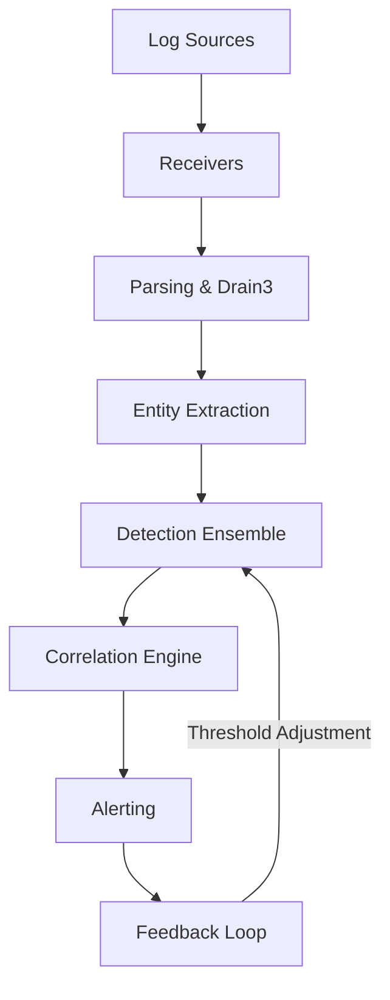

# Welcome to the Seerflow Guide

**Seerflow** is a streaming, entity-centric log intelligence agent that detects operational failures and security threats across log sources. It combines traditional ML for bulk detection with LLMs for edge cases and root cause analysis.

*See what single sources can't.*

---

## Who is this guide for?

!!! tip "Choose your path"

    === "Security Operator"

        Deploying or tuning Seerflow? Go here:

        1. [Architecture](architecture/index.md) — pipeline and data flow
        2. [Detection Deep Dives](detection/index.md) — understand each detector
        3. [Tuning Guide](operations/tuning.md) — reduce false positives
        4. [Configuration Reference](reference/config.md) — every parameter

    === "SRE / DevOps"

        Running infrastructure and want log intelligence?

        1. [Ops Primer](ops-primer/index.md) — operational intelligence concepts
        2. [Architecture](architecture/index.md) — how Seerflow processes logs
        3. [Detection](detection/index.md) — anomaly detection for ops patterns
        4. [Tuning Guide](operations/tuning.md) — reduce noise, focus on real issues

---

## How Seerflow Works

| Component | Purpose |
|-----------|---------|
| **Receivers** | Ingest logs from syslog, files, OTLP, webhooks |
| **Parsing** | Drain3 template extraction, field normalization |
| **Entity Extraction** | Identify IPs, users, hosts, processes, files, domains |
| **Detection Ensemble** | HST, Holt-Winters, CUSUM, Markov, DSPOT thresholds |
| **Correlation** | Sigma rules, temporal windows, kill chain, graph analysis |
| **Alerting** | Webhooks (Slack, Teams, PagerDuty), dedup, feedback |

---

## Guide Structure

Every concept page follows a three-layer structure:

1. **Theory** — what it is, why it matters
2. **Seerflow Implementation** — how it's built, code references
3. **Practical Examples** — real scenarios, config samples, expected output

---

## Source Code

Seerflow is open source: [github.com/seerflow/seerflow](https://github.com/seerflow/seerflow)
