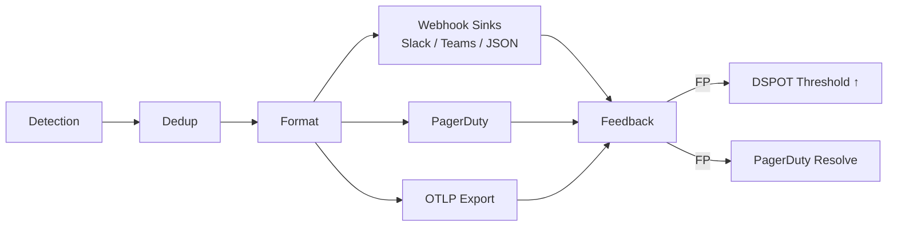
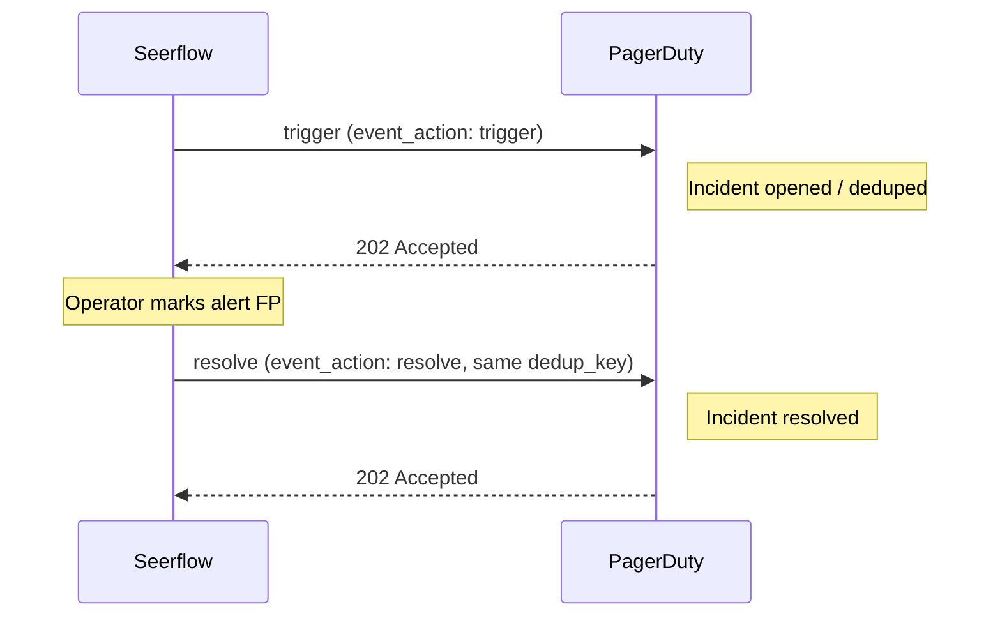

# Alerting & Feedback

This page explains how Seerflow generates alerts, delivers them to configured sinks, and refines detection thresholds through operator feedback. For the full list of alerting parameters, see the [Configuration Reference](../reference/config.md#alerting).

---

## Alert Lifecycle

Every alert passes through five stages before reaching an operator and, when marked as a false positive, feeds back into the detection layer.



| Stage | What happens |
|---|---|
| **Detection** | A detector (HST, Holt-Winters, CUSUM, Markov, or Sigma) produces a scored event that crosses its DSPOT upper threshold. |
| **Dedup** | A composite dedup key (`alert_type:rule_name:entity_uuid`) collapses repeated firings into a single alert, incrementing `dedup_count`. |
| **Format** | The alert is serialised into one or more target-specific payloads (Slack Block Kit, Teams Adaptive Card, or flat JSON). |
| **Delivery** | The `AlertDispatcher` posts to webhook targets; `PagerDutySink` triggers an incident; `OtlpSink` batches the alert as an OTel `LogRecord`. All transports share the same retry policy: 3 attempts with back-off delays of 1 s, 2 s, and 4 s. |
| **Feedback** | An operator marks the alert `tp` (true positive) or `fp` (false positive) via the CLI. An FP adjusts the DSPOT threshold and optionally auto-resolves the PagerDuty incident. |

---

## Webhook Sinks

The `AlertDispatcher` delivers alerts to one or more `WebhookTarget` entries. Each target carries a URL, a format (`slack`, `teams`, or `json`), and an optional `min_severity` integer filter (alerts with a `severity_id` below this value are silently skipped).

The dispatcher holds an internal queue capped at **10,000 alerts**. If the queue fills, incoming alerts are dropped with a `WARNING` log. Delivery uses a 10-second HTTP timeout per request.

=== "Slack"

    The Slack formatter (`format_slack`) produces a [Block Kit](https://api.slack.com/block-kit) payload. The payload structure is:

    | Block | Content |
    |---|---|
    | `header` | Severity emoji + `[SEVERITY] rule_name` |
    | `section` | `description` and `entity_value (entity_type)` |
    | `section` (fields) | Severity, Alert Type, Risk Score, Occurrences |
    | `section` (ATT&CK) | MITRE Tactics and Techniques — omitted when both are empty |
    | `context` | `alert_id` and ISO 8601 UTC timestamp |
    | `actions` | "View in Dashboard" button — omitted when `dashboard_url` is not configured |

    **Example configuration:**

    ```yaml
    alerting:
      webhooks:
        - url: "https://hooks.slack.com/services/T00000/B00000/xxxxxxxxxxxx"
          format: slack
          min_severity: 3   # WARNING and above
    ```

=== "Teams"

    The Teams formatter (`format_teams`) produces a `message/attachments` envelope containing an [Adaptive Card](https://adaptivecards.io/) (schema version 1.4). The card body contains:

    | Element | Content |
    |---|---|
    | `TextBlock` (bold) | `[SEVERITY] rule_name`, coloured by severity |
    | `TextBlock` | Alert description |
    | `FactSet` | Severity, Alert Type, Entity, Risk Score, Occurrences, Timestamp, MITRE fields (when present) |
    | `TextBlock` (subtle) | `alert_id` footer |
    | `Action.OpenUrl` | "View in Dashboard" — appended when `dashboard_url` is configured |

    Severity colours map as follows: `TRACE` → `default`, `INFORMATIONAL`/`NOTICE` → `accent`, `WARNING` → `warning`, `ERROR`/`CRITICAL`/`FATAL` → `attention`.

    **Example configuration:**

    ```yaml
    alerting:
      webhooks:
        - url: "https://your-tenant.webhook.office.com/webhookb2/..."
          format: teams
          min_severity: 0   # all severities
    ```

=== "Generic JSON"

    The JSON formatter (`format_json`) produces a flat, JSON-serialisable dict suitable for any HTTP endpoint. All fields are top-level:

    | Field | Type | Notes |
    |---|---|---|
    | `alert_id` | string | UUID |
    | `alert_type` | string | e.g. `anomaly`, `sigma` |
    | `timestamp` | string | ISO 8601 UTC |
    | `severity` | string | Uppercase enum name, e.g. `CRITICAL` |
    | `rule_name` | string | |
    | `description` | string | |
    | `entity_uuid` | string | UUID |
    | `entity_value` | string | e.g. an IP address or username |
    | `entity_type` | string | e.g. `ip`, `user` |
    | `mitre_tactics` | list[string] | Empty list when none |
    | `mitre_techniques` | list[string] | Empty list when none |
    | `risk_score` | float | |
    | `dedup_count` | int | |
    | `dashboard_url` | string | Only present when `dashboard_url` is configured |

    **Example configuration:**

    ```yaml
    alerting:
      webhooks:
        - url: "https://ingest.example.com/seerflow/alerts"
          format: json
          min_severity: 0
    ```

### HMAC Authentication

!!! note "Planned Feature"
    HMAC webhook authentication (signing the request body with a shared secret and passing the signature in a custom header) is planned for a future release. Until then, protect webhook endpoints at the network level or use token-based URL authentication built into the receiving service.

---

## OTLP Export

The `OtlpSink` exports alerts as OpenTelemetry `LogRecord` protobufs to any OTLP-compatible backend (e.g. an OpenTelemetry Collector, Grafana Cloud, or Datadog Agent).

### Transport comparison

| | gRPC (`protocol: grpc`) | HTTP (`protocol: http`) |
|---|---|---|
| **Endpoint format** | `host:port` or `http(s)://host:port` — scheme stripped automatically | Full URL, e.g. `http://host:4318` — `/v1/logs` appended automatically |
| **Content-Type** | — (protobuf over gRPC) | `application/x-protobuf` |
| **Connection** | Persistent gRPC channel, reused across batches | `aiohttp.ClientSession` created on first flush |
| **Retry on server error** | Yes — 3 attempts, delays 1 s / 2 s / 4 s | Yes — 3 attempts, delays 1 s / 2 s / 4 s |
| **Retry on client error (4xx)** | No | No |

### Severity mapping

The `_SEVERITY_MAP` table translates Seerflow's 0-6 `SeverityLevel` to OTel `SeverityNumber` and `SeverityText`:

| Seerflow level | Seerflow name | OTel SeverityNumber | OTel SeverityText |
|---|---|---|---|
| 0 | TRACE | 1 | `TRACE` |
| 1 | INFORMATIONAL | 9 | `INFO` |
| 2 | NOTICE | 10 | `INFO2` |
| 3 | WARNING | 13 | `WARN` |
| 4 | ERROR | 17 | `ERROR` |
| 5 | CRITICAL | 21 | `FATAL` |
| 6 | FATAL | 24 | `FATAL4` |

### Batching behaviour

`OtlpSink` accumulates incoming alerts in an in-memory pending list (capped at `max_pending`, default **10,000**). Every `export_interval` seconds (default **5**) the sink atomically swaps the pending list for a fresh one and serialises the batch into a single `ExportLogsServiceRequest`. A final flush is performed on shutdown before the background task exits.

If the pending list reaches `max_pending`, additional alerts are dropped with a `WARNING` log.

Each batch is wrapped in a single `ResourceLogs` / `ScopeLogs` pair. The `Resource` carries `service.name = "seerflow"` and `service.version` (read from the installed package metadata, falling back to `"dev"`).

Per-alert attributes exported on each `LogRecord`:

```
alert.id, alert.type, rule.name, entity.uuid, entity.value, entity.type,
risk.score, mitre.tactics, mitre.techniques, dedup.key, dedup.count,
contributing.event_ids
```

### Configuration example

```yaml
alerting:
  otlp_endpoint: "otel-collector:4317"     # gRPC: host:port (no scheme)
  otlp_protocol: grpc                       # "grpc" or "http"
  otlp_export_interval_seconds: 5           # seconds between batch flushes
```

!!! note "Batch buffer"
    The internal pending buffer holds up to 10,000 alerts before dropping. This is not configurable — reduce `otlp_export_interval_seconds` if you see drop warnings.

---

## PagerDuty Integration

Seerflow uses the [PagerDuty Events API v2](https://developer.pagerduty.com/docs/ZG9jOjExMDI5NTgw-events-api-v2-overview) to open and resolve incidents.

### Trigger / resolve workflow



### Routing key

Provide the **32-character hexadecimal integration key** from your PagerDuty service's Events API v2 integration page.

```yaml
alerting:
  pagerduty:
    routing_key: "a1b2c3d4e5f6a1b2c3d4e5f6a1b2c3d4"  # 32-char hex
```

!!! warning "Keep the routing key secret"
    The routing key grants the ability to open incidents on your PagerDuty service. Store it in an environment variable or a secret manager — never commit it to source control.

### Dedup key format

PagerDuty dedup keys prevent duplicate incidents for the same ongoing event. Seerflow constructs the key as:

```
{alert_type}:{rule_name}:{entity_uuid}
```

For example: `anomaly:high-request-rate:550e8400-e29b-41d4-a716-446655440000`

The same key is used in both the trigger and the resolve event, so a PagerDuty incident is correctly closed when FP feedback is submitted.

### Severity mapping

| Seerflow level | PagerDuty severity |
|---|---|
| CRITICAL (5) / FATAL (6) | `critical` |
| ERROR (4) | `error` |
| WARNING (3) / NOTICE (2) | `warning` |
| INFORMATIONAL (1) / TRACE (0) | `info` |

### Auto-resolve on FP feedback

When an alert is marked as a false positive and `pagerduty_routing_key` is configured, the feedback processor automatically sends a `resolve` event to PagerDuty using the alert's dedup key. This happens synchronously within the `process_feedback` call.

### Configuration example

```yaml
alerting:
  pagerduty:
    routing_key: "${PAGERDUTY_ROUTING_KEY}"
```

---

## Feedback Loop

Operators close the detection loop by marking alerts as true positives (TP) or false positives (FP).

### CLI usage

```bash
seerflow feedback <alert_id> tp
seerflow feedback <alert_id> fp
```

`<alert_id>` is the UUID shown in the alert payload (the `alert_id` field).

### What happens on FP

1. The alert record in storage is updated with the `fp` label.
2. If a `DetectionEnsemble` is available, the DSPOT upper threshold for the alert's source is multiplied by **1.05** (`_FP_THRESHOLD_FACTOR`). The source key is derived from the alert's `dedup_key`: for HST alerts (format `hst:{template_id}:{source_type}:{entity_uuid}`), the `source_type` at index 2 is used; for all other alert types, the `alert_type` field is used as a fallback.
3. If a PagerDuty routing key is configured, a `resolve` event is posted immediately.

!!! note "Threshold accumulation"
    Each FP multiplies the current DSPOT upper threshold by 1.05. Three consecutive FP marks on the same source raise the threshold by approximately 16% (`1.05³`), progressively suppressing noisy detectors without permanently disabling them.

### What happens on TP

The alert record in storage is updated with the `tp` label. No threshold or PagerDuty changes are made.

---

## Troubleshooting

| Symptom | Likely cause | Resolution |
|---|---|---|
| Webhook returns **400 Bad Request** | Malformed payload or incorrect endpoint URL for the chosen format | Verify `format` matches the endpoint (e.g. do not send `json` format to a Slack incoming webhook URL). Check Seerflow logs for the sanitised response body. Client errors are not retried. |
| Webhook returns **401 / 403** | Missing or invalid authentication token in the URL | Update the webhook URL with a valid token. If the service requires header-based auth, wait for the HMAC authentication feature. |
| Webhook returns **5xx** repeatedly | Downstream service is unavailable | Seerflow retries 3 times (delays 1 s / 2 s / 4 s) then logs `ERROR: all 3 retries exhausted`. Check the downstream service health. Alerts are dropped after all retries are exhausted. |
| OTLP export — **Connection refused** | OTel Collector is not running or endpoint is wrong | Verify the collector is reachable from the Seerflow host. For gRPC, confirm the endpoint is `host:4317` (no scheme) or `http://host:4317`. For HTTP, confirm the endpoint includes scheme and resolves to the `/v1/logs` path. |
| OTLP export — **batch drops logged** | `max_pending` exceeded before flush | Reduce `export_interval` to flush more frequently, or increase `max_pending`. Consider scaling up the OTel Collector if it is the bottleneck. |
| PagerDuty — **routing error / 400** | Invalid or mismatched routing key | Confirm the 32-character hex key matches the Events API v2 integration (not a REST API key). Check the PagerDuty service is active. |
| PagerDuty — **incident not resolving on FP** | `pagerduty_routing_key` not set in config | Add the `pagerduty_routing_key` to the `process_feedback` configuration so the feedback processor can send the resolve event. |
| Alert queue full — **dropping alerts** | Dispatcher queue reached 10,000 items | Seerflow logs `WARNING: Alert dispatch queue full`. Add more webhook targets, reduce detection sensitivity, or investigate why the consumer loop is stalled (check for downstream HTTP timeouts). |
