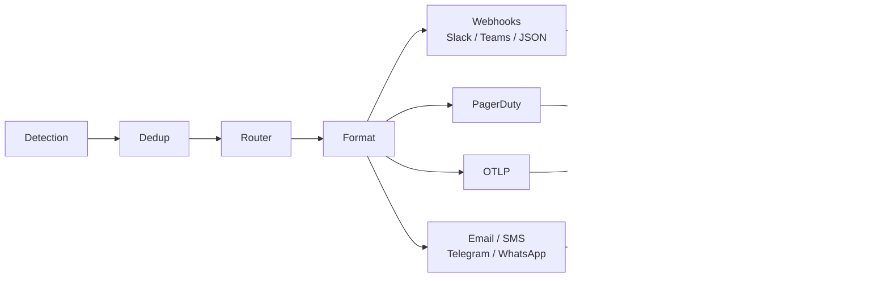
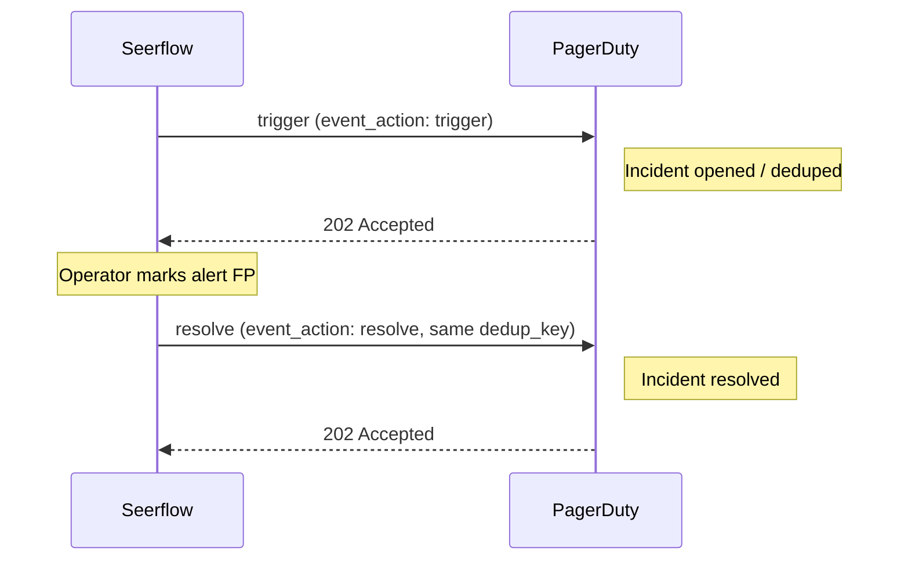

# Alerting & Feedback

This page explains how Seerflow generates alerts, delivers them to configured sinks, and refines detection thresholds through operator feedback. For the full list of alerting parameters, see the [Configuration Reference](../reference/config.md#alerting).

---

## Alert Lifecycle

Every alert passes through five stages before reaching an operator and, when marked as a false positive, feeds back into the detection layer.


```mermaid
flowchart LR
    A[Detection] --> B[Dedup]
    B --> R[Router]
    R --> C[Format]
    C --> D[Webhooks\nSlack / Teams / JSON]
    C --> E[PagerDuty]
    C --> F[OTLP]
    C --> M[Email / SMS\nTelegram / WhatsApp]
    D --> G[Feedback]
    E --> G
    F --> G
    M --> G
    G -->|FP| H[DSPOT Threshold ↑]
    G -->|FP| I[PagerDuty Resolve]
    G -->|TP/FP| J[Persist to store]
```

| Stage | What happens |
|---|---|
| **Detection** | A detector (HST, Holt-Winters, CUSUM, Markov, UEBA, IoC, or Sigma) produces a scored event that crosses its DSPOT upper threshold. |
| **Dedup** | A composite dedup key (`alert_type:rule_name:entity_uuid`) collapses repeated firings into a single alert, incrementing `dedup_count`. |
| **Router** | The `NotificationRouter` evaluates `alerting.routing_rules` (first-match-wins) and picks the channels for this alert. Out-of-window severities are dropped by per-channel `quiet_hours_by_channel`. |
| **Format** | The alert is serialised into one or more channel-specific payloads (Slack Block Kit, Teams Adaptive Card, flat JSON, HTML email, SMS body, Telegram MarkdownV2, WhatsApp template). |
| **Delivery** | Each channel has an independent worker with its own rate-limit token bucket. Common retry policy: 3 attempts with back-off delays of 1 s, 2 s, 4 s. WhatsApp adds a per-target circuit breaker. |
| **Feedback** | An operator marks the alert `tp` or `fp` via the CLI, REST API, or dashboard. Feedback is **persisted** alongside the alert and feeds the DSPOT threshold adjuster, PagerDuty resolve, and the LLM Sigma rule-suggestion service. |

---

## Webhook Sinks

The `AlertDispatcher` delivers alerts to one or more `WebhookTarget` entries. Each target carries a URL, a format (`slack`, `teams`, or `json`), and an optional `min_severity` integer filter (alerts with a `severity_id` below this value are silently skipped).

The dispatcher holds an internal queue capped at **10,000 alerts**. If the queue fills, incoming alerts are dropped with a `WARNING` log. Delivery uses a 10-second HTTP timeout per request.

=== "Slack"

    The Slack formatter (`format_slack`) produces a [Block Kit](https://api.slack.com/block-kit) payload. The payload structure is:

    | Block | Content |
    |---|---|
    | `header` | Severity emoji + `[SEVERITY] rule_name` |
    | `section` | `description` and `entity_value (entity_type)` |
    | `section` (fields) | Severity, Alert Type, Risk Score, Occurrences |
    | `section` (ATT&CK) | MITRE Tactics and Techniques — omitted when both are empty |
    | `context` | `alert_id` and ISO 8601 UTC timestamp |
    | `actions` | "View in Dashboard" button — omitted when `dashboard_url` is not configured |

    **Example configuration:**

    ```yaml
    alerting:
      webhooks:
        - url: "https://hooks.slack.com/services/T00000/B00000/xxxxxxxxxxxx"
          format: slack
          min_severity: 3   # WARNING and above
    ```

=== "Teams"

    The Teams formatter (`format_teams`) produces a `message/attachments` envelope containing an [Adaptive Card](https://adaptivecards.io/) (schema version 1.4). The card body contains:

    | Element | Content |
    |---|---|
    | `TextBlock` (bold) | `[SEVERITY] rule_name`, coloured by severity |
    | `TextBlock` | Alert description |
    | `FactSet` | Severity, Alert Type, Entity, Risk Score, Occurrences, Timestamp, MITRE fields (when present) |
    | `TextBlock` (subtle) | `alert_id` footer |
    | `Action.OpenUrl` | "View in Dashboard" — appended when `dashboard_url` is configured |

    Severity colours map as follows: `TRACE` → `default`, `INFORMATIONAL`/`NOTICE` → `accent`, `WARNING` → `warning`, `ERROR`/`CRITICAL`/`FATAL` → `attention`.

    **Example configuration:**

    ```yaml
    alerting:
      webhooks:
        - url: "https://your-tenant.webhook.office.com/webhookb2/..."
          format: teams
          min_severity: 0   # all severities
    ```

=== "Generic JSON"

    The JSON formatter (`format_json`) produces a flat, JSON-serialisable dict suitable for any HTTP endpoint. All fields are top-level:

    | Field | Type | Notes |
    |---|---|---|
    | `alert_id` | string | UUID |
    | `alert_type` | string | e.g. `anomaly`, `sigma` |
    | `timestamp` | string | ISO 8601 UTC |
    | `severity` | string | Uppercase enum name, e.g. `CRITICAL` |
    | `rule_name` | string | |
    | `description` | string | |
    | `entity_uuid` | string | UUID |
    | `entity_value` | string | e.g. an IP address or username |
    | `entity_type` | string | e.g. `ip`, `user` |
    | `mitre_tactics` | list[string] | Empty list when none |
    | `mitre_techniques` | list[string] | Empty list when none |
    | `risk_score` | float | |
    | `dedup_count` | int | |
    | `dashboard_url` | string | Only present when `dashboard_url` is configured |

    **Example configuration:**

    ```yaml
    alerting:
      webhooks:
        - url: "https://ingest.example.com/seerflow/alerts"
          format: json
          min_severity: 0
    ```

### URL safety / SSRF defence

All webhook URLs are validated at startup and on each delivery:

- Scheme must be `http` or `https`.
- The host is resolved at request time and rejected if it resolves to
  a private, loopback, link-local, or reserved IP range.
- DNS rebinding is mitigated by re-resolving on each request rather
  than caching the result.

This protects against an internal SSRF when an operator with config
write access pastes a URL pointing at the host's metadata service.

### HMAC Authentication

!!! note "Planned Feature"
    HMAC webhook authentication (signing the request body with a shared secret and passing the signature in a custom header) is planned for a future release. Until then, protect webhook endpoints at the network level or use token-based URL authentication built into the receiving service.

---

## Email, SMS, Telegram, WhatsApp

Seerflow also delivers alerts directly to operator inboxes and phones.
Each channel has its own target dataclass with `min_severity`, a
token-bucket rate limiter, and credentials redacted from `repr`.

| Channel | Provider | Config key |
|---------|----------|-----------|
| Email | SMTP (STARTTLS) | `alerting.email_targets` |
| SMS | Twilio | `alerting.sms_targets` |
| Telegram | Bot API | `alerting.telegram_targets` |
| WhatsApp | WhatsApp Cloud API + pre-approved template | `alerting.whatsapp_targets` |

Each target carries a unique `name` — routing rules reference channels
by name, not by index. See
[Config Reference → Alerting](../reference/config.md#alerting) for the
full field set.

### Minimal example

```yaml
alerting:
  email_targets:
    - name: ops-email
      smtp_host: smtp.example.com
      smtp_port: 587
      use_starttls: true
      from_address: alerts@example.com
      to_addresses: [oncall@example.com]
      smtp_user: alerts
      smtp_password: ${SMTP_PASSWORD}
      max_per_minute: 30

  telegram_targets:
    - name: ops-telegram
      bot_token: ${TELEGRAM_BOT_TOKEN}
      chat_id:   ${TELEGRAM_CHAT_ID}
      min_severity: 2
```

### Header injection safety

Free-text alert fields are sanitised before being placed into email
subject lines and SMS bodies — CR / LF are stripped to block header
injection via attacker-controlled rule names.

### Circuit breaker (WhatsApp)

The WhatsApp Cloud API is rate-limited by Meta. The WhatsApp target
trips a per-target circuit breaker after a burst of failures: while
the breaker is open, alerts to that target are logged and dropped
instead of being queued (queueing during an outage would amplify the
rate-limit breach on recovery).

---

## Routing Rules

By default, every alert flows to every configured channel. **Routing
rules** override that, picking the channels for each alert based on
its type, name, entity type, and severity. The first matching rule
wins; remaining rules are skipped.

```yaml
alerting:
  routing_rules:
    - match:
        alert_type: [sigma, correlation]
        min_severity: 5            # CRITICAL+
      notify:
        - { channel: ops-sms,   mode: immediate }
        - { channel: ops-email, mode: immediate }

    - match:
        alert_type: ml             # ML-only signal, lower urgency
        min_severity: 3
      notify:
        - { channel: ops-telegram, mode: digest, digest_window_minutes: 15 }

  default_routing:
    action: notify                 # alerts matching no rule
    notify:
      - { channel: ops-email, mode: digest, digest_window_minutes: 60 }
```

| `match.*` field | Description |
|-----------------|-------------|
| `alert_type` | One or more of `ml`, `sigma`, `correlation`, `ueba`, `ioc`. |
| `rule_name` | `fnmatch` glob (case-sensitive) on the alert's rule name. |
| `entity_type` | One or more of `user`, `ip`, `host`, … |
| `min_severity` / `max_severity` | Inclusive bounds (0–6). |

`notify[].mode` is either `immediate` (deliver as soon as routed) or
`digest` (buffer for `digest_window_minutes` and deliver the batch).

### Digest mode

When a rule selects `digest` mode, alerts are accumulated per
`(rule_index, channel_name)` and flushed after the configured window.
Each channel's `deliver_digest` formatter produces a compact summary
— one message containing the N alerts in the window — to avoid
operator pager fatigue during alert storms.

### Default routing

`default_routing.action` is either `drop` (the default — silently
discard unmatched alerts) or `notify` with its own `notify` list.
`default_routing` is only accepted when `routing_rules` is non-empty.

---

## Quiet Hours

`alerting.quiet_hours_by_channel` mutes individual channels during a
UTC window:

```yaml
alerting:
  quiet_hours_by_channel:
    ops-sms:
      start: "22:00"
      end:   "07:00"        # wraps midnight
      min_severity: 5       # only suppress < CRITICAL
```

While inside the window, alerts to that channel with
`severity_id < min_severity` are dropped (and logged at INFO). When
`start > end`, the window wraps midnight.

Severities at or above `min_severity` always go through — quiet hours
never suppress true critical incidents.

---

## OTLP Export

The `OtlpSink` exports alerts as OpenTelemetry `LogRecord` protobufs to any OTLP-compatible backend (e.g. an OpenTelemetry Collector, Grafana Cloud, or Datadog Agent).

### Transport comparison

| | gRPC (`protocol: grpc`) | HTTP (`protocol: http`) |
|---|---|---|
| **Endpoint format** | `host:port` or `http(s)://host:port` — scheme stripped automatically | Full URL, e.g. `http://host:4318` — `/v1/logs` appended automatically |
| **Content-Type** | — (protobuf over gRPC) | `application/x-protobuf` |
| **Connection** | Persistent gRPC channel, reused across batches | `aiohttp.ClientSession` created on first flush |
| **Retry on server error** | Yes — 3 attempts, delays 1 s / 2 s / 4 s | Yes — 3 attempts, delays 1 s / 2 s / 4 s |
| **Retry on client error (4xx)** | No | No |

### Severity mapping

The `_SEVERITY_MAP` table translates Seerflow's 0-6 `SeverityLevel` to OTel `SeverityNumber` and `SeverityText`:

| Seerflow level | Seerflow name | OTel SeverityNumber | OTel SeverityText |
|---|---|---|---|
| 0 | TRACE | 1 | `TRACE` |
| 1 | INFORMATIONAL | 9 | `INFO` |
| 2 | NOTICE | 10 | `INFO2` |
| 3 | WARNING | 13 | `WARN` |
| 4 | ERROR | 17 | `ERROR` |
| 5 | CRITICAL | 21 | `FATAL` |
| 6 | FATAL | 24 | `FATAL4` |

### Batching behaviour

`OtlpSink` accumulates incoming alerts in an in-memory pending list (capped at `max_pending`, default **10,000**). Every `export_interval` seconds (default **5**) the sink atomically swaps the pending list for a fresh one and serialises the batch into a single `ExportLogsServiceRequest`. A final flush is performed on shutdown before the background task exits.

If the pending list reaches `max_pending`, additional alerts are dropped with a `WARNING` log.

Each batch is wrapped in a single `ResourceLogs` / `ScopeLogs` pair. The `Resource` carries `service.name = "seerflow"` and `service.version` (read from the installed package metadata, falling back to `"dev"`).

Per-alert attributes exported on each `LogRecord`:

```
alert.id, alert.type, rule.name, entity.uuid, entity.value, entity.type,
risk.score, mitre.tactics, mitre.techniques, dedup.key, dedup.count,
contributing.event_ids
```

### Configuration example

```yaml
alerting:
  otlp_endpoint: "otel-collector:4317"     # gRPC: host:port (no scheme)
  otlp_protocol: grpc                       # "grpc" or "http"
  otlp_export_interval_seconds: 5           # seconds between batch flushes
```

### Custom CA and mTLS

For private collectors signed by an internal CA, or when the
collector requires client certificates:

```yaml
alerting:
  otlp_endpoint: "otel-collector.internal:4317"
  otlp_protocol: grpc
  otlp_tls: true
  otlp_tls_ca_file: /etc/seerflow/tls/internal-ca.pem
  otlp_mtls_cert_file: /etc/seerflow/tls/seerflow.crt
  otlp_mtls_key_file:  /etc/seerflow/tls/seerflow.key
```

- `otlp_tls: null` (the default) auto-selects TLS based on protocol
  and URL scheme. Set explicitly to `true`/`false` to override.
- `otlp_tls_ca_file` adds a custom CA bundle on top of the system
  trust store.
- `otlp_mtls_cert_file` / `otlp_mtls_key_file` enable mutual TLS.
  Either both or neither must be set.

The CA, cert, and key are read **once** at sink construction.
Rotating any of them requires a process restart — matching the
behaviour of every other static-credential TLS stack (Go
`tls.Config`, OpenSSL `SSL_CTX`).

!!! note "Batch buffer"
    The internal pending buffer holds up to 10,000 alerts before dropping. This is not configurable — reduce `otlp_export_interval_seconds` if you see drop warnings.

---

## PagerDuty Integration

Seerflow uses the [PagerDuty Events API v2](https://developer.pagerduty.com/docs/ZG9jOjExMDI5NTgw-events-api-v2-overview) to open and resolve incidents.

### Trigger / resolve workflow


```mermaid
sequenceDiagram
    participant S as Seerflow
    participant PD as PagerDuty

    S->>PD: trigger (event_action: trigger)
    Note right of PD: Incident opened / deduped
    PD-->>S: 202 Accepted

    Note over S: Operator marks alert FP
    S->>PD: resolve (event_action: resolve, same dedup_key)
    Note right of PD: Incident resolved
    PD-->>S: 202 Accepted
```

### Routing key

Provide the **32-character hexadecimal integration key** from your PagerDuty service's Events API v2 integration page.

```yaml
alerting:
  pagerduty_routing_key: "a1b2c3d4e5f6a1b2c3d4e5f6a1b2c3d4"  # 32-char hex
```

!!! warning "Keep the routing key secret"
    The routing key grants the ability to open incidents on your PagerDuty service. Store it in an environment variable or a secret manager — never commit it to source control.

### Dedup key format

PagerDuty dedup keys prevent duplicate incidents for the same ongoing event. Seerflow constructs the key as:

```
{alert_type}:{rule_name}:{entity_uuid}
```

For example: `anomaly:high-request-rate:550e8400-e29b-41d4-a716-446655440000`

The same key is used in both the trigger and the resolve event, so a PagerDuty incident is correctly closed when FP feedback is submitted.

### Severity mapping

| Seerflow level | PagerDuty severity |
|---|---|
| CRITICAL (5) / FATAL (6) | `critical` |
| ERROR (4) | `error` |
| WARNING (3) / NOTICE (2) | `warning` |
| INFORMATIONAL (1) / TRACE (0) | `info` |

### Auto-resolve on FP feedback

When an alert is marked as a false positive and `pagerduty_routing_key` is configured, the feedback processor automatically sends a `resolve` event to PagerDuty using the alert's dedup key. This happens synchronously within the `process_feedback` call.

### Configuration example

```yaml
alerting:
  pagerduty_routing_key: ${PAGERDUTY_ROUTING_KEY}
```

---

## Feedback Loop

Operators close the detection loop by marking alerts as true positives (TP) or false positives (FP). Feedback can be submitted via the CLI, the REST API, or the dashboard — all three paths land in the same persisted feedback record.

### Submitting feedback

```bash
# CLI
seerflow feedback <alert_id> tp
seerflow feedback <alert_id> fp --note "Scheduled maintenance"
```

```bash
# REST API
curl -X POST http://localhost:8080/api/v1/alerts/<alert_id>/feedback \
     -H 'content-type: application/json' \
     -d '{"feedback":"fp","note":"Scheduled maintenance","origin":"console"}'
```

`<alert_id>` is the UUID shown in the alert payload (the `alert_id` field).

### What is persisted

Every feedback submission is appended to a per-alert audit log
(retrievable via `GET /api/v1/alerts/{id}/feedback`):

| Field | Description |
|-------|-------------|
| `feedback` | `tp` or `fp` |
| `note` | Free-text operator note (optional) |
| `origin` | `cli`, `api`, `console`, or other caller identifier |
| `timestamp_ns` | Submission time |
| `analyst_id` | Resolved from the auth layer when present |

Persistence has two downstream effects:

- **DSPOT threshold adjustment** — see below.
- **LLM rule-suggestion eligibility** — once an alert pattern
  accumulates ≥ `llm.rule_suggestion_min_tp` TPs, that pattern is
  eligible for [Sigma rule drafting](../detection/llm.md#sigma-rule-suggestion).

### What happens on FP

1. The feedback record is persisted.
2. If a `DetectionEnsemble` is available, the DSPOT upper threshold
   for the alert's source is multiplied by **1.05**
   (`_FP_THRESHOLD_FACTOR`). The source key is derived from the
   alert's `dedup_key`: for HST alerts (format
   `hst:{template_id}:{source_type}:{entity_uuid}`), the
   `source_type` at index 2 is used; for all other alert types, the
   `alert_type` field is used as a fallback.
3. The threshold cannot grow without bound — `detection.dspot_threshold_cap_multiplier` (default `5.0`) caps the maximum factor over the calibrated baseline, so repeated FPs can never silently disable a detector.
4. If a PagerDuty routing key is configured, a `resolve` event is posted immediately for that alert's dedup key.

!!! note "Threshold accumulation"
    Each FP multiplies the current DSPOT upper threshold by 1.05. Three consecutive FP marks on the same source raise the threshold by approximately 16% (`1.05³`), progressively suppressing noisy detectors. The cap multiplier ensures the threshold never exceeds `5.0×` the calibrated baseline.

### What happens on TP

The feedback record is persisted. No threshold or PagerDuty changes are made. If the alert's pattern accumulates enough TPs, an LLM Sigma rule suggestion may be drafted on the operator's next visit to the **Rule Suggestions** tab.

---

## Troubleshooting

| Symptom | Likely cause | Resolution |
|---|---|---|
| Webhook returns **400 Bad Request** | Malformed payload or incorrect endpoint URL for the chosen format | Verify `format` matches the endpoint (e.g. do not send `json` format to a Slack incoming webhook URL). Check Seerflow logs for the sanitised response body. Client errors are not retried. |
| Webhook returns **401 / 403** | Missing or invalid authentication token in the URL | Update the webhook URL with a valid token. If the service requires header-based auth, wait for the HMAC authentication feature. |
| Webhook returns **5xx** repeatedly | Downstream service is unavailable | Seerflow retries 3 times (delays 1 s / 2 s / 4 s) then logs `ERROR: all 3 retries exhausted`. Check the downstream service health. Alerts are dropped after all retries are exhausted. |
| OTLP export — **Connection refused** | OTel Collector is not running or endpoint is wrong | Verify the collector is reachable from the Seerflow host. For gRPC, confirm the endpoint is `host:4317` (no scheme) or `http://host:4317`. For HTTP, confirm the endpoint includes scheme and resolves to the `/v1/logs` path. |
| OTLP export — **batch drops logged** | `max_pending` exceeded before flush | Reduce `export_interval` to flush more frequently, or increase `max_pending`. Consider scaling up the OTel Collector if it is the bottleneck. |
| PagerDuty — **routing error / 400** | Invalid or mismatched routing key | Confirm the 32-character hex key matches the Events API v2 integration (not a REST API key). Check the PagerDuty service is active. |
| PagerDuty — **incident not resolving on FP** | `pagerduty_routing_key` not set in config | Add the `pagerduty_routing_key` to the `process_feedback` configuration so the feedback processor can send the resolve event. |
| Alert queue full — **dropping alerts** | Dispatcher queue reached 10,000 items | Seerflow logs `WARNING: Alert dispatch queue full`. Add more webhook targets, reduce detection sensitivity, or investigate why the consumer loop is stalled (check for downstream HTTP timeouts). |
