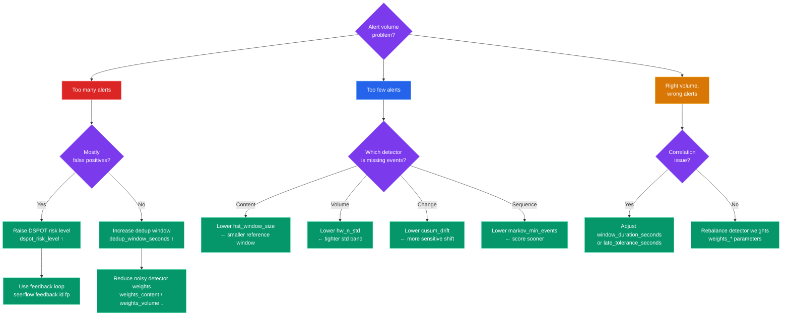

# Tuning Guide

This page helps operators systematically reduce false positives, recover missed detections, and control resource usage. Start with the decision flowchart to identify which lever to pull, then consult the relevant section for parameter details.

---

## Decision Flowchart



---

## Flowchart Walkthrough

### Too Many Alerts — Mostly False Positives

The DSPOT algorithm sets anomaly thresholds automatically using extreme-value theory. Its sensitivity is controlled by `detection.dspot_risk_level`, which is the tail-probability cutoff (default `0.0001`, meaning 1-in-10,000 chance of a legitimate value exceeding the threshold). Raising this to `0.001` or higher makes the threshold more permissive, cutting false positives at the cost of slightly reduced recall.

```yaml
detection:
  dspot_risk_level: 0.001   # was 0.0001 — 10x more permissive
```

For sustained improvement without manual threshold tinkering, use the operator feedback CLI. Marking an alert as a false positive nudges the affected detector's threshold upward by 5% for that entity:

```bash
seerflow feedback <alert-id> fp
```

Repeated feedback compounds: three FP marks on the same entity roughly doubles the threshold (1.05³ ≈ 1.16×). The adjustment persists across restarts because model state is saved to disk every `detection.model_save_interval_seconds` seconds (default 300 s).

### Too Many Alerts — Not False Positives, Just Noisy

When alerts are technically correct but operationally overwhelming (for example, a single flapping service triggering dozens of alerts), the first lever is alert deduplication. The default deduplication window is 900 seconds (15 minutes): any alert with the same dedup key within that window is suppressed.

```yaml
alerting:
  dedup_window_seconds: 1800   # extend to 30 minutes globally
```

For per-type control without changing the global default, use `dedup_window_overrides`:

```yaml
alerting:
  dedup_window_overrides:
    ssh_brute_force: 3600        # 1 hour for brute-force alerts
    disk_usage_high: 300         # 5 minutes for disk alerts
```

If noise comes from a specific detector producing high scores, reduce its blending weight. Weights are relative — only their ratios matter because the pipeline divides each weight by the sum:

```yaml
detection:
  weights_volume: 0.10    # was 0.25 — halve volume detector influence
  weights_content: 0.40   # was 0.30 — compensate with content weight
```

### Too Few Alerts

The most targeted fix is to identify which detector class is responsible for the events you are missing, then lower its sensitivity threshold. See the [Detector Tuning](#detector-tuning) section below and the per-detector deep-dive pages for details.

### Right Volume, Wrong Alerts — Correlation Issues

When individual detector scores look reasonable but correlated alerts are incorrect (for example, grouping unrelated events together, or splitting a real incident across multiple alerts), the problem is usually in the correlation time window or entity late-arrival tolerance.

Increasing `correlation.window_duration_seconds` (default 1800 s) allows more events to be grouped into the same incident. Increasing `correlation.late_tolerance_seconds` (default 30 s) accommodates clock skew between log sources.

```yaml
correlation:
  window_duration_seconds: 3600   # extend to 1 hour
  late_tolerance_seconds: 120     # tolerate up to 2 minutes of clock skew
```

If the grouping logic is sound but the wrong detectors are driving the final score, rebalance the `weights_*` parameters as described above.

---

## Detector Tuning

The table below lists common tuning goals with the exact parameter to change and the expected effect. All parameters live under the `detection:` YAML key.

| Goal | Parameter | Direction | Effect |
|------|-----------|-----------|--------|
| Catch subtle content anomalies | `hst_window_size` | Lower (e.g. 500) | Smaller reference window — HST adapts faster but may increase FPs |
| Reduce HST sensitivity on stable sources | `hst_window_size` | Raise (e.g. 2000) | Larger reference window — more stable baseline, fewer FPs |
| Tighten volume spike detection | `hw_n_std` | Lower (e.g. 2.0) | Narrower normal band — fires on smaller volume changes |
| Reduce volume alert noise | `hw_n_std` | Raise (e.g. 4.0) | Wider normal band — only fires on large spikes |
| Detect gradual drift / slow mean shift | `cusum_drift` | Lower (e.g. 0.2) | More sensitive to small persistent shifts |
| Score sequences with sparse data sooner | `markov_min_events` | Lower (e.g. 50) | Starts scoring after fewer observed events |
| Prevent noisy DSPOT thresholds early on | `dspot_calibration_window` | Raise (e.g. 2000) | Longer calibration phase before thresholds activate |

For detailed parameter semantics and worked examples, see the per-detector pages:

- [Half-Space Trees (HST)](../detection/hst.md)
- [Holt-Winters Volume](../detection/holt-winters.md)
- [CUSUM Change Detection](../detection/cusum.md)
- [Markov Sequence Scoring](../detection/markov.md)
- [DSPOT Auto-Thresholds](../detection/dspot.md)

---

## Correlation Tuning

Parameters under `correlation:` and `detection.kill_chain` / `detection.risk_*` control how events are grouped into incidents and how entity risk accumulates over time.

| Parameter | Default | Tuning Advice |
|-----------|---------|---------------|
| `correlation.window_duration_seconds` | `1800` | Increase (up to 7200) for slow-moving attacks; decrease for high-throughput environments where grouping should be tighter |
| `correlation.max_events_per_entity` | `1000` | Lower to reduce memory per active entity; raise if legitimate bursts are being truncated |
| `correlation.max_entities` | `10000` | Sets the LRU cap for active entity windows; lower in memory-constrained environments |
| `correlation.late_tolerance_seconds` | `30` | Raise to 120–300 for distributed systems with significant clock skew |
| `detection.kill_chain.tactic_threshold` | `3` | Minimum distinct ATT&CK tactics needed to trigger a kill-chain alert; lower to 2 for high-security environments, raise to 4–5 to reduce noise |
| `detection.kill_chain.window_seconds` | `86400` | Observation window for tactic progression (24 h default); raise for slow APT scenarios |
| `detection.risk_half_life_hours` | `4` | Controls how quickly accumulated risk decays; lower (e.g. 2) for fast-moving environments; raise (e.g. 12) for persistent threat tracking |
| `detection.risk_threshold` | `50.0` | Risk score at which a risk-accumulation alert fires; lower to catch earlier accumulation; raise to reduce noise from minor repeated events |

For deeper guidance see:

- [Correlation Engine](../correlation/engine.md)
- [Kill Chain Tracking](../correlation/kill-chain.md)
- [Risk Accumulation](../correlation/risk-accumulation.md)

---

## Performance Tuning

When Seerflow is under memory or CPU pressure the parameters below are the primary levers. Most have an upper bound enforced by an LRU cache that evicts the oldest entries when the limit is hit.

| Resource | Parameter | Default | Tuning Advice |
|----------|-----------|---------|---------------|
| CPU (ingestion) | `receivers.queue_maxsize` | `10000` | Lower to apply back-pressure on log sources sooner; raise (up to 50,000) on high-throughput pipelines with sufficient RAM |
| CPU (scoring) | `detection.score_interval` | `1` | Set to `N` to score every Nth event per source — `score_interval: 5` cuts scoring CPU by ~80% with minimal recall loss on high-volume sources |
| Memory (per-source models) | `detection.max_sources` | `256` | LRU cap on sources with active detector state; lower on constrained hosts |
| Memory (template Holt-Winters) | `detection.max_template_hw` | `500` | Maximum number of Drain3 templates tracked by the volume detector; lower to reduce peak RSS |
| Memory (entity Holt-Winters) | `detection.max_entity_hw` | `500` | Maximum number of entities tracked by the entity-volume detector |
| Memory (correlation entities) | `correlation.max_entities` | `10000` | LRU cap on entity correlation windows; lower when RAM is limited |
| Disk I/O (model checkpoints) | `detection.model_save_interval_seconds` | `300` | Raise to 600–1800 to reduce checkpoint write frequency; increases potential state loss on crash |

!!! tip "Monitoring eviction"
    When an LRU cache hits its capacity limit, Seerflow logs a `WARNING` message at the `seerflow.detection` or `seerflow.correlation` logger with the text `evicting oldest entry`. If you see this frequently, either raise the relevant cap or investigate whether the number of active sources/entities is unexpectedly large (possible misconfiguration or log flood). Set `log_level: DEBUG` temporarily to see eviction counts per minute.
