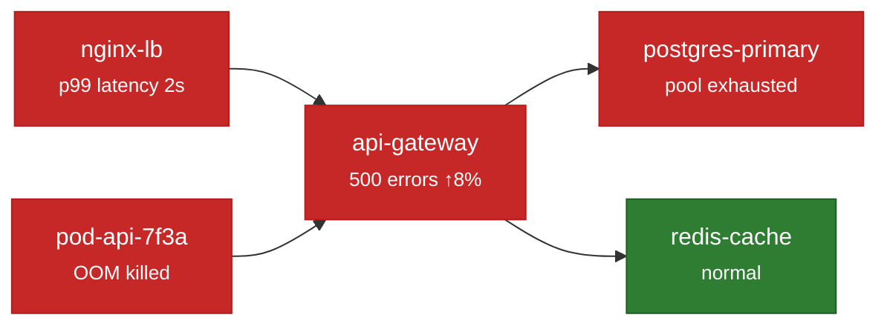
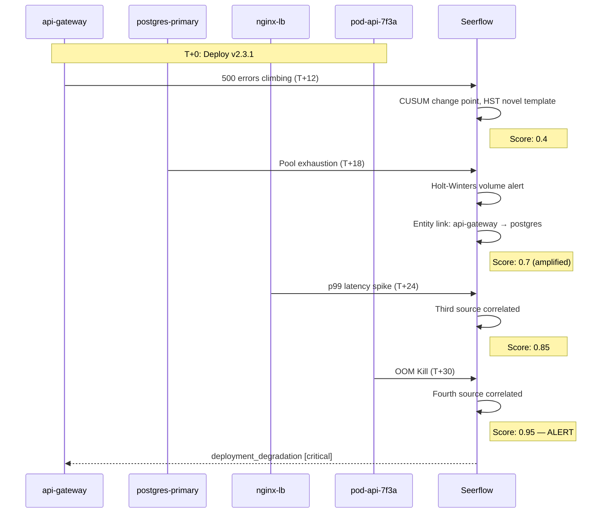

# Cross-Source Correlation for Operations

A database connection pool running dry is not just a database problem. It is usually a symptom --- of a misconfigured connection limit, a slow query holding connections open, or a sudden traffic spike from an upstream service. The database log tells you *what* happened. To understand *why*, you need the application logs, the proxy logs, and the system metrics --- all at the same time.

In the [Security Primer](../security-primer/iocs-entities.md), we showed how Seerflow links events across log sources through shared entities --- IP addresses, usernames, hostnames. The same principle applies to operational failures. The entities change (services, databases, pods, load balancers), but the mechanism is identical --- when multiple log sources mention the same entity within a time window, Seerflow connects them. Scattered symptoms become a single correlated incident.

---

## Why Single-Source Monitoring Fails

When our v2.3.1 deployment starts failing, each team sees their own slice of the problem:

- **App team:** "We're getting 500s. Looks like the database is down."
- **DBA:** "Connection pool is maxed out. Someone is holding connections open."
- **Platform team:** "Load balancer shows high latency. Must be the app."
- **SRE on-call:** "Got an OOM alert. Killing the pod and restarting."

Every team is correct about their symptom. Every team is wrong about the cause. Without cross-source correlation, the incident response looks like this:

1. The app team restarts the service. It doesn't help --- the new process hits the same connection pool ceiling.
2. The DBA increases the pool size. The error rate dips briefly, then climbs again as the larger pool fills up too.
3. The pod restarts and OOMs again within minutes.
4. Forty-five minutes of finger-pointing before someone checks the deployment history and finds that v2.3.1 introduced a connection leak.

Each team is troubleshooting in isolation, treating symptoms instead of causes. The information needed to diagnose the root cause exists --- it is just spread across four log sources that nobody is looking at simultaneously.

---

## Entity Graph for Services

Seerflow's entity graph for security connects users, IP addresses, and hostnames. For operational detection, the graph extends to **services**, **databases**, **pods**, and **network endpoints**. These are the entities that matter when infrastructure breaks.

### Entity Resolution Across Log Sources

The same database can appear under different identifiers depending on which log source recorded it. The application log might reference `10.0.1.42:5432` --- an IP and port. The database's own log comes from host `db-primary` at that same IP. The Kubernetes pod log calls it `postgres-primary-0`. Seerflow resolves all three to the same entity, the same way it resolves `web-prod-01` and `10.0.1.15` to the same host in a security investigation.

### Automatic Service Dependency Mapping

Seerflow does not require you to define a service topology upfront. It builds the dependency graph automatically from observed log data. When `api-gateway` logs show connections to `10.0.1.42:5432`, and `postgres-primary` logs come from that address, Seerflow creates an edge: `api-gateway` depends on `postgres-primary`. Over time, the graph reflects your actual runtime architecture --- not a stale diagram on a wiki.

In our v2.3.1 incident, the entity graph looks like this:



Four nodes in alert state, all connected through `api-gateway`. One node (`redis-cache`) is healthy --- which is itself useful information --- it narrows the problem to the database path. The graph makes this visible at a glance.

---

## Temporal Correlation

Shared entities are not enough. A database hiccup last Tuesday and an application error today both mention `postgres-primary`, but they are not related. Seerflow adds a second constraint: **time**.

Events from different sources that share entities and fall within a configurable **time window** (default: 30 minutes) are grouped into a single **correlation cluster**. The window slides continuously --- Seerflow does not wait for all events to arrive before correlating. Each new event is matched against existing clusters in real time. If it shares an entity with an open cluster and falls within the window, it joins the cluster and the correlation strengthens.

In our running example, the timeline fits neatly:

| Time | Source | Event | Shared Entity |
|------|--------|-------|---------------|
| T+12 min | App logs | 500 error rate climbs to 8% | `api-gateway` |
| T+18 min | DB logs | Connection pool exhaustion | `postgres-primary` -> `api-gateway` |
| T+24 min | Proxy logs | p99 latency spikes to 2s | `nginx-lb` -> `api-gateway` |
| T+30 min | System logs | OOM kill on pod | `pod-api-7f3a` -> `api-gateway` |

All four events fall within the same 30-minute window. All share the `api-gateway` -> `postgres-primary` entity link. Seerflow groups them into a single correlation cluster.

---

## From Symptoms to Root Cause

Here is the full cascade as Seerflow processes it, event by event:

**T+12 min --- Application logs.** CUSUM detects a change point in the `api-gateway` error rate --- the 500 rate shifted from a stable 1% baseline to 8%. Simultaneously, HST flags `ConnectionRefusedError` as a novel log template that has never appeared at this volume before. Seerflow opens a new correlation cluster for `api-gateway` with an initial anomaly score of **0.4**. One source, two detectors --- notable but not yet alarming.

**T+18 min --- Database logs.** Holt-Winters flags connection pool exhaustion in `postgres-primary` logs --- the active connection count exceeded the seasonal forecast by more than three standard deviations. The entity graph links `postgres-primary` to the existing `api-gateway` cluster. Two sources now agree that something is wrong along the same dependency path. The correlated score amplifies to **0.7**.

**T+24 min --- Proxy logs.** The `nginx-lb` access logs show p99 latency jumping from 200ms to 2 seconds for requests routed to `api-gateway`. Third source, same entity cluster. Score: **0.85**. The accumulation of evidence is accelerating.

**T+30 min --- System logs.** The Linux kernel OOM killer terminates `pod-api-7f3a`, which runs the `api-gateway` process. Fourth source. Score: **0.95**. Seerflow fires a critical alert.



The alert that fires contains everything the on-call engineer needs to start investigating:

```json
{
  "alert_type": "deployment_degradation",
  "severity": "critical",
  "score": 0.95,
  "root_entity": "api-gateway",
  "correlated_events": 4,
  "sources": ["app-logs", "postgres", "nginx", "syslog"],
  "timeline": {
    "first_signal": "2026-03-15T14:12:00Z",
    "alert_fired": "2026-03-15T14:30:00Z",
    "window_minutes": 18
  },
  "detectors_triggered": ["cusum", "hst", "holt_winters"],
  "suggested_action": "Check recent deployments to api-gateway"
}
```

Eighteen minutes from the first anomaly to a correlated, actionable alert --- with the root entity identified, all contributing sources listed, and a suggested starting point for investigation. Compare that to the 45-minute finger-pointing session.

---

!!! info "How Seerflow Uses This"
    Four capabilities work together to make operational correlation possible:

    - **Service-level entity graph.** The entity graph extends beyond security entities (users, IPs, hosts) to include services, databases, pods, and network endpoints. This lets Seerflow correlate across the operational domain the same way it correlates across the security domain.
    - **Temporal windowing.** Configurable sliding windows (default 30 minutes) group events that share entities and occur close together in time. The window size is tunable per environment --- a tightly coupled microservices architecture might use 10 minutes, while a batch processing pipeline might use 60.
    - **Risk accumulation.** Each correlated source amplifies the anomaly score. A single detector firing is a data point. Two detectors across two sources is a signal. Four sources is a near-certain incident. The amplification curve is configurable.
    - **Deployment correlation.** When deployment events are ingested (from CI/CD webhooks, Kubernetes audit logs, or deploy-tagged log entries), Seerflow automatically checks whether correlated anomalies fall within a deployment's risk window. If they do, the alert includes the deployment identifier and a suggested action pointing the responder to the change.

---

## You've Completed the Ops Primer

You now understand three key concepts:

1. **Failure patterns.** Operational failures leave recognizable signatures in your logs --- error rate shifts, volume anomalies, sequence violations --- that streaming ML detectors can identify in real time.
2. **Deployment risk windows.** Deployments are the single largest source of production incidents. They create windows where baselines shift and normal thresholds stop working. Seerflow monitors these windows with change-point detection tuned for post-deploy behavior.
3. **Cross-source correlation.** No single log source tells the whole story. By linking events across sources through shared entities and temporal proximity, Seerflow turns scattered symptoms into actionable root-cause alerts --- cutting incident response from 45 minutes of guesswork to 18 minutes of directed investigation.

### Ready to Go Deeper?

- [Architecture overview &rarr;](../architecture/index.md) --- how Seerflow processes logs from ingestion to alerting
- [Detection deep dives &rarr;](../detection/index.md) --- the math behind HST, CUSUM, Holt-Winters, and Markov detectors
- [Tuning guide &rarr;](../operations/tuning.md) --- reducing false positives in your environment
