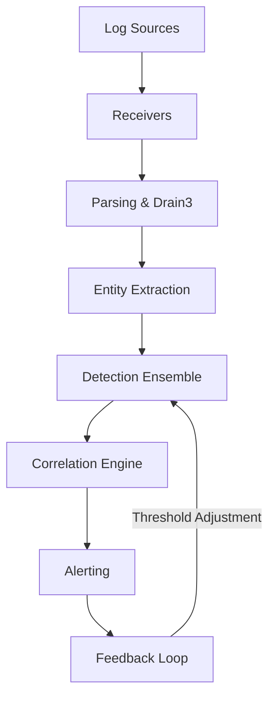

# Seerflow Guide Brand Refresh 2026 Implementation Plan

> **For agentic workers:** REQUIRED SUB-SKILL: Use superpowers:subagent-driven-development (recommended) or superpowers:executing-plans to implement this plan task-by-task. Steps use checkbox (`- [ ]`) syntax for tracking.

**Goal:** Re-skin the entire Seerflow Guide (MkDocs Material) to the 2026 brand — dark-first OKLCH ink palette, indigo accent, Geist/Geist Mono type, sharp corners, hairlines, mono eyebrows — on every page, with a rebuilt homepage, brand header chrome, and rethemed visualizations.

**Architecture:** Lean on Material's `--md-*` CSS-variable system. A new `tokens.css` holds the brand palette (OKLCH + a hex mirror for JS/canvas); `extra.css` bridges those tokens onto Material's variables and reskins every markdown construct; one minimal header-partial fork adds the brand chrome; `index.md` is rebuilt with `.sf-*` utility classes; the already-`--sf-*`-driven viz picks up brand colors from tokens.css with a few surgical JS edits.

**Tech Stack:** MkDocs Material, CSS custom properties, OKLCH color, Geist + Geist Mono (Google Fonts via Material, self-hosted by the `privacy` plugin), Jinja2 header partial override, D3 v7, Plotly.

**Spec:** `superpowers/specs/2026-05-29-brand-refresh-design.md`. **Brand source:** `~/PycharmProjects/seerflow/docs/new_image/` (`Brand System.html`, `tokens.css`, `docs.jsx`, `docs-pages.jsx`, 5 page mockups).

---

## Verification model (read first)

`seerflow-guide` is a **static MkDocs docs site with no unit-test harness** — the global TDD/coverage rules apply to application code (`src/`), not to this CSS/markup reskin. Each task's **hard gate** is something a context-free worker can run and check objectively:

- `cd /home/fflores/PycharmProjects/seerflow-guide && uv run --version >/dev/null 2>&1 || true; .venv/bin/mkdocs build --strict` exits **0** (catches bad CSS refs, YAML errors, **orphan pages**, **broken links**).
- Targeted `grep` assertions on the built `site/` output (e.g. compiled CSS contains a selector; the viz hex block contains no `oklch(`).
- **Visual QA is performed by the orchestrating agent** (not per-task subagents, which can't see a browser): after the build tasks, the main agent runs `mkdocs serve` and drives a headless browser (Playwright / agent-browser) to screenshot the homepage + one page per section in **dark and light**, comparing against the mockups. This is Task 8.

Run mkdocs via the repo venv: **`/home/fflores/PycharmProjects/seerflow-guide/.venv/bin/mkdocs`** (alias below as `$MK`). Set once per shell: `MK=/home/fflores/PycharmProjects/seerflow-guide/.venv/bin/mkdocs`.

## Conventions

- **Branch:** `feat/brand-refresh-2026` (already created off `docs/v0.5-feature-sync`). All work + commits here.
- **Never stage** `scripts/gen_viz_data.py` or `.letta/` (pre-existing, unrelated). Always `git add` explicit paths.
- **Commits:** Conventional (`feat(brand):`, `style(brand):`, `docs(brand):`, `refactor(viz):`). Attribution is disabled globally — no footer.
- All commands use absolute paths; no `cd x && y`.

## File structure (decomposition)

| File | Responsibility | Task |
|---|---|---|
| `docs/assets/stylesheets/tokens.css` *(new)* | Brand palette: OKLCH tokens + `--sf-hex-*` mirror + `--sf-*` viz vars + Geist font vars, per scheme. Single source of truth. | 1 |
| `scripts/gen_brand_hex.py` *(new)* | Dependency-free OKLCH→sRGB-hex converter that emits the `--sf-hex-*` block. | 1 |
| `mkdocs.yml` *(modify)* | Geist fonts, `custom_dir: overrides`, dark-first palette order, extra_css order. | 2 |
| `docs/assets/stylesheets/extra.css` *(rewrite)* | Material `--md-*` bridge + global reset + every-component reskin + `.sf-*` utilities. | 3, 4 |
| `overrides/partials/header.html` *(new)* | Minimal fork: "THE GUIDE" eyebrow + color logo + glass topbar; native search/toggle kept. | 5 |
| `docs/assets/seerflow_logo_color.svg` *(new)* | Color brand mark for the header. | 0 |
| `docs/index.md` *(rewrite)* | Homepage rebuilt to the Docs Home mockup with `.sf-*` utilities; content preserved. | 6 |
| `docs/assets/javascripts/viz/plotly-charts.js` *(modify)* | Route remaining hardcoded chart colors through `--sf-*` vars. | 7 |
| `docs/assets/javascripts/viz/entity-graph.js` *(modify)* | Confirm node/edge colors read brand `--sf-*` vars. | 7 |
| `docs/assets/stylesheets/viz.css` *(modify)* | Keep layout/surfaces; drop any stale color var defs (now in tokens.css). | 7 |

---

## Task 0: Baseline build + color logo asset

**Files:**
- Create: `docs/assets/seerflow_logo_color.svg`

- [ ] **Step 1: Confirm branch + clean baseline build**

```bash
git -C /home/fflores/PycharmProjects/seerflow-guide rev-parse --abbrev-ref HEAD
MK=/home/fflores/PycharmProjects/seerflow-guide/.venv/bin/mkdocs
$MK build -f /home/fflores/PycharmProjects/seerflow-guide/mkdocs.yml --strict
```
Expected: branch `feat/brand-refresh-2026`; build exits `0` (note any pre-existing warnings — they must not increase later).

- [ ] **Step 2: Copy the color brand mark into docs assets**

```bash
cp /home/fflores/PycharmProjects/seerflow/images/seerflow_logo_color.svg \
   /home/fflores/PycharmProjects/seerflow-guide/docs/assets/seerflow_logo_color.svg
ls -la /home/fflores/PycharmProjects/seerflow-guide/docs/assets/seerflow_logo_color.svg
```
Expected: file present (~65 KB).

- [ ] **Step 3: Commit**

```bash
git -C /home/fflores/PycharmProjects/seerflow-guide add docs/assets/seerflow_logo_color.svg
git -C /home/fflores/PycharmProjects/seerflow-guide commit -m "feat(brand): add color logo mark for docs header"
```

---

## Task 1: Design tokens + hex mirror

**Files:**
- Create: `scripts/gen_brand_hex.py`
- Create: `docs/assets/stylesheets/tokens.css`

- [ ] **Step 1: Write the OKLCH→hex generator (dependency-free)**

Create `scripts/gen_brand_hex.py`:

```python
#!/usr/bin/env python3
"""Convert the brand OKLCH tokens to sRGB hex for the --sf-hex-* mirror.

Pure-math OKLab->linear-sRGB (no third-party deps). Run once; paste the
printed CSS block into tokens.css. The mirror exists because Plotly/canvas
cannot parse oklch().
"""
from __future__ import annotations
import math

# token name -> (L, C, hue_degrees), grouped by scheme
DARK = {
    "bg": (0.145, 0.012, 250), "surface": (0.175, 0.012, 250),
    "surface-2": (0.205, 0.014, 250), "line": (0.275, 0.012, 250),
    "line-2": (0.345, 0.012, 250), "text": (0.965, 0.005, 250),
    "text-2": (0.795, 0.008, 250), "text-3": (0.620, 0.010, 250),
    "accent": (0.745, 0.130, 283), "accent-2": (0.620, 0.140, 283),
    "warn": (0.815, 0.155, 80), "crit": (0.725, 0.195, 25),
    "info": (0.795, 0.115, 235),
}
LIGHT = {
    "bg": (0.985, 0.003, 95), "surface": (0.965, 0.004, 95),
    "surface-2": (0.935, 0.005, 95), "line": (0.895, 0.006, 95),
    "line-2": (0.815, 0.008, 95), "text": (0.205, 0.014, 250),
    "text-2": (0.405, 0.012, 250), "text-3": (0.555, 0.010, 250),
    "accent": (0.480, 0.180, 283), "accent-2": (0.395, 0.180, 283),
    "warn": (0.605, 0.165, 65), "crit": (0.555, 0.215, 26),
    "info": (0.555, 0.150, 235),
}


def _lin_to_srgb(c: float) -> float:
    c = max(0.0, min(1.0, c))
    return 12.92 * c if c <= 0.0031308 else 1.055 * c ** (1 / 2.4) - 0.055


def oklch_to_hex(L: float, C: float, h_deg: float) -> str:
    h = math.radians(h_deg)
    a, b = C * math.cos(h), C * math.sin(h)
    l_ = (L + 0.3963377774 * a + 0.2158037573 * b) ** 3
    m_ = (L - 0.1055613458 * a - 0.0638541728 * b) ** 3
    s_ = (L - 0.0894841775 * a - 1.2914855480 * b) ** 3
    r = 4.0767416621 * l_ - 3.3077115913 * m_ + 0.2309699292 * s_
    g = -1.2684380046 * l_ + 2.6097574011 * m_ - 0.3413193965 * s_
    bl = -0.0041960863 * l_ - 0.7034186147 * m_ + 1.7076147010 * s_
    rgb = (round(_lin_to_srgb(r) * 255), round(_lin_to_srgb(g) * 255),
           round(_lin_to_srgb(bl) * 255))
    return "#{:02x}{:02x}{:02x}".format(*rgb)


def emit(name: str, table: dict[str, tuple[float, float, float]]) -> None:
    print(f"  /* {name} hex mirror */")
    for token, (L, C, h) in table.items():
        print(f"  --sf-hex-{token}: {oklch_to_hex(L, C, h)};")


if __name__ == "__main__":
    print("DARK:")
    emit("dark", DARK)
    print("\nLIGHT:")
    emit("light", LIGHT)
```

- [ ] **Step 2: Run it and capture the hex blocks**

```bash
/home/fflores/PycharmProjects/seerflow-guide/.venv/bin/python \
  /home/fflores/PycharmProjects/seerflow-guide/scripts/gen_brand_hex.py
```
Expected: two blocks of `--sf-hex-*: #rrggbb;` lines (DARK and LIGHT). Sanity check: light `--sf-hex-accent` should be near `#5154b4` (the documented indigo anchor); dark `--sf-hex-bg` should be a very dark cool near-black (≈ `#11151c`). Copy both blocks for the next step.

- [ ] **Step 3: Write `docs/assets/stylesheets/tokens.css`**

Paste the generated hex lines into the marked slots. Tokens are keyed to Material's `data-md-color-scheme` so they follow the native toggle.

```css
/* Seerflow brand design tokens — dark-first, single indigo accent.
   OKLCH for CSS; --sf-hex-* mirror for JS/canvas (Plotly cannot parse oklch). */

:root,
[data-md-color-scheme="slate"] {
  /* ink (dark) */
  --bg:        oklch(0.145 0.012 250);
  --surface:   oklch(0.175 0.012 250);
  --surface-2: oklch(0.205 0.014 250);
  --surface-3: oklch(0.245 0.014 250);
  --line:      oklch(0.275 0.012 250);
  --line-2:    oklch(0.345 0.012 250);
  --text:      oklch(0.965 0.005 250);
  --text-2:    oklch(0.795 0.008 250);
  --text-3:    oklch(0.620 0.010 250);
  --mute:      oklch(0.500 0.010 250);
  /* accent + semantic */
  --accent:    oklch(0.745 0.130 283);
  --accent-2:  oklch(0.620 0.140 283);
  --accent-ink:oklch(0.16 0.05 283);
  --warn:      oklch(0.815 0.155 80);
  --crit:      oklch(0.725 0.195 25);
  --info:      oklch(0.795 0.115 235);

  /* >>> PASTE generated DARK --sf-hex-* block here <<< */

  /* type + geometry */
  --font-display: 'Geist', ui-sans-serif, system-ui, sans-serif;
  --font-mono:    'Geist Mono', ui-monospace, 'SFMono-Regular', Menlo, monospace;
  --r-sm: 4px; --r-md: 6px; --r-lg: 10px; --r-xl: 16px;

  /* viz var namespace (read by plotly-charts.js / entity-graph.js via getComputedStyle).
     Aliased to the hex mirror so the computed value is a literal hex. */
  --sf-viz-fg:       var(--sf-hex-text);
  --sf-viz-muted:    var(--sf-hex-text-3);
  --sf-viz-border:   var(--sf-hex-line-2);
  --sf-viz-panel-bg: var(--sf-hex-surface-2);
  --sf-viz-panel-fg: var(--sf-hex-text);
  --sf-baseline:     var(--sf-hex-accent);
  --sf-threshold:    var(--sf-hex-warn);
  --sf-anomaly:      var(--sf-hex-crit);
  --sf-edge:         var(--sf-hex-line-2);
  /* entity node hues (categorical, brand-tinted) */
  --sf-entity-host:    var(--sf-hex-info);
  --sf-entity-user:    var(--sf-hex-accent);
  --sf-entity-ip:      var(--sf-hex-accent-2);
  --sf-entity-process: var(--sf-hex-warn);
  --sf-entity-file:    var(--sf-hex-text-2);
  --sf-entity-domain:  var(--sf-hex-crit);
}

[data-md-color-scheme="default"] {
  /* paper (light flavor) */
  --bg:        oklch(0.985 0.003 95);
  --surface:   oklch(0.965 0.004 95);
  --surface-2: oklch(0.935 0.005 95);
  --surface-3: oklch(0.905 0.006 95);
  --line:      oklch(0.895 0.006 95);
  --line-2:    oklch(0.815 0.008 95);
  --text:      oklch(0.205 0.014 250);
  --text-2:    oklch(0.405 0.012 250);
  --text-3:    oklch(0.555 0.010 250);
  --mute:      oklch(0.640 0.008 250);
  --accent:    oklch(0.480 0.180 283);
  --accent-2:  oklch(0.395 0.180 283);
  --accent-ink:oklch(0.985 0.003 95);
  --warn:      oklch(0.605 0.165 65);
  --crit:      oklch(0.555 0.215 26);
  --info:      oklch(0.555 0.150 235);

  /* >>> PASTE generated LIGHT --sf-hex-* block here <<< */
}
```

- [ ] **Step 4: Wire tokens.css first in `mkdocs.yml` `extra_css`** *(also done in Task 2; do it here so this task builds standalone)*

In `mkdocs.yml`, change the `extra_css:` list so tokens loads before extra.css:
```yaml
extra_css:
  - assets/stylesheets/tokens.css
  - assets/stylesheets/extra.css
  - assets/stylesheets/viz.css
```

- [ ] **Step 5: Build gate**

```bash
$MK build -f /home/fflores/PycharmProjects/seerflow-guide/mkdocs.yml --strict
grep -c "sf-hex-bg" /home/fflores/PycharmProjects/seerflow-guide/site/assets/stylesheets/tokens.css
```
Expected: build exits `0`; grep count ≥ 1 (token file shipped). No `oklch(` inside any `--sf-hex-*` line: `grep -E "sf-hex-[a-z0-9-]+: *oklch" site/assets/stylesheets/tokens.css` returns **nothing**.

- [ ] **Step 6: Commit**

```bash
git -C /home/fflores/PycharmProjects/seerflow-guide add scripts/gen_brand_hex.py docs/assets/stylesheets/tokens.css mkdocs.yml
git -C /home/fflores/PycharmProjects/seerflow-guide commit -m "feat(brand): add OKLCH design tokens + hex mirror"
```

---

## Task 2: mkdocs.yml — fonts, dark-first palette, custom_dir

**Files:**
- Modify: `mkdocs.yml` (theme block)

- [ ] **Step 1: Set Geist fonts + custom_dir + dark-first palette**

Replace the `theme:` `font:` and `palette:` and add `custom_dir`. Final `theme` block:

```yaml
theme:
  name: material
  custom_dir: overrides
  logo: assets/seerflow_logo_color.svg
  favicon: assets/favicon.png
  font:
    text: Geist
    code: Geist Mono
  palette:
    - media: "(prefers-color-scheme: dark)"
      scheme: slate
      primary: custom
      accent: custom
      toggle:
        icon: material/brightness-4
        name: Switch to light mode
    - media: "(prefers-color-scheme: light)"
      scheme: default
      primary: custom
      accent: custom
      toggle:
        icon: material/brightness-7
        name: Switch to dark mode
  features:
    - navigation.tabs
    - navigation.sections
    - navigation.expand
    - navigation.path
    - navigation.top
    - navigation.instant
    - toc.follow
    - search.highlight
    - search.suggest
    - content.code.copy
    - content.tabs.link
```
(The `slate`/dark entry is listed **first** so dark is the default. `navigation.instant` + `toc.follow` are brand-fit niceties; safe to omit if they cause issues.)

- [ ] **Step 2: Create the overrides dir so `custom_dir` resolves**

```bash
mkdir -p /home/fflores/PycharmProjects/seerflow-guide/overrides/partials
touch /home/fflores/PycharmProjects/seerflow-guide/overrides/.gitkeep
```
(Header partial added in Task 5; an empty `custom_dir` is valid.)

- [ ] **Step 3: Build gate**

```bash
$MK build -f /home/fflores/PycharmProjects/seerflow-guide/mkdocs.yml --strict
grep -o "Geist" /home/fflores/PycharmProjects/seerflow-guide/site/index.html | head -1
```
Expected: build `0`; "Geist" present in the built HTML font CSS/head.

- [ ] **Step 4: Commit**

```bash
git -C /home/fflores/PycharmProjects/seerflow-guide add mkdocs.yml overrides/.gitkeep
git -C /home/fflores/PycharmProjects/seerflow-guide commit -m "feat(brand): Geist fonts, dark-first palette, custom_dir"
```

---

## Task 3: extra.css — Material bridge + global reset

**Files:**
- Rewrite: `docs/assets/stylesheets/extra.css`

This task replaces the whole file with the **bridge + global** section. Task 4 appends the component section.

- [ ] **Step 1: Replace `extra.css` with the bridge + reset**

```css
/* Seerflow brand reskin for MkDocs Material. Tokens come from tokens.css. */

/* ---- Material variable bridge ------------------------------------ */
[data-md-color-scheme="slate"],
[data-md-color-scheme="default"] {
  --md-primary-fg-color:        var(--accent);
  --md-primary-fg-color--light: var(--accent-2);
  --md-primary-fg-color--dark:  var(--accent-2);
  --md-primary-bg-color:        var(--text);
  --md-primary-bg-color--light: var(--text-2);
  --md-accent-fg-color:         var(--accent);
  --md-accent-fg-color--transparent: color-mix(in oklch, var(--accent) 12%, transparent);

  --md-default-bg-color:           var(--bg);
  --md-default-fg-color:           var(--text);
  --md-default-fg-color--light:    var(--text-2);
  --md-default-fg-color--lighter:  var(--text-3);
  --md-default-fg-color--lightest: var(--line);

  --md-typeset-color:    var(--text-2);
  --md-typeset-a-color:  var(--accent);
  --md-typeset-mark-color: color-mix(in oklch, var(--accent) 28%, transparent);

  --md-code-fg-color: var(--text);
  --md-code-bg-color: var(--surface);

  --md-footer-bg-color:      var(--surface);
  --md-footer-bg-color--dark:var(--bg);
  --md-footer-fg-color:      var(--text-2);
  --md-footer-fg-color--light: var(--text-3);
  --md-footer-fg-color--lighter: var(--mute);
}

/* ---- Global reset: kill shadows, sharpen corners, Geist everywhere -- */
.md-typeset, .md-header, .md-footer, .md-nav, body { font-family: var(--font-display); }
.md-typeset code, .md-typeset pre, .md-typeset kbd, .md-search__input {
  font-family: var(--font-mono);
}
.md-header, .md-tabs { box-shadow: none; }
[data-md-color-scheme] .md-typeset .admonition,
[data-md-color-scheme] .md-typeset details,
[data-md-color-scheme] .md-typeset pre > code,
[data-md-color-scheme] .md-typeset .tabbed-set,
[data-md-color-scheme] .md-search__form,
[data-md-color-scheme] .md-typeset table:not([class]) {
  box-shadow: none;
  border-radius: 0;
}
.md-typeset ::selection { background: color-mix(in oklch, var(--accent) 30%, transparent); }
.md-grid { max-width: 64rem; } /* tighten content column toward the brand prose width */
```

- [ ] **Step 2: Build gate**

```bash
$MK build -f /home/fflores/PycharmProjects/seerflow-guide/mkdocs.yml --strict
grep -c "md-primary-fg-color" /home/fflores/PycharmProjects/seerflow-guide/site/assets/stylesheets/extra.css
```
Expected: build `0`; grep ≥ 1.

- [ ] **Step 3: Commit**

```bash
git -C /home/fflores/PycharmProjects/seerflow-guide add docs/assets/stylesheets/extra.css
git -C /home/fflores/PycharmProjects/seerflow-guide commit -m "style(brand): bridge tokens onto Material variables + global reset"
```

---

## Task 4: extra.css — component reskin + `.sf-*` utilities

**Files:**
- Modify (append): `docs/assets/stylesheets/extra.css`

- [ ] **Step 1: Append the component + utility CSS**

```css
/* ===== Nav (left) ============================================== */
.md-nav { font-size: 0.72rem; }
.md-nav__title { font-family: var(--font-mono); text-transform: uppercase; letter-spacing: 0.12em;
  font-size: 0.62rem; color: var(--text-3); }
.md-nav__link { color: var(--text-2); border-left: 2px solid transparent; padding-left: .6rem;
  transition: color .12s, border-color .12s, background .12s; }
.md-nav__link:hover { color: var(--text); background: color-mix(in oklch, var(--accent) 7%, transparent); }
.md-nav__item--active > .md-nav__link,
.md-nav__link--active { color: var(--text); font-weight: 500; border-left-color: var(--accent); }
.md-tabs__link { font-family: var(--font-mono); letter-spacing: 0.02em; opacity: .85; }
.md-tabs__link--active { opacity: 1; }

/* ===== TOC (right) ============================================= */
.md-nav--secondary .md-nav__link--active { color: var(--accent); border-left-color: var(--accent); }

/* ===== Headings + prose ======================================= */
.md-typeset h1 { font-weight: 600; letter-spacing: -0.03em; color: var(--text); }
.md-typeset h2 { font-weight: 600; letter-spacing: -0.02em; color: var(--text);
  margin-top: 2.6rem; padding-top: 0; border-top: 1px solid var(--line); padding-top: 1.4rem; }
.md-typeset h3 { font-weight: 600; letter-spacing: -0.01em; color: var(--text); }
.md-typeset { color: var(--text-2); line-height: 1.62; }
.md-typeset a { color: var(--accent); text-underline-offset: 3px; }
.md-typeset a:hover { color: var(--accent-2); }
.md-typeset hr { border-bottom: 1px solid var(--line); }
.md-typeset blockquote { border-left: 2px solid var(--line-2); color: var(--text-3); }

/* ===== Inline + block code ==================================== */
.md-typeset code { background: color-mix(in oklch, var(--surface-2) 70%, transparent);
  color: var(--text); border-radius: 0; padding: .1em .35em; }
.md-typeset pre > code { background: var(--surface); border: 1px solid var(--line);
  color: var(--text-2); }
.md-typeset .highlight > .filename,
.md-typeset .highlighttable .linenos { background: var(--surface-2); color: var(--text-3);
  font-family: var(--font-mono); }
.md-clipboard { color: var(--text-3); }
.md-clipboard:hover { color: var(--accent); }

/* ===== Admonitions / details ================================== */
.md-typeset .admonition, .md-typeset details {
  background: var(--surface); border: 1px solid var(--line); border-left-width: 4px;
  font-size: .72rem; }
.md-typeset .admonition-title, .md-typeset summary {
  background: transparent; font-family: var(--font-mono); text-transform: uppercase;
  letter-spacing: 0.1em; font-size: .62rem; color: var(--text); }
/* tone map: note/abstract->accent, tip/success->accent, info/question->info,
   warning/attention/caution->warn, danger/failure/bug->crit, example->accent-2, quote->mute */
.md-typeset .admonition.note, .md-typeset details.note,
.md-typeset .admonition.abstract, .md-typeset .admonition.tip,
.md-typeset .admonition.success, .md-typeset .admonition.example { border-left-color: var(--accent); }
.md-typeset .note > .admonition-title, .md-typeset .tip > .admonition-title,
.md-typeset .success > .admonition-title, .md-typeset .abstract > .admonition-title,
.md-typeset .example > .admonition-title { color: var(--accent); }
.md-typeset .note > .admonition-title::before, .md-typeset .tip > .admonition-title::before,
.md-typeset .success > .admonition-title::before, .md-typeset .abstract > .admonition-title::before,
.md-typeset .example > .admonition-title::before { background-color: var(--accent); }
.md-typeset .admonition.info, .md-typeset .admonition.question { border-left-color: var(--info); }
.md-typeset .info > .admonition-title, .md-typeset .question > .admonition-title { color: var(--info); }
.md-typeset .info > .admonition-title::before, .md-typeset .question > .admonition-title::before { background-color: var(--info); }
.md-typeset .admonition.warning, .md-typeset .admonition.attention,
.md-typeset .admonition.caution { border-left-color: var(--warn); }
.md-typeset .warning > .admonition-title, .md-typeset .attention > .admonition-title,
.md-typeset .caution > .admonition-title { color: var(--warn); }
.md-typeset .warning > .admonition-title::before, .md-typeset .attention > .admonition-title::before,
.md-typeset .caution > .admonition-title::before { background-color: var(--warn); }
.md-typeset .admonition.danger, .md-typeset .admonition.failure,
.md-typeset .admonition.bug { border-left-color: var(--crit); }
.md-typeset .danger > .admonition-title, .md-typeset .failure > .admonition-title,
.md-typeset .bug > .admonition-title { color: var(--crit); }
.md-typeset .danger > .admonition-title::before, .md-typeset .failure > .admonition-title::before,
.md-typeset .bug > .admonition-title::before { background-color: var(--crit); }

/* ===== Tables ================================================= */
.md-typeset table:not([class]) { border: 1px solid var(--line); font-size: .72rem; }
.md-typeset table:not([class]) th { background: var(--surface-2); color: var(--text-3);
  font-family: var(--font-mono); text-transform: uppercase; letter-spacing: 0.08em;
  font-size: .6rem; border: 1px solid var(--line); }
.md-typeset table:not([class]) td { border: 1px solid var(--line); color: var(--text-2);
  background: var(--surface); }
.md-typeset table:not([class]) tr:hover td { background: var(--surface-2); }

/* ===== Tabbed ================================================= */
.md-typeset .tabbed-set > label { font-family: var(--font-mono); font-size: .66rem;
  text-transform: uppercase; letter-spacing: 0.06em; color: var(--text-3); }
.md-typeset .tabbed-set > input:checked + label { color: var(--accent); border-color: var(--accent); }

/* ===== Search ================================================= */
.md-search__form { background: var(--surface); border: 1px solid var(--line); border-radius: 0; }
.md-search__input { color: var(--text); }
.md-search__output, .md-search-result__meta { background: var(--bg); color: var(--text-2); }
.md-search-result__article { border-bottom: 1px solid var(--line); }
.md-search-result mark { color: var(--accent); }

/* ===== Footer ================================================= */
.md-footer-meta { border-top: 1px solid var(--line); }

/* ===== Mermaid (retint; sizing rules preserved below) ========= */
.md-typeset .mermaid { background: transparent; }

/* ================================================================
   .sf-* UTILITIES — used by index.md (Task 6) and any page via md_in_html
   ================================================================ */
.sf-eyebrow { font-family: var(--font-mono); text-transform: uppercase; letter-spacing: 0.14em;
  font-size: .66rem; color: var(--accent); display: block; margin-bottom: .6rem; }
.md-typeset .sf-hero-title { font-size: 2.2rem; line-height: 1.05; letter-spacing: -0.035em;
  font-weight: 600; margin: 0 0 .5rem; }
.sf-accent { color: var(--accent); }
.sf-tagline { font-style: italic; color: var(--accent); font-size: 1.05rem; letter-spacing: -0.01em; }

.sf-grid { display: grid; gap: 0; border: 1px solid var(--line); margin: 1.2rem 0; }
.sf-grid.cols-2 { grid-template-columns: 1fr 1fr; }
.sf-grid.cols-3 { grid-template-columns: repeat(3, 1fr); }
.sf-card { background: var(--surface); padding: 1.3rem 1.4rem; border-right: 1px solid var(--line);
  border-bottom: 1px solid var(--line); }
.sf-card:last-child { border-right: 0; }
.sf-card .sf-card-label { font-family: var(--font-mono); font-size: .62rem; letter-spacing: 0.14em;
  text-transform: uppercase; color: var(--accent); }
.sf-card .sf-card-title { font-size: 1.15rem; font-weight: 600; color: var(--text);
  letter-spacing: -0.02em; margin: .4rem 0 .2rem; }
.sf-card p { font-size: .78rem; color: var(--text-2); margin: .2rem 0 0; }

.sf-badge { display: inline-flex; align-items: center; gap: .35em; font-family: var(--font-mono);
  font-size: .62rem; font-weight: 500; letter-spacing: 0.06em; padding: .15em .6em; border-radius: 0; }
.sf-badge.accent { color: var(--accent); background: color-mix(in oklch, var(--accent) 12%, transparent);
  border: 1px solid color-mix(in oklch, var(--accent) 35%, transparent); }
.sf-badge.warn { color: var(--warn); background: color-mix(in oklch, var(--warn) 12%, transparent);
  border: 1px solid color-mix(in oklch, var(--warn) 35%, transparent); }
.sf-badge.crit { color: var(--crit); background: color-mix(in oklch, var(--crit) 14%, transparent);
  border: 1px solid color-mix(in oklch, var(--crit) 38%, transparent); }
.sf-badge.info { color: var(--info); background: color-mix(in oklch, var(--info) 12%, transparent);
  border: 1px solid color-mix(in oklch, var(--info) 35%, transparent); }
.sf-badge.mute { color: var(--text-3); background: transparent; border: 1px solid var(--line); }

.md-typeset .sf-btn { display: inline-flex; align-items: center; gap: .5em; font-family: var(--font-mono);
  font-size: .78rem; padding: .6em .9em; border-radius: 0; text-decoration: none; }
.md-typeset .sf-btn.primary { background: var(--accent); color: var(--accent-ink); font-weight: 600; }
.md-typeset .sf-btn.secondary { background: transparent; color: var(--text); border: 1px solid var(--line-2); }
```

- [ ] **Step 2: Build gate + selector presence**

```bash
$MK build -f /home/fflores/PycharmProjects/seerflow-guide/mkdocs.yml --strict
for s in "sf-card" "sf-badge" "admonition.danger" "md-nav__link--active"; do \
  grep -q "$s" /home/fflores/PycharmProjects/seerflow-guide/site/assets/stylesheets/extra.css \
  && echo "ok: $s" || echo "MISSING: $s"; done
```
Expected: build `0`; all four `ok:`.

- [ ] **Step 3: Commit**

```bash
git -C /home/fflores/PycharmProjects/seerflow-guide add docs/assets/stylesheets/extra.css
git -C /home/fflores/PycharmProjects/seerflow-guide commit -m "style(brand): reskin Material components + add .sf-* utilities"
```

---

## Task 5: Header chrome — minimal partial fork

**Files:**
- Create: `overrides/partials/header.html`
- Modify (append): `docs/assets/stylesheets/extra.css`

- [ ] **Step 1: Copy Material's upstream header partial verbatim**

```bash
HDR=$(/home/fflores/PycharmProjects/seerflow-guide/.venv/bin/python -c \
"import os,material;print(os.path.join(os.path.dirname(material.__file__),'templates','partials','header.html'))")
echo "$HDR"
cp "$HDR" /home/fflores/PycharmProjects/seerflow-guide/overrides/partials/header.html
```
Expected: prints a path ending `templates/partials/header.html`; file copied. (Forking verbatim first keeps the diff reviewable and upgrade-traceable.)

- [ ] **Step 2: Insert the "THE GUIDE" eyebrow after the site title**

In `overrides/partials/header.html`, find the title block (it contains `{{ config.site_name }}` inside an element with class `md-header__title` / `md-ellipsis`). Immediately **after** the closing `</div>` of `md-header__title`, insert:

```html
    <span class="sf-guide-eyebrow">The&nbsp;Guide</span>
```
Leave the logo (`md-header__button md-logo`), search, palette toggle, and repo blocks **unchanged** — they stay functional and get reskinned by CSS.

- [ ] **Step 3: Append header CSS to `extra.css`**

```css
/* ===== Header chrome ========================================== */
.md-header { background: color-mix(in oklch, var(--bg) 88%, transparent);
  -webkit-backdrop-filter: blur(12px); backdrop-filter: blur(12px);
  border-bottom: 1px solid var(--line); color: var(--text); }
.md-header__title { color: var(--text); font-weight: 600; letter-spacing: -0.01em; }
.sf-guide-eyebrow { font-family: var(--font-mono); text-transform: uppercase;
  letter-spacing: 0.14em; font-size: .58rem; color: var(--text-3); align-self: center;
  margin-left: .7rem; padding-left: .7rem; border-left: 1px solid var(--line); white-space: nowrap; }
.md-header__button.md-logo img { height: 1.7rem; width: auto; }
/* reskin native palette toggle into the brand pill */
.md-header__option .md-header__button { color: var(--text-2); }
.md-header__option .md-header__button:hover { color: var(--accent); }
@media screen and (max-width: 76.1875em) { .sf-guide-eyebrow { display: none; } }
```

- [ ] **Step 4: Build gate**

```bash
$MK build -f /home/fflores/PycharmProjects/seerflow-guide/mkdocs.yml --strict
grep -q "sf-guide-eyebrow" /home/fflores/PycharmProjects/seerflow-guide/site/index.html && echo "eyebrow rendered"
grep -q "seerflow_logo_color" /home/fflores/PycharmProjects/seerflow-guide/site/index.html && echo "color logo wired"
```
Expected: build `0`; both echoes print. (If `material` package layout differs and Step 1 path fails, fall back to fetching the header partial for the installed Material version from the package data and re-run.)

- [ ] **Step 5: Commit**

```bash
git -C /home/fflores/PycharmProjects/seerflow-guide add overrides/partials/header.html docs/assets/stylesheets/extra.css
git -C /home/fflores/PycharmProjects/seerflow-guide commit -m "feat(brand): brand header chrome (eyebrow, color logo, glass topbar)"
```

---

## Task 6: Homepage rebuild (`docs/index.md`)

**Files:**
- Rewrite: `docs/index.md`

- [ ] **Step 1: Replace `docs/index.md`** (content preserved from the original; layout upgraded with `.sf-*` utilities + `md_in_html`)

````markdown
---
title: Seerflow Guide
description: Comprehensive guide to Seerflow — streaming log intelligence
hide:
  - navigation
---

<span class="sf-eyebrow">The Guide · v0.5.0 · Read start to finish or jump in</span>

# Welcome to the <span class="sf-accent">Seerflow</span> Guide { .sf-hero-title }

**Seerflow** is a streaming, entity-centric log intelligence agent that detects operational
failures and security threats across log sources. It combines traditional ML for bulk detection
with LLMs for edge cases and root cause analysis.

<p class="sf-tagline">See what single sources can't.</p>

## Who is this guide for?

<div class="sf-grid cols-2" markdown>
<div class="sf-card" markdown>
<span class="sf-card-label">Path 01</span>
<span class="sf-card-title">Security Operator</span>

Deploying or tuning Seerflow? Go here:

1. [Architecture](architecture/index.md) — pipeline and data flow
2. [Detection Deep Dives](detection/index.md) — understand each detector
3. [Tuning Guide](operations/tuning.md) — reduce false positives
4. [Configuration Reference](reference/config.md) — every parameter
</div>
<div class="sf-card" markdown>
<span class="sf-card-label">Path 02</span>
<span class="sf-card-title">SRE / DevOps</span>

Running infrastructure and want log intelligence?

1. [Ops Primer](ops-primer/index.md) — operational intelligence concepts
2. [Architecture](architecture/index.md) — how Seerflow processes logs
3. [Detection](detection/index.md) — anomaly detection for ops patterns
4. [Tuning Guide](operations/tuning.md) — reduce noise, focus on real issues
</div>
</div>

## How Seerflow works



| Component | Purpose |
|-----------|---------|
| **Receivers** | Ingest logs from syslog, files, OTLP, webhooks |
| **Parsing** | Drain3 template extraction, field normalization |
| **Entity Extraction** | Identify IPs, users, hosts, processes, files, domains |
| **Detection Ensemble** | HST, Holt-Winters, CUSUM, Markov, DSPOT thresholds |
| **Correlation** | Sigma rules, temporal windows, kill chain, graph analysis |
| **Alerting** | Webhooks (Slack, Teams, PagerDuty), dedup, feedback |

## Guide structure

Every concept page follows a three-layer structure:

<div class="sf-grid cols-3" markdown>
<div class="sf-card" markdown>
<span class="sf-card-label">Step 01</span>
<span class="sf-card-title">Theory</span>

What it is, why it matters.
</div>
<div class="sf-card" markdown>
<span class="sf-card-label">Step 02</span>
<span class="sf-card-title">Seerflow Implementation</span>

How it's built, with code references.
</div>
<div class="sf-card" markdown>
<span class="sf-card-label">Step 03</span>
<span class="sf-card-title">Practical Examples</span>

Real scenarios, config samples, expected output.
</div>
</div>

## Source code

Seerflow is open source.

[:material-github: github.com/seerflow/seerflow](https://github.com/seerflow/seerflow){ .sf-btn .primary }
````

- [ ] **Step 2: Build gate (no broken links — all targets already exist in nav)**

```bash
$MK build -f /home/fflores/PycharmProjects/seerflow-guide/mkdocs.yml --strict
grep -q "sf-card-title" /home/fflores/PycharmProjects/seerflow-guide/site/index.html && echo "cards rendered"
```
Expected: build `0` (no "contains a link ... not found" warnings); "cards rendered" prints.

- [ ] **Step 3: Commit**

```bash
git -C /home/fflores/PycharmProjects/seerflow-guide add docs/index.md
git -C /home/fflores/PycharmProjects/seerflow-guide commit -m "feat(brand): rebuild homepage to Docs Home layout"
```

---

## Task 7: Visualization retheme

Most of the retheme is already delivered by the `--sf-*` viz vars defined in `tokens.css` (Task 1). This task routes the **remaining hardcoded** colors in `plotly-charts.js` through those vars and confirms `entity-graph.js` reads brand vars.

**Files:**
- Modify: `docs/assets/javascripts/viz/plotly-charts.js`
- Modify: `docs/assets/javascripts/viz/entity-graph.js`
- Modify: `docs/assets/stylesheets/viz.css`

- [ ] **Step 1: Read the three files to confirm exact edit points**

```bash
sed -n '170,200p;360,400p' /home/fflores/PycharmProjects/seerflow-guide/docs/assets/javascripts/viz/plotly-charts.js
grep -nE "var\(--sf-|getCssVar|#[0-9a-fA-F]{3,6}" /home/fflores/PycharmProjects/seerflow-guide/docs/assets/javascripts/viz/entity-graph.js
grep -nE "--sf-(baseline|threshold|anomaly|edge|entity|viz)" /home/fflores/PycharmProjects/seerflow-guide/docs/assets/stylesheets/viz.css
```
Expected: confirms the ATT&CK heatmap colorscale (~L178-181), the categorical stage palette (~L367-374), and which `--sf-*` vars entity-graph reads. **If `viz.css` defines any `--sf-*` color vars with the old hexes, delete those lines** (tokens.css is now the source of truth) — keep only layout/surface rules there.

- [ ] **Step 2: Route the heatmap colorscale through brand vars** (`plotly-charts.js`, the ATT&CK matrix `colorscale`)

Replace the hardcoded array:
```javascript
        colorscale: [
          [0, 'rgba(107,114,128,0.15)'],
          [0.5, '#fbbf24'],
          [1, '#dc2626'],
        ],
```
with brand-var reads (add near the other `getCssVar` calls in that function):
```javascript
        colorscale: [
          [0, 'rgba(0,0,0,0)'],
          [0.5, getCssVar('--sf-threshold') || '#fbbf24'],
          [1, getCssVar('--sf-anomaly') || '#dc2626'],
        ],
```

- [ ] **Step 3: Route the categorical stage palette through brand vars** (`plotly-charts.js`, the ~8-color array near L367)

Replace the hardcoded palette array with brand-derived hues read from CSS (place above its use):
```javascript
    const palette = [
      getCssVar('--sf-baseline')     || '#3b82f6',
      getCssVar('--sf-entity-host')  || '#10b981',
      getCssVar('--sf-entity-ip')    || '#0ea5e9',
      getCssVar('--sf-entity-user')  || '#a855f7',
      getCssVar('--sf-threshold')    || '#ea580c',
      getCssVar('--sf-anomaly')      || '#dc2626',
      getCssVar('--sf-entity-domain')|| '#ec4899',
      getCssVar('--sf-entity-process')|| '#ef4444',
    ];
```
(Use this `palette` where the literal array was referenced — keep the existing variable name if the file already names it; otherwise rename the literal to `palette`.)

- [ ] **Step 4: Swap remaining `#ffffff` bar/marker text to a token**

For Plotly `textfont`/`marker.line` literals using `'#ffffff'` or `'#1a1a1a'`, replace with `getCssVar('--sf-viz-panel-fg') || '#ffffff'` (text on filled bars) so it tracks the scheme. Leave `'rgba(0,0,0,0)'` transparent backgrounds as-is.

- [ ] **Step 5: Confirm entity-graph reads brand vars**

`entity-graph.js` already uses `var(--sf-edge)` (L56). Ensure node fills read `--sf-entity-*` (or `--sf-baseline`/`--accent`) rather than literal hex; if any literal node hexes remain, replace them with the matching `--sf-entity-*` var (defined in tokens.css). No new vars needed.

- [ ] **Step 6: Update `viz.css` surfaces**

Ensure container/legend/tooltip backgrounds use brand tokens:
```css
.seerflow-viz, .sf-viz-panel { background: var(--surface); border: 1px solid var(--line); border-radius: 0; }
.sf-viz-caption, figcaption { color: var(--text-3); font-family: var(--font-mono); font-size: .62rem; }
```
(Adapt selector names to those already in `viz.css`; do not introduce new container classes.)

- [ ] **Step 7: Build gate + no-oklch-in-viz assertion**

```bash
$MK build -f /home/fflores/PycharmProjects/seerflow-guide/mkdocs.yml --strict
! grep -RnE "oklch" /home/fflores/PycharmProjects/seerflow-guide/site/assets/javascripts/viz/ && echo "viz JS has no oklch literals (good)"
```
Expected: build `0`; the echo prints (Plotly never receives `oklch()`).

- [ ] **Step 8: Commit**

```bash
git -C /home/fflores/PycharmProjects/seerflow-guide add docs/assets/javascripts/viz/plotly-charts.js docs/assets/javascripts/viz/entity-graph.js docs/assets/stylesheets/viz.css
git -C /home/fflores/PycharmProjects/seerflow-guide commit -m "refactor(viz): drive chart palette from brand tokens"
```

---

## Task 8: Visual QA pass + PR (orchestrating agent)

**This task is run by the main agent** (it requires seeing rendered pages). Per-task subagents stop at Task 7.

- [ ] **Step 1: Serve + screenshot matrix (dark and light)**

```bash
/home/fflores/PycharmProjects/seerflow-guide/.venv/bin/mkdocs serve -f /home/fflores/PycharmProjects/seerflow-guide/mkdocs.yml -a 127.0.0.1:8123
```
Drive a headless browser (Playwright / agent-browser) to capture, in **both** schemes (toggle the palette), against the mockups:
- `/` (Docs Home) — hero, PATH cards, pipeline, STEP cards, source CTA.
- `/security-primer/` and `/ops-primer/failure-patterns/` — concept lede, callouts.
- `/detection/hst/` and `/correlation/engine/` — card grids, comparison tables, code, mermaid.
- `/reference/config/` and `/reference/cli/` — dense param tables.
- `/operations/tuning/` — procedural steps + code.
- `/entity-graph/construction/` — D3 entity graph (brand node/edge colors, re-themes on toggle).
- a detector page with a Plotly chart + `/reference/attack-coverage/` (ATT&CK heatmap) — brand colorways, **no console errors**.

- [ ] **Step 2: Checklist verification** — for each page above confirm: dark default on first paint; Geist renders (no Roboto FOUT); nav active = accent left-border; admonitions tinted by tone; tables on `--surface-2` headers; code blocks bordered on `--surface`; search modal legible; mermaid legible in both schemes; viz colors brand-correct and re-theme on toggle; **browser console clean** (no `oklch` parse errors). Fix any issue in the relevant unit's file and re-run its build gate before continuing.

- [ ] **Step 3: Final strict build + link check**

```bash
$MK build -f /home/fflores/PycharmProjects/seerflow-guide/mkdocs.yml --strict
# lychee link check if available (config: .lychee.toml)
command -v lychee >/dev/null && lychee --config /home/fflores/PycharmProjects/seerflow-guide/.lychee.toml /home/fflores/PycharmProjects/seerflow-guide/site || echo "lychee not installed; --strict link validation already ran"
```
Expected: build `0`; link check clean (or strict already covered it).

- [ ] **Step 4: Push + open PR → main**

```bash
git -C /home/fflores/PycharmProjects/seerflow-guide push -u origin feat/brand-refresh-2026
gh -C /home/fflores/PycharmProjects/seerflow-guide pr create --base main \
  --title "feat(brand): 2026 brand refresh for the docs site" \
  --body "Re-skins the Seerflow Guide to the 2026 brand (dark-first OKLCH ink, indigo accent, Geist/Geist Mono, sharp corners, hairlines, mono eyebrows). New tokens.css + Material variable bridge reskin every page; homepage rebuilt to the Docs Home mockup; minimal header-partial fork adds brand chrome (eyebrow, color logo, glass topbar); visualizations rethemed from brand tokens. Spec: superpowers/specs/2026-05-29-brand-refresh-design.md. NOTE: branched off docs/v0.5-feature-sync — land after that merges (or rebase onto main first)."
```
Expected: PR opened against `main`. (`gh` has no `-C`; if it errors, run from the repo dir via a subshell or `gh pr create -R seerflow/seerflow-guide`.)

- [ ] **Step 5: Commit the plan doc**

```bash
git -C /home/fflores/PycharmProjects/seerflow-guide add superpowers/plans/2026-05-29-brand-refresh-2026.md
git -C /home/fflores/PycharmProjects/seerflow-guide commit -m "docs(brand): add brand-refresh-2026 implementation plan"
```

---

## Self-review (completed during planning)

- **Spec coverage:** Unit 1→Task 1; Unit 2→Task 3; Unit 3→Task 4; Unit 4→Task 5; Unit 5→Task 6; Unit 6→Task 7; verification→Task 8; logo asset→Task 0; fonts/dark-first/custom_dir→Task 2. Archetype→section coverage is satisfied by the universal component CSS (Task 4) + homepage (Task 6); no per-section task needed. All spec sections map to a task.
- **Placeholders:** none — every code step contains the literal CSS/JS/markdown/commands. The only "paste here" markers are the two generated hex blocks, produced by the concrete script in Task 1 Steps 1–2.
- **Type/name consistency:** the `--sf-hex-*` and `--sf-*` viz var names in tokens.css (Task 1) are exactly those read by `getCssVar()` in plotly-charts.js (Task 7) and `var(--sf-edge)` in entity-graph.js. `.sf-card`, `.sf-grid`, `.sf-eyebrow`, `.sf-card-label`, `.sf-card-title`, `.sf-btn`, `.sf-hero-title`, `.sf-accent`, `.sf-tagline`, `.sf-guide-eyebrow` defined in Tasks 4–5 match their uses in Tasks 5–6.
- **Known follow-up at execution:** Task 5 Step 1 depends on the installed Material package path; fallback noted. Task 7 selector names in `viz.css` adapt to existing classes (Step 1 reads them first).
